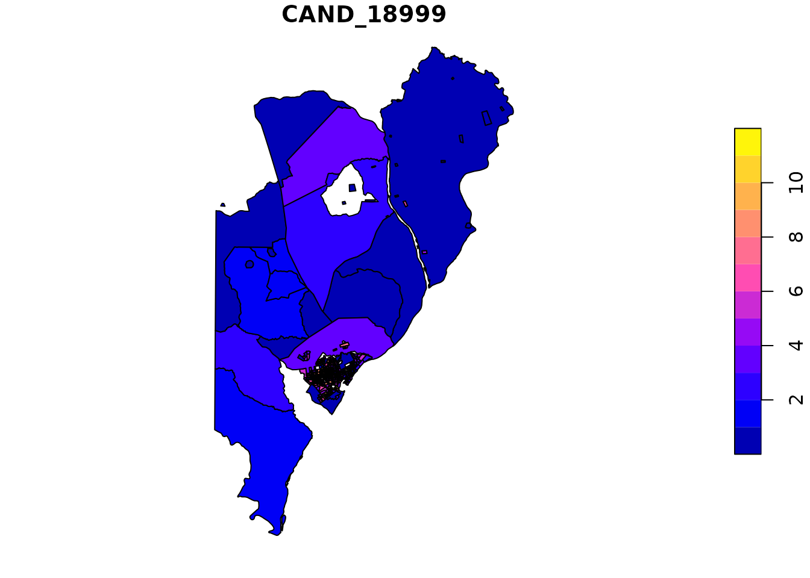

# Interpolating Brazilian Electoral Data

This vignette walks through the primary use case of `interpElections`:
disaggregating Brazilian electoral data from polling locations into
census tracts. The package automates census data download, electoral
data retrieval, travel-time computation, and IDW interpolation – all in
a single function call.

## Prerequisites

The Brazilian workflow requires several packages for census data,
shapefiles, and travel-time routing. Install them once:

``` r
install.packages(c("sf", "geobr", "censobr", "dplyr", "tidyr",
                    "data.table", "stringr", "arrow"))
```

Travel-time computation requires Java 21+ and the r5r package:

``` r
install.packages("r5r")

# Install Java 21 (if not already installed)
setup_java()

# Verify Java + r5r are properly configured
check_r5r()
```

For GPU-accelerated optimization (optional, for large municipalities):

``` r
setup_torch()
check_torch()
```

## One-Call Workflow

The simplest way to use the package is
[`interpolate_election_br()`](https://antrologos.github.io/interpElections/reference/interpolate_election_br.md),
which handles everything automatically. You only need an IBGE
municipality code and an election year:

``` r
library(interpElections)

result <- interpolate_election_br(
  code_muni = 1400100,  # Boa Vista, RR
  year = 2020
)
```

For this vignette, we load a pre-computed result instead of running the
full pipeline (which requires network access and Java):

``` r
library(interpElections)
#> interpElections: some optional dependencies are missing:
#> - No OSM clipping tool found (osmium/osmconvert)
#>   Install with: interpElections::setup_osmium()
#> These are needed for the full interpolation pipeline.

result <- readRDS(
  system.file("extdata/example_br_result.rds", package = "interpElections")
)
```

The result is an `interpElections_result` object with a rich
[`summary()`](https://rdrr.io/r/base/summary.html):

``` r
summary(result)
#> interpElections result summary
#> -------------------------------------------------- 
#> Municipality: 1400100 (election 2020, census 2022)
#> Zones: 506 | Sources: 149 | Variables: 11
#> 
#> Calibration brackets:
#>   Zones:   pop_15_24, pop_25_29, pop_30_39, pop_40_49, pop_50_59, pop_60_69
#>   Sources: votantes_15_24, votantes_25_29, votantes_30_39, votantes_40_49, votantes_50_59, votantes_60_69
#> 
#> Optimization: cpu_lbfgsb | Objective: 5041410.9862 | Convergence: 0
#>   Alpha: min=0.991, Q1=1.293, median=1.460, Q3=1.645, max=9.541
#> 
#> Interpolated variables:
#>   QT_COMPARECIMENTO            total=    165428  mean=   326.9  [0.0, 1073.7]
#>   CAND_18999                   total=      1606  mean=     3.2  [0.0, 11.5]
#>   CAND_90123                   total=       135  mean=     0.3  [0.0, 1.7]
#>   CAND_12012                   total=        64  mean=     0.1  [0.0, 0.6]
#>   CAND_25000                   total=       616  mean=     1.2  [0.0, 3.8]
#>   CAND_22444                   total=       442  mean=     0.9  [0.0, 3.2]
#>   CAND_28029                   total=        66  mean=     0.1  [0.0, 1.0]
#>   CAND_14100                   total=       337  mean=     0.7  [0.0, 2.6]
#>   CAND_77234                   total=       394  mean=     0.8  [0.0, 3.0]
#>   CAND_28008                   total=       371  mean=     0.7  [0.0, 3.4]
#>   CAND_22123                   total=       190  mean=     0.4  [0.0, 1.3]
#> 
#> Object size: 0.8 MB (lightweight)
```

Plot the first interpolated variable as a choropleth map:



Show plot code

``` r
plot(result)
```

### Filtering what to interpolate

The `what` parameter controls which variables are interpolated. The
`candidates` and `parties` parameters filter specific subsets:

``` r
# Only specific candidates (by ballot number or name)
result <- interpolate_election_br(
  code_muni = 1400100, year = 2020,
  what = "candidates",
  candidates = c(13, 22)
)

# Party-level vote totals
result <- interpolate_election_br(
  code_muni = 1400100, year = 2020,
  what = "parties",
  parties = c("PT", "PL")
)

# Turnout and abstention
result <- interpolate_election_br(
  code_muni = 1400100, year = 2020,
  what = "turnout"
)

# Voter demographics (gender + education level)
result <- interpolate_election_br(
  code_muni = 1400100, year = 2020,
  what = "demographics"
)
```

## The Municipality Crosswalk

Brazilian electoral data uses TSE 5-digit codes, while census data uses
IBGE 7-digit codes. The package includes a crosswalk table mapping all
5,710 municipalities:

``` r
data(muni_crosswalk)
dim(muni_crosswalk)
#> [1] 5710    4
head(muni_crosswalk)
#>   code_ibge code_tse uf            nome
#> 1   1200013    01120 AC      ACRELÂNDIA
#> 2   1200054    01570 AC    ASSIS BRASIL
#> 3   1200104    01058 AC       BRASILÉIA
#> 4   1200138    01007 AC          BUJARI
#> 5   1200179    01015 AC        CAPIXABA
#> 6   1200203    01074 AC CRUZEIRO DO SUL
```

Search by name or state:

``` r
# Find Boa Vista
subset(muni_crosswalk, grepl("BOA VISTA", nome))
#>      code_ibge code_tse uf                       nome
#> 136    1300680    02976 AM         BOA VISTA DO RAMOS
#> 247    2903805    33758 BA         BOA VISTA DO TUPIM
#> 1160   2101970    07323 MA        BOA VISTA DO GURUPI
#> 2281   5100359    90042 MT             ALTO BOA VISTA
#> 2547   1507706    05533 PA SÃO SEBASTIÃO DA BOA VISTA
#> 2592   2502151    19941 PB                  BOA VISTA
#> 2930   2612604    25518 PE   SANTA MARIA DA BOA VISTA
#> 3234   4103057    79812 PR     BOA VISTA DA APARECIDA
#> 3549   4125407    78832 PR      SÃO JOSÉ DA BOA VISTA
#> 3908   1400100    03018 RR                  BOA VISTA
#> 3962   4302154    86428 RS      BOA VISTA DAS MISSÕES
#> 3963   4302204    85430 RS        BOA VISTA DO BURICÁ
#> 3964   4302220    89044 RS       BOA VISTA DO CADEADO
#> 3965   4302238    89060 RS         BOA VISTA DO INCRA
#> 3966   4302253    88161 RS           BOA VISTA DO SUL
#> 4191   4312955    87203 RS             NOVA BOA VISTA
#> 4290   4317004    88439 RS       SANTANA DA BOA VISTA
#> 4676   4217154    80780 SC    SÃO MIGUEL DA BOA VISTA
#> 5352   3549102    70831 SP      SÃO JOÃO DA BOA VISTA

# All municipalities in Roraima
subset(muni_crosswalk, uf == "RR")
#>      code_ibge code_tse uf               nome
#> 3906   1400050    03050 RR        ALTO ALEGRE
#> 3907   1400027    03042 RR            AMAJARI
#> 3908   1400100    03018 RR          BOA VISTA
#> 3909   1400159    03077 RR             BONFIM
#> 3910   1400175    03069 RR              CANTÁ
#> 3911   1400209    03034 RR          CARACARAÍ
#> 3912   1400233    03000 RR            CAROEBE
#> 3913   1400282    03026 RR            IRACEMA
#> 3914   1400308    03093 RR            MUCAJAÍ
#> 3915   1400407    03115 RR          NORMANDIA
#> 3916   1400456    03123 RR          PACARAIMA
#> 3917   1400472    03085 RR       RORAINÓPOLIS
#> 3918   1400506    03131 RR SÃO JOÃO DA BALIZA
#> 3919   1400605    03158 RR           SÃO LUIZ
#> 3920   1400704    03107 RR           UIRAMUTÃ
```

When you call
[`interpolate_election_br()`](https://antrologos.github.io/interpElections/reference/interpolate_election_br.md),
the TSE code and state abbreviation are resolved automatically from the
IBGE code.

## Step-by-Step Workflow

Under the hood,
[`interpolate_election_br()`](https://antrologos.github.io/interpElections/reference/interpolate_election_br.md)
runs five preparation steps before calling the core interpolation
engine. You can run each step individually for more control.

### Step 1 – Census population

[`br_prepare_population()`](https://antrologos.github.io/interpElections/reference/br_prepare_population.md)
downloads census population data (via `censobr`) and groups ages into
brackets that match the TSE voter profile data:

``` r
pop_data <- br_prepare_population(code_muni = 1400100, year = 2022)
```

``` r
pop_data <- readRDS(
  system.file("extdata/example_pop_data.rds", package = "interpElections")
)
head(pop_data)
#>            code_tract code_muni pop_00_04 pop_05_09 pop_10_14 pop_15_19
#> 15351 140010005000001   1400100         6        16         9        10
#> 15352 140010005000002   1400100        20        30        24        22
#> 15353 140010005000003   1400100        22        19        23        15
#> 15354 140010005000004   1400100        20        17        15        18
#> 15355 140010005000007   1400100        21        36        24        31
#> 15356 140010005000009   1400100        23        20        17        26
#>       pop_20_24 pop_25_29 pop_30_39 pop_40_49 pop_50_59 pop_60_69 pop_70mais
#> 15351        16        14        38        25        30        14          7
#> 15352        38        41        62        54        37        38         17
#> 15353        31        23        42        30        25        19          8
#> 15354        28        27        28        31        26        11         27
#> 15355        33        36        93        71        58        42         30
#> 15356        23        30        59        58        41        39         27
str(pop_data)
#> 'data.frame':    528 obs. of  13 variables:
#>  $ code_tract: chr  "140010005000001" "140010005000002" "140010005000003" "140010005000004" ...
#>  $ code_muni : num  1400100 1400100 1400100 1400100 1400100 ...
#>  $ pop_00_04 : num  6 20 22 20 21 23 18 21 31 10 ...
#>  $ pop_05_09 : num  16 30 19 17 36 20 13 16 18 13 ...
#>  $ pop_10_14 : num  9 24 23 15 24 17 8 22 25 21 ...
#>  $ pop_15_19 : num  10 22 15 18 31 26 13 16 36 13 ...
#>  $ pop_20_24 : num  16 38 31 28 33 23 21 23 26 23 ...
#>  $ pop_25_29 : num  14 41 23 27 36 30 18 25 25 21 ...
#>  $ pop_30_39 : num  38 62 42 28 93 59 36 38 69 45 ...
#>  $ pop_40_49 : num  25 54 30 31 71 58 36 39 41 41 ...
#>  $ pop_50_59 : num  30 37 25 26 58 41 26 30 49 30 ...
#>  $ pop_60_69 : num  14 38 19 11 42 39 29 31 27 30 ...
#>  $ pop_70mais: num  7 17 8 27 30 27 28 33 31 33 ...
```

The census year is auto-selected based on the election year:

| Election years | Census year |
|----------------|-------------|
| 2000–2004      | 2000        |
| 2008–2016      | 2010        |
| 2020+          | 2022        |

You can override this with the `census_year` parameter.

### Step 2 – Tract geometries

[`br_prepare_tracts()`](https://antrologos.github.io/interpElections/reference/br_prepare_tracts.md)
downloads census tract shapefiles via `geobr`, joins the population
data, and optionally removes unpopulated tracts:

``` r
tracts_sf <- br_prepare_tracts(
  code_muni = 1400100,
  pop_data = pop_data
)
```

``` r
tracts_sf <- readRDS(
  system.file("extdata/example_tracts_sf.rds", package = "interpElections")
)
dim(tracts_sf)
#> [1] 506  14
names(tracts_sf)
#>  [1] "code_tract" "pop_00_04"  "pop_05_09"  "pop_10_14"  "pop_15_19" 
#>  [6] "pop_20_24"  "pop_25_29"  "pop_30_39"  "pop_40_49"  "pop_50_59" 
#> [11] "pop_60_69"  "pop_70mais" "pop_total"  "geom"
```

    #> Linking to GEOS 3.12.1, GDAL 3.8.4, PROJ 9.4.0; sf_use_s2() is TRUE


Show plot code

``` r
library(sf)
plot(st_geometry(tracts_sf), main = "Census tracts")
```

Additional options:

- `remove_unpopulated = TRUE` (default): drops tracts with zero
  population.
- `clip_sf`: pass an `sf` polygon to clip tracts to an urban boundary,
  removing parks, forests, or water bodies.

### Step 3 – Electoral data

[`br_prepare_electoral()`](https://antrologos.github.io/interpElections/reference/br_prepare_electoral.md)
downloads TSE voting data, merges geocoded polling station coordinates,
and aggregates to the polling-location level:

``` r
electoral_data <- br_prepare_electoral(
  code_muni_ibge = "1400100",
  code_muni_tse = "03018",
  uf = "RR",
  year = 2020
)
```

``` r
electoral_data <- readRDS(
  system.file("extdata/example_electoral_data.rds", package = "interpElections")
)
head(electoral_data[, 1:8])
#> # A tibble: 6 × 8
#>      id   lat  long votantes_18_20 votantes_21_24 votantes_25_29 votantes_30_34
#>   <int> <dbl> <dbl>          <int>          <int>          <int>          <int>
#> 1     1  2.76 -60.7            125            180            212            239
#> 2     2  2.76 -60.7             23             90            126            113
#> 3     3  2.76 -60.7              9             69             17             15
#> 4     4  2.76 -60.7            192            153             86            110
#> 5     5  2.76 -60.7             18             26             30             23
#> 6     6  2.76 -60.7              8             76             93             84
#> # ℹ 1 more variable: votantes_35_39 <int>
names(electoral_data)
#>  [1] "id"                "lat"               "long"             
#>  [4] "votantes_18_20"    "votantes_21_24"    "votantes_25_29"   
#>  [7] "votantes_30_34"    "votantes_35_39"    "votantes_40_44"   
#> [10] "votantes_45_49"    "votantes_50_54"    "votantes_55_59"   
#> [13] "votantes_60_64"    "votantes_65_69"    "QT_COMPARECIMENTO"
#> [16] "CAND_18999"        "CAND_90123"        "CAND_12012"       
#> [19] "CAND_25000"        "CAND_22444"        "CAND_28029"       
#> [22] "CAND_14100"        "CAND_77234"        "CAND_28008"       
#> [25] "CAND_22123"
```

The `what`, `candidates`, and `parties` parameters work the same way as
in
[`interpolate_election_br()`](https://antrologos.github.io/interpElections/reference/interpolate_election_br.md).

### Step 4 – Travel times

Travel-time computation requires r5r and a Java runtime. The package can
download the OSM road network automatically:

``` r
# Download OSM road network for the municipality
r5r_data <- download_r5r_data(
  area_sf    = tracts_sf,
  output_dir = "r5r_network/boa_vista"
)

# Convert electoral data to sf points
electoral_sf <- sf::st_as_sf(electoral_data,
                              coords = c("long", "lat"), crs = 4326)

# Compute travel-time matrix (tract centroids -> polling locations)
tt_matrix <- compute_travel_times(
  zones_sf     = tracts_sf,
  points_sf    = electoral_sf,
  network_path = r5r_data$output_dir,
  mode         = "WALK",
  max_trip_duration = 300
)
```

If you already have a travel-time matrix from another source, skip this
step entirely by passing it via the `time_matrix` parameter in
[`interpolate_election_br()`](https://antrologos.github.io/interpElections/reference/interpolate_election_br.md)
or
[`interpolate_election()`](https://antrologos.github.io/interpElections/reference/interpolate_election.md).

### Step 5 – Optimize and interpolate

The final step finds optimal decay parameters (alpha) and applies the
IDW interpolation:

``` r
# Find optimal alpha (one per tract)
optim_result <- optimize_alpha(
  time_matrix = tt_matrix,
  pop_matrix = pop_matrix,
  source_matrix = source_matrix
)

# Apply interpolation with the optimized alpha
interpolated <- idw_interpolate(
  time_matrix = tt_matrix,
  alpha = optim_result$alpha,
  source_matrix = electoral_matrix
)
```

## Downloading Raw TSE Data

The package provides direct access to TSE open data for custom analyses:

``` r
# Candidate vote data (votacao por secao eleitoral)
votes <- br_download_votes(year = 2020, uf = "RR")

# Turnout/attendance data (comparecimento e abstencao)
turnout <- br_download_turnout(year = 2020, uf = "RR")

# Polling station geocodes (latitude/longitude)
geocodes <- br_download_geocode(year = 2020, uf = "RR")
```

Note: geocoding data is not available from TSE for elections before
approximately 2014.

## Supported Elections

Brazil holds elections every two years, alternating between municipal
and general (federal/state) elections:

**Municipal elections** (2000, 2004, 2008, 2012, 2016, 2020, 2024):

| Cargo    | TSE code | Description    |
|----------|----------|----------------|
| Prefeito | 11       | Mayor          |
| Vereador | 13       | City councilor |

**General elections** (2002, 2006, 2010, 2014, 2018, 2022):

| Cargo              | TSE code | Description                       |
|--------------------|----------|-----------------------------------|
| Presidente         | 1        | President                         |
| Governador         | 3        | State governor                    |
| Senador            | 5        | Senator                           |
| Deputado Federal   | 6        | Federal representative            |
| Deputado Estadual  | 7        | State representative              |
| Deputado Distrital | 8        | District representative (DF only) |

Use the `turno` parameter to select the election round: `1` (first
round, always available) or `2` (runoff, only for executive offices when
no candidate wins outright).
