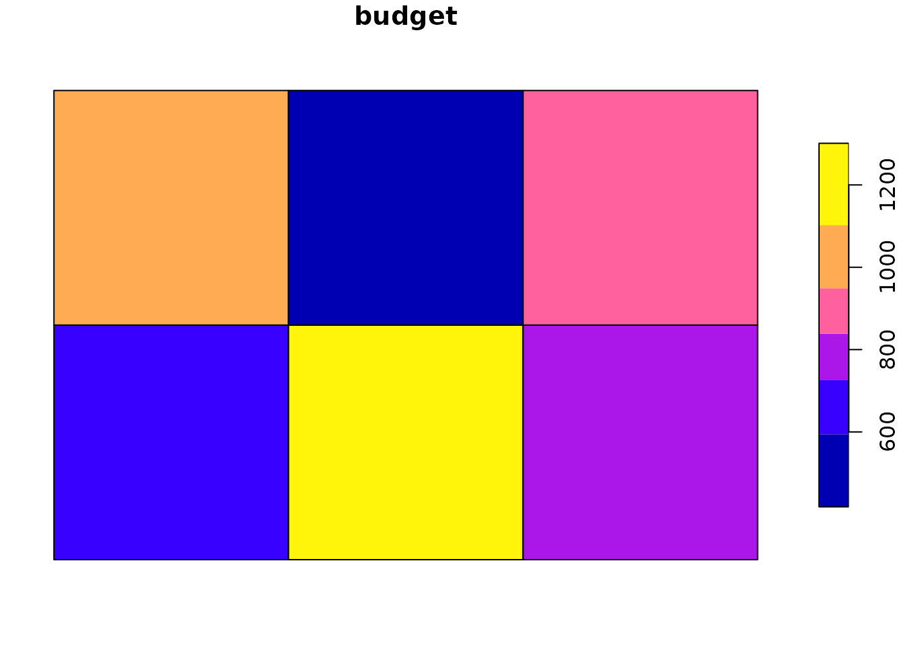
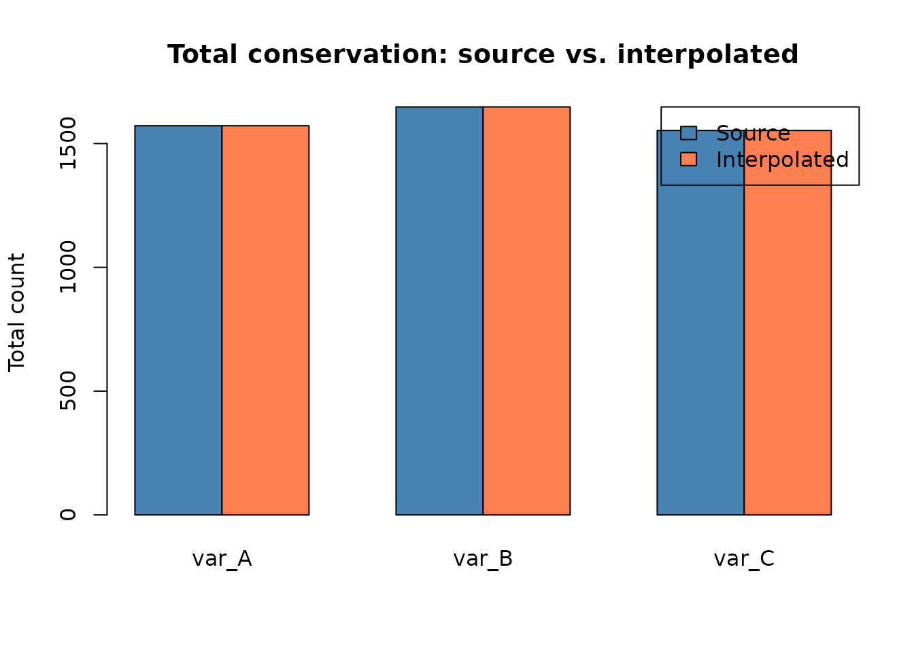

# Using interpElections with Your Own Data

While `interpElections` was designed for Brazilian elections, the core
interpolation engine works with any point-to-polygon spatial
disaggregation problem. This vignette shows how to use the package with
your own data.

## When to Use This Vignette

Use `interpElections` when you have:

- **Source points** (e.g., schools, hospitals, weather stations,
  sensors) with counts or measurements for one or more variables.
- **Target polygons** (e.g., districts, neighborhoods, grid cells) with
  known totals for at least one calibration variable.
- A need to **disaggregate** the source data into the target polygons,
  calibrated against the known totals.

The calibration step is what distinguishes IDW interpolation from naive
spatial allocation: the package finds per-zone decay parameters that
minimize the discrepancy between interpolated and observed totals.

## Preparing Your Data

Let us build a small synthetic example: 6 rectangular districts with
known population by two age groups, and 10 schools with enrollment
counts by the same groups plus a “budget” variable we want to
interpolate.

``` r
library(interpElections)
#> interpElections: some optional dependencies are missing:
#> - No OSM clipping tool found (osmium/osmconvert)
#>   Install with: interpElections::setup_osmium()
#> These are needed for the full interpolation pipeline.
library(sf)
#> Linking to GEOS 3.12.1, GDAL 3.8.4, PROJ 9.4.0; sf_use_s2() is TRUE

# -- Target zones: 6 rectangular districts in a 3x2 grid --
make_rect <- function(x0, y0, w = 1, h = 1) {
  st_polygon(list(matrix(c(
    x0, y0,
    x0 + w, y0,
    x0 + w, y0 + h,
    x0, y0 + h,
    x0, y0
  ), ncol = 2, byrow = TRUE)))
}

districts_sf <- st_sf(
  id = paste0("D", 1:6),
  pop_young = c(120, 200, 150, 180, 90, 160),
  pop_old   = c(80, 100, 130, 70, 110, 95),
  geometry  = st_sfc(
    make_rect(0, 0), make_rect(1, 0), make_rect(2, 0),
    make_rect(0, 1), make_rect(1, 1), make_rect(2, 1),
    crs = 4326
  )
)

# -- Source points: 10 schools scattered across the grid --
set.seed(42)
schools_sf <- st_sf(
  id = paste0("S", 1:10),
  enroll_young = c(55, 80, 45, 70, 60, 35, 90, 40, 65, 50),
  enroll_old   = c(30, 50, 40, 25, 45, 55, 35, 60, 20, 38),
  budget       = c(500, 800, 350, 620, 410, 290, 750, 380, 530, 440),
  geometry     = st_sfc(
    st_point(c(0.3, 0.2)), st_point(c(0.8, 0.4)),
    st_point(c(1.3, 0.3)), st_point(c(1.7, 0.8)),
    st_point(c(2.2, 0.5)), st_point(c(2.6, 0.7)),
    st_point(c(0.5, 1.3)), st_point(c(1.2, 1.6)),
    st_point(c(1.8, 1.2)), st_point(c(2.5, 1.5)),
    crs = 4326
  )
)

print(districts_sf)
#> Simple feature collection with 6 features and 3 fields
#> Geometry type: POLYGON
#> Dimension:     XY
#> Bounding box:  xmin: 0 ymin: 0 xmax: 3 ymax: 2
#> Geodetic CRS:  WGS 84
#>   id pop_young pop_old                       geometry
#> 1 D1       120      80 POLYGON ((0 0, 1 0, 1 1, 0 ...
#> 2 D2       200     100 POLYGON ((1 0, 2 0, 2 1, 1 ...
#> 3 D3       150     130 POLYGON ((2 0, 3 0, 3 1, 2 ...
#> 4 D4       180      70 POLYGON ((0 1, 1 1, 1 2, 0 ...
#> 5 D5        90     110 POLYGON ((1 1, 2 1, 2 2, 1 ...
#> 6 D6       160      95 POLYGON ((2 1, 3 1, 3 2, 2 ...
print(schools_sf)
#> Simple feature collection with 10 features and 4 fields
#> Geometry type: POINT
#> Dimension:     XY
#> Bounding box:  xmin: 0.3 ymin: 0.2 xmax: 2.6 ymax: 1.6
#> Geodetic CRS:  WGS 84
#>     id enroll_young enroll_old budget        geometry
#> 1   S1           55         30    500 POINT (0.3 0.2)
#> 2   S2           80         50    800 POINT (0.8 0.4)
#> 3   S3           45         40    350 POINT (1.3 0.3)
#> 4   S4           70         25    620 POINT (1.7 0.8)
#> 5   S5           60         45    410 POINT (2.2 0.5)
#> 6   S6           35         55    290 POINT (2.6 0.7)
#> 7   S7           90         35    750 POINT (0.5 1.3)
#> 8   S8           40         60    380 POINT (1.2 1.6)
#> 9   S9           65         20    530 POINT (1.8 1.2)
#> 10 S10           50         38    440 POINT (2.5 1.5)
```

The key requirement is that the calibration columns must measure the
**same thing** in both layers. Here, `pop_young`/`pop_old` in districts
and `enroll_young`/`enroll_old` in schools both measure population
counts by age group. The `budget` column has no counterpart in districts
– it is the variable we want to spatially disaggregate.

## The `interpolate_election()` Wrapper

[`interpolate_election()`](https://antrologos.github.io/interpElections/reference/interpolate_election.md)
is the general-purpose wrapper (not specific to Brazil). It accepts `sf`
objects and handles matrix construction internally.

First, we build a simple Euclidean distance matrix. In a real
application you would use travel times (see Section 4.6), but distances
work well for demonstration:

``` r
coords_zones <- st_coordinates(suppressWarnings(st_centroid(districts_sf)))
coords_pts   <- st_coordinates(schools_sf)
all_coords   <- rbind(coords_zones, coords_pts)
full_dist    <- as.matrix(dist(all_coords))
dist_matrix  <- full_dist[1:6, 7:16]

rownames(dist_matrix) <- districts_sf$id
colnames(dist_matrix) <- schools_sf$id
round(dist_matrix, 2)
#>      S1   S2   S3   S4   S5   S6   S7   S8   S9  S10
#> D1 0.36 0.32 0.82 1.24 1.70 2.11 0.80 1.30 1.48 2.24
#> D2 1.24 0.71 0.28 0.36 0.70 1.12 1.28 1.14 0.76 1.41
#> D3 2.22 1.70 1.22 0.85 0.30 0.22 2.15 1.70 0.99 1.00
#> D4 1.32 1.14 1.44 1.39 1.97 2.25 0.20 0.71 1.33 2.00
#> D5 1.77 1.30 1.22 0.73 1.22 1.36 1.02 0.32 0.42 1.00
#> D6 2.56 2.02 1.70 1.06 1.04 0.81 2.01 1.30 0.76 0.00
```

Now call
[`interpolate_election()`](https://antrologos.github.io/interpElections/reference/interpolate_election.md):

``` r
result <- interpolate_election(
  tracts_sf     = districts_sf,
  electoral_sf  = schools_sf,
  zone_id       = "id",
  point_id      = "id",
  calib_zones   = c("pop_young", "pop_old"),
  calib_sources = c("enroll_young", "enroll_old"),
  interp_sources = "budget",
  time_matrix   = dist_matrix
)
#> although coordinates are longitude/latitude, st_union assumes that they are
#> planar
#> although coordinates are longitude/latitude, st_union assumes that they are
#> planar
#> although coordinates are longitude/latitude, st_intersects assumes that they
#> are planar
#> [1/3] Using pre-computed travel time matrix
#> [2/3] Optimizing alpha...
#>   CPU optimization: method=auto, parallel=TRUE
#> Trying parallel L-BFGS-B optimization...
#> Parallel L-BFGS-B failed: length(parallel$forward) == 1 is not TRUE
#> Trying serial L-BFGS-B optimization...
#>   Converged in 29 steps (0.5s), objective=23,598  Converged in 29 steps (0.5s), objective=23,598
#> [3/3] Interpolating...
#>   Interpolated 1 variables into 6 zones

summary(result)
#> interpElections result summary
#> -------------------------------------------------- 
#> Zones: 6 | Sources: 10 | Variables: 1
#> 
#> Calibration brackets:
#>   Zones:   pop_young, pop_old
#>   Sources: enroll_young, enroll_old
#> 
#> Optimization: cpu_lbfgsb | Objective: 23597.7150 | Convergence: 0
#>   Alpha: min=6.976, Q1=8.777, median=9.775, Q3=11.769, max=20.000
#> 
#> Interpolated variables:
#>   budget                       total=      5070  mean=   845.0  [491.6, 1227.5]
#> 
#> Object size: 0.0 MB (lightweight)
```



Show plot code

``` r
plot(result, "budget")
```

The result object contains the interpolated `sf` data frame, the
optimized alpha vector, and optimization diagnostics.

## Supplying a Pre-Computed Distance Matrix

The `time_matrix` parameter accepts any numeric matrix with dimensions
`n_zones x m_points`. Values must be positive (they represent distances
or travel times). The matrix can come from any source – Euclidean
distances, network distances, travel times from Google Maps, or custom
cost surfaces.

Requirements:

- Rows correspond to target zones (same order as `tracts_sf`).
- Columns correspond to source points (same order as `electoral_sf`).
- Values must be positive numeric (no NA, NaN, or Inf).

``` r
dim(dist_matrix)
#> [1]  6 10
head(dist_matrix)
#>           S1        S2        S3        S4       S5        S6        S7
#> D1 0.3605604 0.3162298 0.8246227 1.2369301 1.700000 2.1095017 0.7999937
#> D2 1.2369332 0.7071077 0.2828472 0.3605499 0.700000 1.1180329 1.2806209
#> D3 2.2203612 1.7029390 1.2165535 0.8543981 0.300000 0.2236011 2.1540636
#> D4 1.3153134 1.1401938 1.4422363 1.3892540 1.972318 2.2472273 0.2000190
#> D5 1.7691946 1.3038565 1.2165712 0.7280293 1.220671 1.3601582 1.0198076
#> D6 2.5553961 2.0248560 1.6970697 1.0630271 1.044049 0.8062446 2.0099770
#>           S8        S9          S10
#> D1 1.3038351 1.4764793 2.236065e+00
#> D2 1.1401693 0.7615715 1.414209e+00
#> D3 1.7029345 0.9899450 9.999937e-01
#> D4 0.7071041 1.3341707 2.000000e+00
#> D5 0.3162218 0.4242775 1.000000e+00
#> D6 1.3038390 0.7615848 1.899604e-05
```

## Step-by-Step with Core Functions

For maximum control, you can bypass the wrappers and call the core
functions directly. This section uses the bundled example data.

``` r
tt  <- readRDS(system.file("extdata/example_tt_matrix.rds",
                            package = "interpElections"))
pop <- readRDS(system.file("extdata/example_pop_matrix.rds",
                            package = "interpElections"))
src <- readRDS(system.file("extdata/example_source_matrix.rds",
                            package = "interpElections"))

cat("Travel time matrix:", nrow(tt), "zones x", ncol(tt), "sources\n")
#> Travel time matrix: 20 zones x 8 sources
cat("Population matrix: ", nrow(pop), "zones x", ncol(pop), "groups\n")
#> Population matrix:  20 zones x 3 groups
cat("Source matrix:     ", nrow(src), "sources x", ncol(src), "groups\n")
#> Source matrix:      8 sources x 3 groups
```

### Optimize alpha

[`optimize_alpha()`](https://antrologos.github.io/interpElections/reference/optimize_alpha.md)
finds per-zone decay parameters that minimize the squared error between
IDW-interpolated and observed population:

``` r
optim_result <- optimize_alpha(
  time_matrix   = tt,
  pop_matrix    = pop,
  source_matrix = src,
  use_gpu       = FALSE,
  verbose       = FALSE
)

optim_result
#> interpElections optimization result
#>   Method:      cpu_lbfgsb
#>   Objective:   2150.0468
#>   Convergence: 0
#>   Alpha range: [0.000, 0.072]
#>   N zones:     20
#>   Elapsed:     0.4 secs
```

### Interpolate new data

Once you have the optimal alpha, you can interpolate any source-level
data into the target zones. The alpha vector is reusable across
variables – you do not need to re-optimize for each one:

``` r
# Simulate new data at the 8 source locations (3 variables)
set.seed(123)
new_data <- matrix(rpois(8 * 3, 200), nrow = 8, ncol = 3)
colnames(new_data) <- c("var_A", "var_B", "var_C")

interpolated <- idw_interpolate(tt, optim_result$alpha, new_data)
head(interpolated)
#>            var_A    var_B    var_C
#> tract_1 80.26303 84.22678 79.37102
#> tract_2 78.54542 82.31001 77.59161
#> tract_3 82.68261 86.76879 81.76064
#> tract_4 88.57890 92.89904 87.53234
#> tract_5 70.48203 73.85247 69.53898
#> tract_6 74.96871 78.58623 74.05313
```

A key property of the column-standardized IDW weights is **total
conservation**: the column sums of the interpolated matrix equal the
column sums of the source data. This means no counts are created or
destroyed during interpolation.



Show plot code

``` r
totals <- rbind(
  Source       = colSums(new_data),
  Interpolated = colSums(interpolated)
)
barplot(
  totals,
  beside = TRUE,
  legend.text = rownames(totals),
  args.legend = list(x = "topright"),
  main = "Total conservation: source vs. interpolated",
  ylab = "Total count",
  col = c("steelblue", "coral")
)
```

## Computing Travel Times with r5r

For real-world applications, travel-time distances produce better
results than Euclidean distances because they account for road networks,
terrain, and barriers.

The package provides helpers for r5r-based travel-time computation:

``` r
# Download OSM road network for your study area
r5r_data <- download_r5r_data(
  area_sf    = my_study_area_sf,
  output_dir = "path/to/output"
)

# Compute travel-time matrix
tt_matrix <- compute_travel_times(
  zones_sf     = my_zones_sf,
  points_sf    = my_points_sf,
  network_path = r5r_data$output_dir,
  mode         = "WALK",
  max_trip_duration = 300
)
```

Available routing modes: `"WALK"`, `"BICYCLE"`, `"CAR"`. The
`fill_missing` parameter controls the value assigned to unreachable
origin-destination pairs (defaults to `max_trip_duration`).

The
[`download_r5r_data()`](https://antrologos.github.io/interpElections/reference/download_r5r_data.md)
function downloads an OpenStreetMap extract for your study area and
clips it to the relevant bounding box. This requires Java 21+ and the
`osmium-tool` command-line utility. Run
[`check_r5r()`](https://antrologos.github.io/interpElections/reference/check_r5r.md)
to verify your setup.
