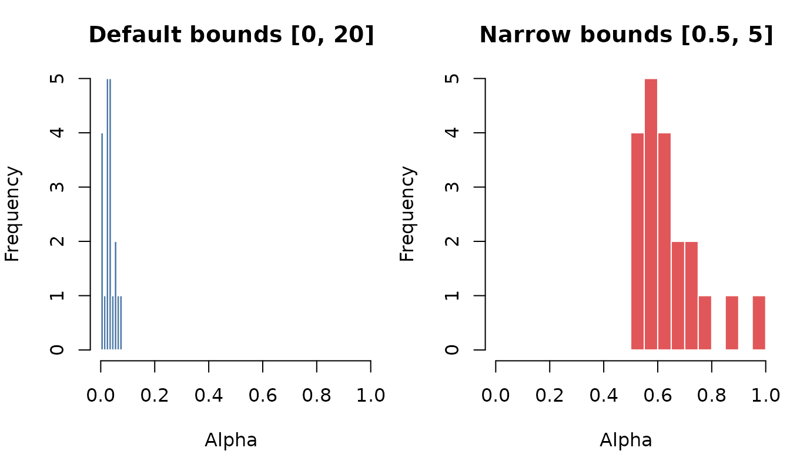

# Performance Tuning and Configuration

This vignette covers how to configure GPU acceleration, tune
optimization parameters, and manage the package’s file cache.

## GPU Setup

interpElections can accelerate alpha optimization using a GPU via the
torch R package. The
[`check_torch()`](https://antrologos.github.io/interpElections/reference/check_torch.md)
function runs a comprehensive diagnostic:

``` r
library(interpElections)
check_torch()
```

On a system with a working NVIDIA GPU, the output looks like:

    [ok] torch package installed (v0.13.0)
    [ok] libtorch + lantern binaries installed
    [ok] NVIDIA GPU: NVIDIA GeForce RTX 4090 (24576 MB VRAM)
         Driver: 555.42.02 | Max CUDA: 12.5
    [ok] CUDA runtime 12.1 (1 device)
         Compute capability: 8.9 | cuDNN: 9.1.0
    [ok] GPU tensor test: passed (cuda)

    All checks passed. GPU acceleration is ready.
      Device: cuda | Enable with: use_gpu(TRUE)

If torch is not yet installed,
[`setup_torch()`](https://antrologos.github.io/interpElections/reference/setup_torch.md)
handles the full installation – the R package from CRAN and the
platform-appropriate libtorch/lantern binaries with GPU support:

``` r
setup_torch()              # auto-detect GPU type
setup_torch(type = "cuda") # force CUDA binaries
```

After setup, enable GPU acceleration globally:

``` r
use_gpu(enable = TRUE)
```

Or enable it for a single call:

``` r
result <- optimize_alpha(tt, pop, src, use_gpu = TRUE)
```

## GPU vs CPU: When to Use Which

The GPU path uses the torch ADAM optimizer with automatic
differentiation, while the CPU path uses L-BFGS-B (optionally
parallelized across cores). The best choice depends on problem size:

| Problem size (zones) | Recommended              | Notes                                                                            |
|----------------------|--------------------------|----------------------------------------------------------------------------------|
| \< 200               | CPU                      | Overhead of transferring data to GPU exceeds the speedup.                        |
| 200 – 1,000          | Either                   | GPU may be slightly faster; CPU is reliable.                                     |
| 1,000 – 10,000       | GPU preferred            | GPU parallelism provides clear speedup.                                          |
| \> 10,000            | GPU strongly recommended | CPU optimization becomes very slow; GPU handles tens of thousands of zones well. |

**GPU requirements:**

- **NVIDIA**: CUDA-capable GPU with a recent driver. Compute capability
  3.7 or higher (Maxwell and newer). Works on Windows and Linux.
- **Apple Silicon**: MPS backend on macOS with M1/M2/M3/M4 chips.
  Requires torch \>= 0.12 and macOS 12.3+.
- **No GPU**: The CPU fallback works on any platform. It is the default
  when `use_gpu = FALSE` or when no GPU is detected.

## Optimization Parameters

### CPU optimization

Load the bundled example data and run the optimizer with default
settings:

``` r
library(interpElections)
#> interpElections: some optional dependencies are missing:
#> - No OSM clipping tool found (osmium/osmconvert)
#>   Install with: interpElections::setup_osmium()
#> These are needed for the full interpolation pipeline.

tt  <- readRDS(system.file("extdata/example_tt_matrix.rds",
                            package = "interpElections"))
pop <- readRDS(system.file("extdata/example_pop_matrix.rds",
                            package = "interpElections"))
src <- readRDS(system.file("extdata/example_source_matrix.rds",
                            package = "interpElections"))

result_default <- optimize_alpha(tt, pop, src,
                                  use_gpu = FALSE, verbose = FALSE)
```

Inspect convergence information:

``` r
result_default$method
#> [1] "cpu_lbfgsb"
result_default$convergence   # 0 = success
#> [1] 0
result_default$message
#> [1] "CONVERGENCE: REL_REDUCTION_OF_F <= FACTR*EPSMCH"
result_default$iterations
#> function gradient 
#>       58       58
cat("Elapsed:", format(result_default$elapsed), "\n")
#> Elapsed: 0.4363866 secs
cat("Objective:", round(result_default$value, 2), "\n")
#> Objective: 2150.05
```

**CPU cascade.** When `cpu_method = "auto"` (the default), the optimizer
tries methods in order:

1.  **Parallel L-BFGS-B** via `optimParallel` – uses multiple CPU cores.
    Requires the `optimParallel` and `parallel` packages.
2.  **Serial L-BFGS-B** – standard
    [`optim()`](https://rdrr.io/r/stats/optim.html) with box
    constraints.
3.  **BFGS** – unconstrained fallback (bounds enforced via clamping).

Each method is tried only if the previous one fails. Most problems
converge on the first attempt.

### Effect of bounds

By default, alpha values are bounded between 0 and 20. Narrowing the
bounds can speed up convergence and prevent extreme values:

``` r
result_narrow <- optimize_alpha(tt, pop, src,
                                 use_gpu = FALSE,
                                 lower_bound = 0.5,
                                 upper_bound = 5,
                                 verbose = FALSE)

cat("Default bounds [0, 20] -- objective:", round(result_default$value, 2), "\n")
#> Default bounds [0, 20] -- objective: 2150.05
cat("Narrow bounds [0.5, 5] -- objective:", round(result_narrow$value, 2), "\n")
#> Narrow bounds [0.5, 5] -- objective: 2312.95
```



Show plot code

``` r
par(mfrow = c(1, 2), mar = c(4, 4, 3, 1))

hist(result_default$alpha, breaks = 10, col = "#4E79A7", border = "white",
     main = "Default bounds [0, 20]",
     xlab = "Alpha", ylab = "Frequency",
     xlim = range(c(result_default$alpha, result_narrow$alpha)))

hist(result_narrow$alpha, breaks = 10, col = "#E15759", border = "white",
     main = "Narrow bounds [0.5, 5]",
     xlab = "Alpha", ylab = "Frequency",
     xlim = range(c(result_default$alpha, result_narrow$alpha)))
```

Narrow bounds constrain the alpha distribution but may increase the
objective value (worse fit). Use narrow bounds when you have prior
knowledge about the expected decay behavior, or when you want to prevent
extreme solutions.

### GPU parameters

When `use_gpu = TRUE`, the optimizer uses the torch ADAM algorithm with
a learning rate schedule. The key parameters are:

``` r
result <- optimize_alpha(
  tt, pop, src,
  use_gpu        = TRUE,
  device         = "cuda",     # or "mps" for Apple Silicon
  dtype          = "float32",  # or "float64" for higher precision
  gpu_iterations = 20,         # number of ADAM phases (outer iterations)
  gpu_lr_init    = 0.1,        # initial learning rate
  gpu_lr_decay   = 0.6         # decay factor per phase
)
```

- **`gpu_iterations`**: Each “phase” runs a full ADAM optimization pass.
  The learning rate is reduced by `gpu_lr_decay` after each phase. More
  phases allow finer convergence. Default: 20.

- **`gpu_lr_init`**: Starting learning rate. Larger values explore
  faster but risk overshooting. Default: 0.1.

- **`gpu_lr_decay`**: Multiplicative decay applied each phase. A value
  of 0.6 means the learning rate after phase k is `gpu_lr_init * 0.6^k`.
  Default: 0.6.

## float32 vs float64

The `dtype` parameter controls numerical precision on the GPU:

| dtype     | Precision             | Memory | Speed  | Use case                                                      |
|-----------|-----------------------|--------|--------|---------------------------------------------------------------|
| `float32` | Single precision      | 1x     | Faster | Default; good balance of speed and accuracy for most problems |
| `float64` | Full double precision | 2x     | Slower | When maximum numerical precision is needed                    |

The default is `float32`, which provides sufficient precision for most
municipal-scale problems while using less GPU memory. Switch to
`float64` if you need maximum accuracy, or keep `float32` when VRAM is
tight or you need maximum throughput:

``` r
# Global setting for higher precision
use_gpu(enable = TRUE, dtype = "float64")

# Or per-call
result <- optimize_alpha(tt, pop, src, use_gpu = TRUE, dtype = "float64")
```

The CPU optimizer always uses `float64` (R’s native double precision).

## Java and r5r Setup

Travel time computation requires the `r5r` package and a Java
Development Kit (JDK) version 21 or higher.

### Diagnostics

``` r
check_r5r()
```

Sample output on a correctly configured system:

    [ok] r5r package installed (v2.1)
    [ok] Java 21 found
    [ok] Java max heap: 4g
         System RAM: 16 GB

    All checks passed. r5r is ready to use.

### Installing Java

If Java is missing or the wrong version,
[`setup_java()`](https://antrologos.github.io/interpElections/reference/setup_java.md)
downloads and configures Adoptium Temurin JDK 21 automatically:

``` r
setup_java()
```

This downloads the JDK for your platform, extracts it to a local
directory, sets `JAVA_HOME`, and optionally persists the setting in
`~/.Renviron`.

### OSM clipping tool

The travel time pipeline clips OpenStreetMap data to the study area
before building the routing network. This requires `osmium-tool`:

``` r
setup_osmium()
```

This searches for `osmium` on the system and, if not found, downloads a
platform-appropriate binary.

### Memory configuration

Large travel time matrices (e.g., 10,000+ zones with 500+ sources) can
require several gigabytes of JVM heap. Configure this **before** loading
r5r:

``` r
# Set JVM heap to 8 GB
set_java_memory("8g")

# Rule of thumb: >= 2 GB per million origin-destination pairs
# 5,000 tracts x 200 sources = 1M pairs -> 2-4 GB
# 20,000 tracts x 500 sources = 10M pairs -> 8-16 GB
```

The
[`set_java_memory()`](https://antrologos.github.io/interpElections/reference/set_java_memory.md)
function must be called before `r5r` (or `rJava`) is loaded in the R
session. Once the JVM starts, heap size cannot be changed without
restarting R.

## Cache Management

interpElections caches downloaded files and computed artifacts (travel
time matrices, processed electoral data, etc.) to avoid re-downloading
and re-computing across sessions.

### Viewing the cache directory

``` r
cache_dir <- get_interpElections_cache_dir()
cache_dir
#> [1] "/home/runner/.cache/R/interpElections"
```

### Changing the cache directory

You can point the cache to a different location. Here we demonstrate
with a temporary directory:

``` r
old_cache <- get_interpElections_cache_dir()
set_interpElections_cache_dir(tempdir(), verbose = FALSE)
get_interpElections_cache_dir()   # now points to temp
#> [1] "/tmp/RtmpGBOSf4"

# Restore the original
set_interpElections_cache_dir(old_cache, verbose = FALSE)
```

To reset to the OS default location:

``` r
set_interpElections_cache_dir(NULL)
```

### Listing cached files

``` r
# Per-category summary
interpElections_cache()

# Detailed listing with individual files
interpElections_cache(details = TRUE)
```

### Cleaning the cache

Remove specific categories or the entire cache:

``` r
# Clear only travel time matrices (forces re-computation next run)
interpElections_cache_clean("travel_times")

# Clear all raw downloads
interpElections_cache_clean("downloads")

# Clear everything
interpElections_cache_clean("all")
```

Available categories:

| Category       | Contents                                                                |
|----------------|-------------------------------------------------------------------------|
| `votes`        | TSE vote count ZIPs                                                     |
| `turnout`      | TSE turnout data ZIPs                                                   |
| `geocode`      | TSE polling station location ZIPs                                       |
| `profile`      | TSE voter profile ZIPs                                                  |
| `hidalgo`      | Hidalgo geocoding fallback data                                         |
| `osm`          | OpenStreetMap road network extracts                                     |
| `electoral`    | Processed electoral data                                                |
| `tracts`       | Cached census tract geometries                                          |
| `r5r`          | r5r routing network indices                                             |
| `travel_times` | Cached travel time matrices                                             |
| `downloads`    | All raw downloads (votes + turnout + geocode + profile + hidalgo + osm) |
| `processed`    | All processed results (electoral + tracts)                              |
| `networks`     | All r5r network indices                                                 |
| `all`          | The entire cache                                                        |

### The `cache` and `force` parameters

Most download functions (e.g.,
[`br_download_votes()`](https://antrologos.github.io/interpElections/reference/br_download_votes.md),
[`br_download_turnout()`](https://antrologos.github.io/interpElections/reference/br_download_turnout.md))
accept two caching parameters:

- **`cache = TRUE`** (default): Store downloaded files in the persistent
  cache. Subsequent calls reuse the cached file instead of
  re-downloading.
- **`force = TRUE`**: Re-download even if a cached copy exists. Useful
  when you suspect a corrupted download or when upstream data has been
  updated.

## Troubleshooting

### CUDA not found

If
[`check_torch()`](https://antrologos.github.io/interpElections/reference/check_torch.md)
reports that CUDA is not available despite having an NVIDIA GPU:

1.  Verify the GPU driver is installed: run `nvidia-smi` in a terminal.

2.  Reinstall torch binaries with CUDA support:

    ``` r
    setup_torch(reinstall = TRUE)
    ```

3.  Restart R after reinstalling – torch binaries are loaded once at
    namespace load time.

### torch binary mismatch

If torch was installed with CPU-only binaries (e.g., because CUDA was
not detected at install time), GPU tensor creation will fail. Fix by
reinstalling:

``` r
setup_torch(reinstall = TRUE)
# Then restart R
```

### Java version mismatch

r5r requires Java 21+. If
[`check_r5r()`](https://antrologos.github.io/interpElections/reference/check_r5r.md)
reports an older version:

``` r
setup_java()   # downloads and configures JDK 21
```

### r5r memory errors

If r5r crashes with `OutOfMemoryError`:

1.  Increase the JVM heap **before** loading r5r:

    ``` r
    set_java_memory("8g")
    ```

2.  Restart R (the JVM cannot be reconfigured once started).

3.  If the problem persists, try a larger value (e.g., `"16g"`), keeping
    in mind your system’s total RAM.

### Slow CPU optimization

If CPU optimization is slow for a large municipality:

1.  Ensure `optimParallel` is installed for parallel L-BFGS-B:

    ``` r
    install.packages("optimParallel")
    ```

2.  Consider narrowing the bounds to speed convergence:

    ``` r
    optimize_alpha(tt, pop, src, lower_bound = 0.1, upper_bound = 10)
    ```

3.  For municipalities with more than ~1,000 zones, GPU acceleration
    typically provides a significant speedup. See the GPU Setup section
    above.
