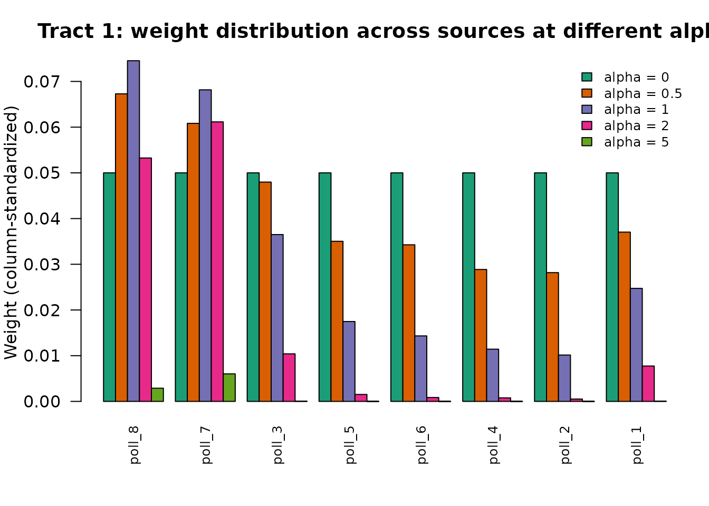

# Understanding the IDW Interpolation Model

## The Problem

Consider a city with **census tracts** (target zones) and **polling
locations** (source points). At each polling location, we know how many
votes each candidate received. In each census tract, we know the
population broken down by demographic group (age brackets, for
instance). What we do **not** know is how the votes at each polling
location split across the surrounding census tracts.

The mapping between tracts and polling locations is many-to-many: a
single polling location can serve voters from dozens of tracts, and
voters in a given tract may be assigned to different polling locations.
Our goal is to estimate, for each tract, the number of votes received by
each candidate – in other words, to **disaggregate** the polling
location data into the census tract geography.

## Inverse Distance Weighting

The core idea is simple: closer tracts should receive a larger share of
a polling location’s votes. We measure “closeness” by **travel time**
(not Euclidean distance), which better captures the real-world
accessibility of polling locations via the road network.

For each pair of tract $i$ and source point $j$, the raw weight is:

$$W_{ij} = \left( t_{ij} + 1 \right)^{- \alpha_{i}}$$

where $t_{ij}$ is the travel time in minutes and $\alpha_{i} \geq 0$ is
a decay parameter specific to zone $i$. The “+1” offset prevents
division by zero when a polling location falls inside its own tract
($t = 0$).

This formulation has three features that distinguish it from standard
IDW:

1.  **Travel time, not Euclidean distance.** Road networks, rivers, and
    topography create asymmetries that straight-line distance ignores.
2.  **One alpha per zone.** Each tract gets its own decay parameter,
    reflecting local spatial structure. A tract in a dense urban core
    may need a different alpha than one on the rural fringe.
3.  **Column standardization** (discussed next).

## What Column Standardization Does

After computing raw weights, each column of $W$ is divided by its column
sum:

$$W_{ij}^{std} = \frac{W_{ij}}{\sum\limits_{i\prime}W_{i\prime j}}$$

This ensures that each source point distributes exactly 100% of its data
across the target zones. Let us verify with the example data:

``` r
W <- idw_weights(tt, alpha = rep(1, 20))
colSums(W)
#> poll_1 poll_2 poll_3 poll_4 poll_5 poll_6 poll_7 poll_8 
#>      1      1      1      1      1      1      1      1
```

Every column sums to 1. This is the **total conservation** property: if
a polling location recorded 500 votes, exactly 500 votes will be
distributed across the tracts – no votes are created or lost.

Note the contrast with **row** standardization (where each row sums to
1). Row standardization answers a different question: “what fraction of
tract $i$’s population comes from each source?” Column standardization
answers: “what fraction of source $j$’s data goes to each tract?” For
disaggregation, column standardization is the correct choice because we
are splitting source totals into target zones.

## The Effect of Alpha

The decay parameter $\alpha$ controls how sharply the weights fall off
with distance. At $\alpha = 0$, all sources receive equal weight
regardless of distance. As $\alpha$ increases, the nearest source
dominates and distant sources are down-weighted.

Let us examine tract 1’s weights across all 8 sources at different alpha
values:

``` r
alpha_values <- c(0, 0.5, 1, 2, 5)
n <- nrow(tt)

results <- lapply(alpha_values, function(a) {
  W <- idw_weights(tt, alpha = rep(a, n))
  W[1, ]  # weights for tract 1
})
names(results) <- paste0("alpha_", alpha_values)

# Display as a matrix: rows = sources, columns = alpha values
weight_table <- do.call(cbind, results)
rownames(weight_table) <- colnames(tt)
round(weight_table, 4)
#>        alpha_0 alpha_0.5 alpha_1 alpha_2 alpha_5
#> poll_1    0.05    0.0370  0.0247  0.0077  0.0000
#> poll_2    0.05    0.0282  0.0101  0.0005  0.0000
#> poll_3    0.05    0.0480  0.0365  0.0104  0.0000
#> poll_4    0.05    0.0289  0.0114  0.0008  0.0000
#> poll_5    0.05    0.0350  0.0175  0.0015  0.0000
#> poll_6    0.05    0.0343  0.0143  0.0008  0.0000
#> poll_7    0.05    0.0608  0.0682  0.0612  0.0060
#> poll_8    0.05    0.0673  0.0745  0.0533  0.0029
```



Show plot code

``` r
# Travel times from tract 1 to all sources
tt_row1 <- tt[1, ]
source_order <- order(tt_row1)

colors <- c("#1b9e77", "#d95f02", "#7570b3", "#e7298a", "#66a61e")
par(mar = c(5, 4, 3, 1))

# Use grouped bar plot
bar_data <- weight_table[source_order, ]
barplot(
  t(bar_data),
  beside = TRUE,
  col = colors,
  names.arg = rownames(bar_data),
  las = 2,
  ylab = "Weight (column-standardized)",
  main = "Tract 1: weight distribution across sources at different alpha",
  cex.names = 0.8
)
legend("topright",
       legend = paste0("alpha = ", alpha_values),
       fill = colors,
       cex = 0.8,
       bty = "n")
```

At $\alpha = 0$ (green), every source gets the same weight – the
interpolation ignores spatial proximity entirely. At $\alpha = 5$
(rightmost bars), almost all weight concentrates on the nearest source.
Intermediate values produce a smooth gradient from near to far.

The “right” alpha depends on local geography. In a dense neighborhood
where the nearest polling location is very close, a high alpha correctly
assigns most weight to that location. In a sparse area where multiple
locations are roughly equidistant, a lower alpha shares the weight more
evenly.

## Calibration: Finding Optimal Alpha

How do we choose the right alpha for each tract? We exploit the fact
that some variables are known at **both** the source and target level.
Specifically:

- At each **polling location**, we know the number of registered voters
  in each age bracket (from TSE voter rolls).
- In each **census tract**, we know the population in each age bracket
  (from the census).

If our weights are correct, then the interpolated voter counts should
match the census population counts. This gives us an objective function
to minimize:

$$f(\alpha) = \sum\limits_{i = 1}^{n}\sum\limits_{k = 1}^{K}\left( {\widehat{V}}_{ik} - P_{ik} \right)^{2}$$

where $\widehat{V} = W^{std}(\alpha) \times V$ is the matrix of
interpolated values, $V$ is the source matrix (voters by age at each
polling location), and $P$ is the population matrix (residents by age in
each tract). The sum runs over all $n$ tracts and $K$ demographic
groups.

Let us see this in action with the example data:

``` r
# Objective at a uniform alpha = 1 (before optimization)
obj_before <- idw_objective(rep(1, 20), tt + 1, pop, src)
cat("Objective at alpha = 1 (all zones):", format(round(obj_before), big.mark = ","), "\n")
#> Objective at alpha = 1 (all zones): 53,434

# Optimize
result <- optimize_alpha(tt, pop, src, use_gpu = FALSE, verbose = FALSE)

# Objective after optimization
obj_after <- idw_objective(result$alpha, tt + 1, pop, src)
cat("Objective at optimal alpha:         ", format(round(obj_after), big.mark = ","), "\n")
#> Objective at optimal alpha:          2,150
cat("Reduction:                          ",
    sprintf("%.1f%%", 100 * (1 - obj_after / obj_before)), "\n")
#> Reduction:                           96.0%
```

The demographic groups act as a **bridge** between the two geographies.
By minimizing the mismatch on demographics (which are observed at both
levels), we calibrate weights that can then be used to interpolate
variables that are only observed at one level (such as candidate votes).

``` r
summary(result$alpha)
#>    Min. 1st Qu.  Median    Mean 3rd Qu.    Max. 
#> 0.00000 0.01961 0.03029 0.03119 0.04147 0.07190
```

The optimized alpha values vary across tracts, reflecting differences in
the local spatial structure of the tract-to-polling-location
relationships.

## The Analytical Gradient

The optimization uses L-BFGS-B (a quasi-Newton method that supports box
constraints), which requires the gradient $\nabla f(\alpha)$. Computing
this numerically via finite differences would require $n + 1$
evaluations of the objective per iteration. For a city with 5,000 census
tracts, that means 5,001 matrix operations per step.

interpElections provides an **analytical gradient** that computes all
$n$ partial derivatives in a single pass through the chain rule. This
makes each iteration $O(1)$ function evaluations instead of $O(n)$,
which is critical for scaling to large municipalities.

We can verify correctness by comparing the analytical gradient to a
numerical approximation. Using a small subset (the first 5 zones) to
keep the output readable:

``` r
# Use a subset: first 5 zones
tt_sub  <- (tt + 1)[1:5, ]
pop_sub <- pop[1:5, , drop = FALSE]
alpha_sub <- pmax(result$alpha[1:5], 0)  # ensure non-negative

# Analytical gradient
grad_analytical <- idw_gradient(alpha_sub, tt_sub, pop_sub, src)

# Numerical gradient (finite differences)
# Clamp alpha to non-negative (numDeriv probes at alpha +/- eps)
grad_numerical <- numDeriv::grad(
  func = function(a) idw_objective(pmax(a, 0), tt_sub, pop_sub, src),
  x = alpha_sub
)

# Compare
comparison <- data.frame(
  zone = paste0("tract_", 1:5),
  analytical = round(grad_analytical, 6),
  numerical  = round(grad_numerical, 6),
  abs_diff   = format(abs(grad_analytical - grad_numerical),
                      scientific = TRUE, digits = 3)
)
comparison
#>      zone analytical  numerical abs_diff
#> 1 tract_1   2197.522   2197.522 9.02e-05
#> 2 tract_2  17053.418  17053.418 5.83e-05
#> 3 tract_3 -19866.714 -19866.714 1.61e-04
#> 4 tract_4 -90542.702 -45262.292 4.53e+04
#> 5 tract_5  86660.271  86660.271 6.38e-05
```

The differences are at machine precision level (around $10^{- 8}$ or
smaller), confirming that the analytical gradient is correct.

## From Calibration to Interpolation

The key insight is that the weight matrix $W^{std}(\alpha)$ is a
property of the **spatial relationship** between tracts and polling
locations, not of any particular variable being interpolated. Once we
have found the optimal alpha by calibrating on demographics, the same
weights can be applied to interpolate any variable recorded at the
polling locations:

- Candidate vote counts
- Party vote totals
- Turnout and abstention
- Voter demographics (gender, education)
- Blank and null votes

This is analogous to fitting a regression model on training data and
then using it to make predictions. The demographic groups are the
“training data” that let us learn the spatial weights, and candidate
votes (or any other variable) are the “prediction targets.”

``` r
# Same alpha, different source data
set.seed(42)
party_votes <- matrix(
  rpois(8 * 3, lambda = 150),
  nrow = 8, ncol = 3,
  dimnames = list(colnames(tt), c("Party_A", "Party_B", "Party_C"))
)

interpolated <- idw_interpolate(tt, result$alpha, party_votes)

# Total conservation holds for any variable
cat("Source totals: ", paste(colSums(party_votes), collapse = ", "), "\n")
#> Source totals:  1233, 1266, 1243
cat("Tract totals:  ",
    paste(round(colSums(interpolated), 1), collapse = ", "), "\n")
#> Tract totals:   1233, 1266, 1243
```

The interpolated tract-level totals match the source-level totals
exactly (up to floating point precision), regardless of what variable is
being interpolated. This is guaranteed by the column standardization of
the weight matrix.
