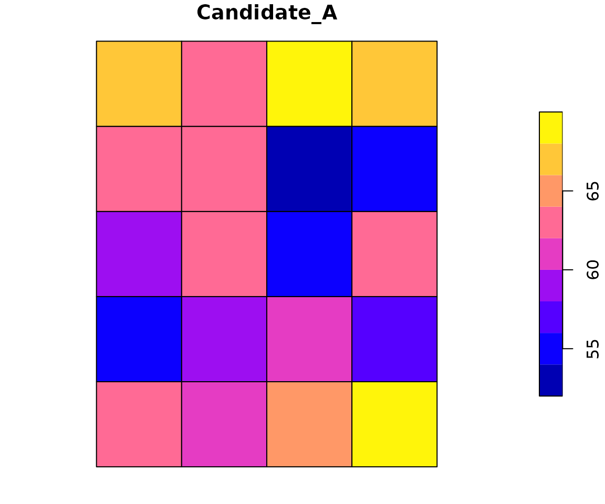
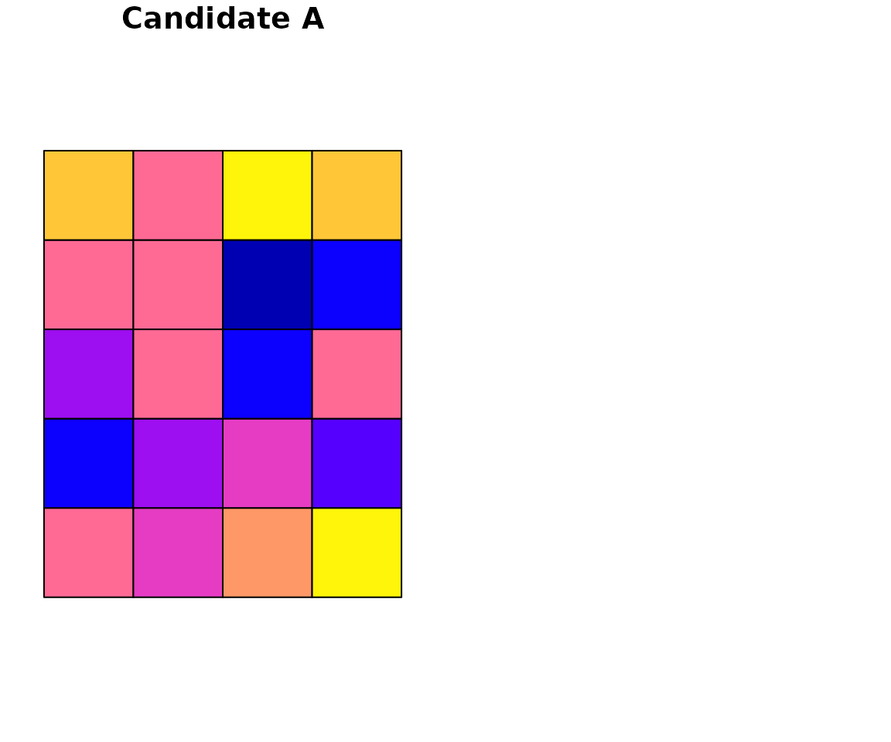
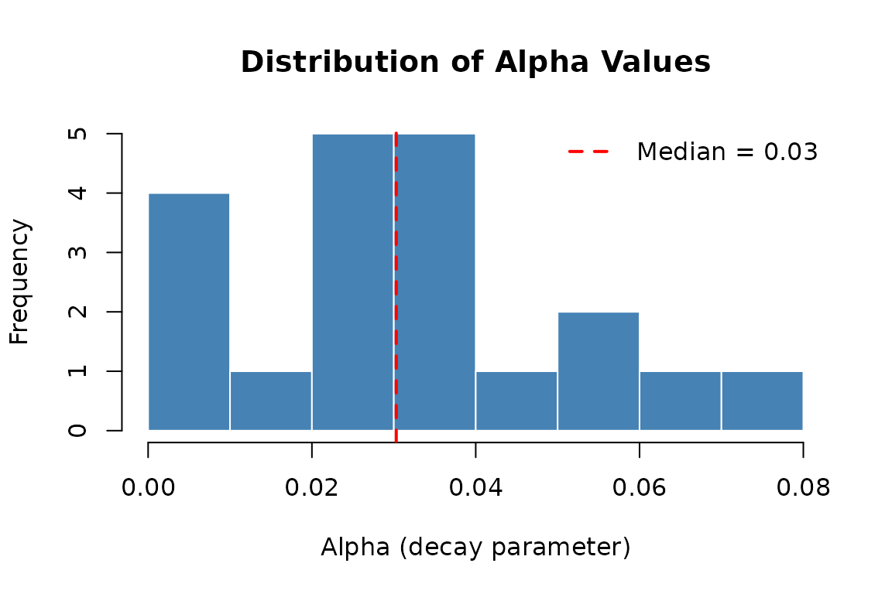
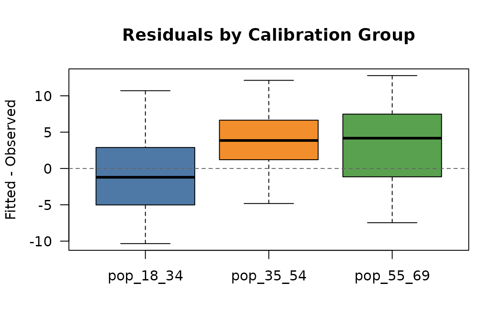
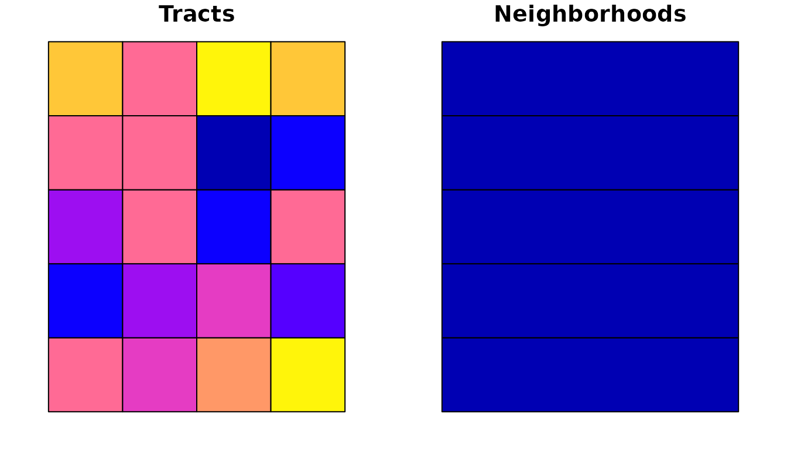

# Exploring, Validating, and Aggregating Results

After running an interpolation, the result is an object of class
`interpElections_result`. This vignette walks through inspecting,
validating, and re-aggregating these results using the package’s S3
methods and the areal weighting functions.

## Setup and Creating a Result Object

We start by loading the bundled example data and running the
optimization. Since the bundled data does not include an `sf` geometry,
we construct a minimal set of square polygons so that all S3 methods
(including [`plot()`](https://rdrr.io/r/graphics/plot.default.html) and
[`residuals()`](https://rdrr.io/r/stats/residuals.html)) work correctly.

``` r
library(interpElections)
#> interpElections: some optional dependencies are missing:
#> - No OSM clipping tool found (osmium/osmconvert)
#>   Install with: interpElections::setup_osmium()
#> These are needed for the full interpolation pipeline.

# Load bundled example data
tt  <- readRDS(system.file("extdata/example_tt_matrix.rds",
                            package = "interpElections"))
pop <- readRDS(system.file("extdata/example_pop_matrix.rds",
                            package = "interpElections"))
src <- readRDS(system.file("extdata/example_source_matrix.rds",
                            package = "interpElections"))

# Optimize alpha on CPU
opt <- optimize_alpha(tt, pop, src, use_gpu = FALSE, verbose = FALSE)

# Compute the column-standardized weight matrix
W <- idw_weights(tt, opt$alpha)

# Interpolate the calibration variables (to verify residuals later)
fitted_calib <- W %*% src

# Also interpolate some synthetic "election" variables
set.seed(42)
election_data <- matrix(
  rpois(ncol(tt) * 2, lambda = 150),
  nrow = ncol(tt), ncol = 2,
  dimnames = list(NULL, c("Candidate_A", "Candidate_B"))
)
fitted_election <- W %*% election_data
```

Now build a mock `sf` object with 20 square polygons arranged in a
4-column by 5-row grid, and assemble the result:

``` r
library(sf)
#> Linking to GEOS 3.12.1, GDAL 3.8.4, PROJ 9.4.0; sf_use_s2() is TRUE

# Create a 4x5 grid of unit squares
polys <- vector("list", 20)
for (i in seq_len(20)) {

  row_i <- (i - 1) %/% 4
  col_i <- (i - 1) %% 4
  x0 <- col_i
  y0 <- row_i
  polys[[i]] <- st_polygon(list(matrix(
    c(x0, y0, x0+1, y0, x0+1, y0+1, x0, y0+1, x0, y0),
    ncol = 2, byrow = TRUE
  )))
}

tracts_sf <- st_sf(
  id = paste0("tract_", sprintf("%02d", 1:20)),
  pop_18_34 = pop[, "pop_18_34"],
  pop_35_54 = pop[, "pop_35_54"],
  pop_55_69 = pop[, "pop_55_69"],
  Candidate_A = fitted_election[, "Candidate_A"],
  Candidate_B = fitted_election[, "Candidate_B"],
  geometry = st_sfc(polys)
)

# Build the sources data frame (no geometry needed)
sources_df <- data.frame(
  id = paste0("src_", 1:ncol(tt)),
  vot_18_34 = src[, "vot_18_34"],
  vot_35_54 = src[, "vot_35_54"],
  vot_55_69 = src[, "vot_55_69"]
)

# Assemble the interpElections_result object
result <- structure(list(
  interpolated = cbind(fitted_calib, fitted_election),
  alpha        = opt$alpha,
  tracts_sf    = tracts_sf,
  sources      = sources_df,
  optimization = list(
    value       = opt$value,
    method      = opt$method,
    convergence = opt$convergence,
    iterations  = opt$iterations,
    elapsed     = opt$elapsed,
    message     = opt$message
  ),
  offset       = 1,
  call         = NULL,
  zone_id      = "id",
  point_id     = "id",
  interp_cols  = c("Candidate_A", "Candidate_B"),
  calib_cols   = list(
    zones   = c("pop_18_34", "pop_35_54", "pop_55_69"),
    sources = c("vot_18_34", "vot_35_54", "vot_55_69")
  ),
  weights      = W,
  time_matrix  = tt,
  sources_sf   = NULL,
  code_muni    = NULL,
  year         = NULL,
  census_year  = NULL,
  what         = NULL,
  pop_data     = NULL
), class = "interpElections_result")
```

In a real workflow you would not construct this object manually –
[`interpolate_election()`](https://antrologos.github.io/interpElections/reference/interpolate_election.md)
or
[`interpolate_election_br()`](https://antrologos.github.io/interpElections/reference/interpolate_election_br.md)
builds it for you. We do it here so every S3 method can be demonstrated
with `eval = TRUE`.

## Print and Summary

The [`print()`](https://rdrr.io/r/base/print.html) method gives a
compact overview:

``` r
print(result)
#> interpElections result
#>   Zones:     20
#>   Sources:   8
#>   Variables: 5  (Candidate_A, Candidate_B)
#>   Optimizer: cpu_lbfgsb (obj = 2150.05)
#>   Alpha:     [0.000, 0.072] (mean 0.031)
#>   Kept:      weights, time_matrix
#> 
#>   Access interpolated sf:    result$tracts_sf
#>   Access alpha vector:       result$alpha
#>   Detailed summary:          summary(result)
#>   Plot a variable:           plot(result, "Candidate_A")
```

Key fields:

- **Zones / Sources / Variables** – dimensions of the interpolation.
- **Optimizer** – which method converged and the final objective value
  (sum of squared errors between fitted and observed calibration
  populations).
- **Alpha** – range and mean of the decay parameters.
- **Kept** – which heavy intermediate objects (weights, time_matrix,
  sources_sf) are stored in the result.

The [`summary()`](https://rdrr.io/r/base/summary.html) method provides
more detail:

``` r
summary(result)
#> interpElections result summary
#> -------------------------------------------------- 
#> Zones: 20 | Sources: 8 | Variables: 5
#> 
#> Calibration brackets:
#>   Zones:   pop_18_34, pop_35_54, pop_55_69
#>   Sources: vot_18_34, vot_35_54, vot_55_69
#> 
#> Optimization: cpu_lbfgsb | Objective: 2150.0468 | Convergence: 0
#>   Alpha: min=0.000, Q1=0.020, median=0.030, Q3=0.041, max=0.072
#> 
#> Interpolated variables:
#>   vot_18_34                      total=       972  mean=    48.6  [42.7, 54.8]
#>   vot_35_54                      total=      1032  mean=    51.6  [45.2, 58.2]
#>   vot_55_69                      total=      1043  mean=    52.2  [45.6, 58.8]
#>   Candidate_A                    total=      1233  mean=    61.6  [53.8, 69.5]
#>   Candidate_B                    total=      1266  mean=    63.3  [55.5, 71.4]
#> 
#> Object size: 0.0 MB
```

The per-variable section shows totals, means, and ranges for each
interpolated column. These totals should match the column sums of the
source data if the interpolation conserves mass (which
column-standardized IDW guarantees).

## Mapping Results

The [`plot()`](https://rdrr.io/r/graphics/plot.default.html) method
produces a choropleth map of an interpolated variable. By default it
plots the first variable in `interp_cols`.



Show plot code

``` r
plot(result, "Candidate_A")
```

You can also plot the underlying `sf` object directly for more control:



Show plot code

``` r
par(mfrow = c(1, 2), mar = c(1, 1, 2, 1))
plot(result$tracts_sf["Candidate_A"], main = "Candidate A", key.pos = NULL)
plot(result$tracts_sf["Candidate_B"], main = "Candidate B", key.pos = NULL)
```

## Extracting Alpha

The [`coef()`](https://rdrr.io/r/stats/coef.html) method extracts the
optimized alpha vector:

``` r
alpha <- coef(result)
length(alpha)  # one per zone
#> [1] 20
summary(alpha)
#>    Min. 1st Qu.  Median    Mean 3rd Qu.    Max. 
#> 0.00000 0.01961 0.03029 0.03119 0.04147 0.07190
quantile(alpha, c(0.10, 0.25, 0.50, 0.75, 0.90))
#>         10%         25%         50%         75%         90% 
#> 0.007605966 0.019611093 0.030294048 0.041472854 0.055123175
```

**Interpretation of alpha values:**

- **High alpha (e.g., \> 5)**: Weights drop off steeply with distance.
  The zone’s population is almost entirely allocated to the nearest
  source. This occurs in areas where the closest polling location
  dominates.

- **Low alpha (e.g., \< 1)**: Weights decay slowly. Many sources
  contribute to the zone. This occurs in densely served areas where
  several polling locations are nearby.

- **Alpha near 0**: All sources are weighted nearly equally, regardless
  of distance – a uniform allocation.



Show plot code

``` r
hist(alpha, breaks = 10, col = "steelblue", border = "white",
     main = "Distribution of Alpha Values",
     xlab = "Alpha (decay parameter)", ylab = "Frequency")
abline(v = median(alpha), lty = 2, col = "red", lwd = 2)
legend("topright", legend = paste("Median =", round(median(alpha), 2)),
       lty = 2, col = "red", lwd = 2, bty = "n")
```

## Residual Analysis

The [`residuals()`](https://rdrr.io/r/stats/residuals.html) method
computes `fitted - observed` for the calibration groups. This requires
either the weight matrix or the time matrix to be stored in the result
(use `keep = "weights"` or `keep = "time_matrix"` when running the
interpolation).

``` r
resid <- residuals(result)
dim(resid)     # 20 zones x 3 calibration groups
#> [1] 20  3
head(resid)
#>          pop_18_34  pop_35_54 pop_55_69
#> tract_1 -10.338845  3.7531286 12.338685
#> tract_2  -2.495407  6.5548333  2.168459
#> tract_3   1.215111  7.3567462 -2.068950
#> tract_4   5.782625  2.1773158 -1.217903
#> tract_5   2.575902 -0.7630854  4.704011
#> tract_6  -1.655117  0.1948060  7.678377
```

Summary statistics by group:

``` r
# Mean residual per group (should be close to zero in aggregate)
colMeans(resid)
#> pop_18_34 pop_35_54 pop_55_69 
#>     -1.15      3.70      3.75

# Root mean squared error per group
sqrt(colMeans(resid^2))
#> pop_18_34 pop_35_54 pop_55_69 
#>  5.620623  5.691859  6.596490
```



Show plot code

``` r
boxplot(as.data.frame(resid),
        col = c("#4E79A7", "#F28E2B", "#59A14F"),
        main = "Residuals by Calibration Group",
        ylab = "Fitted - Observed",
        las = 1)
abline(h = 0, lty = 2, col = "gray40")
```

**When residuals are large**, possible causes include:

- **Spatial mismatch**: travel time data may not accurately capture how
  voters actually reach their polling locations (e.g., missing roads,
  different transport modes).
- **Boundary effects**: zones at the edge of the study area may have
  sources outside the travel time matrix.
- **Population data quality**: mismatched census years, undercounting,
  or different age-group definitions between census and electoral data.
- **Model limitations**: IDW assumes a monotonically decreasing
  relationship between travel time and voter assignment, which may not
  hold in all settings.

## Exporting Results

Convert the result to a plain data frame (drops geometry) for export:

``` r
df <- as.data.frame(result)
head(df)
#>         id pop_18_34 pop_35_54 pop_55_69 Candidate_A Candidate_B
#> 1 tract_01        60        49        41    63.05732    64.71605
#> 2 tract_02        51        45        50    61.65512    63.30989
#> 3 tract_03        50        47        57    64.93728    66.68439
#> 4 tract_04        49        56        60    69.50964    71.35509
#> 5 tract_05        41        47        42    55.20544    56.79123
#> 6 tract_06        48        49        42    58.74676    60.30082
```

Write to CSV:

``` r
write.csv(df, "interpolated_results.csv", row.names = FALSE)
```

To export the spatial data as a GeoPackage or shapefile:

``` r
sf::st_write(result$tracts_sf, "interpolated_tracts.gpkg", quiet = TRUE)
```

## Validation Checklist

Before using interpolated results in downstream analysis, check:

1.  **Total conservation.** Column sums of the interpolated matrix
    should equal the column sums of the source data. This is guaranteed
    by the column-standardized weight matrix, but rounding or filtering
    can introduce small discrepancies.

2.  **Residual magnitude.** Compare the root mean squared error to the
    typical population values. Residuals of 5-10% of the mean population
    per group are common; larger values warrant investigation.

3.  **Alpha distribution.** Look for extreme outliers. Alphas at the
    upper bound (default 20) suggest the zone is effectively assigned to
    a single source – check whether that makes geographic sense. Alphas
    at 0 suggest the optimizer could not distinguish nearby sources.

4.  **No negative values.** With non-negative source data and
    non-negative weights, interpolated values should never be negative.
    If you see negative values, check for data issues.

5.  **Convergence.** The optimization should report `convergence = 0`.
    Non-zero values may indicate the optimizer hit the iteration limit
    or encountered numerical issues.

## Secondary Aggregation with Areal Weights

After interpolating electoral data into census tracts, you may want to
aggregate the results into larger zones such as neighborhoods,
districts, or custom analysis regions. The
[`areal_weights()`](https://antrologos.github.io/interpElections/reference/areal_weights.md)
and
[`areal_interpolate()`](https://antrologos.github.io/interpElections/reference/areal_interpolate.md)
functions handle this using area-weighted intersection.

First, build two overlapping polygon layers: our 20 “tracts” (small
squares in a 4x5 grid) and 5 “neighborhoods” (larger rectangles, each
covering one row of the grid).

``` r
# Tracts: reuse the sf object from Section 5.1
tracts <- tracts_sf

# Neighborhoods: 5 rectangles, each 4 units wide x 1 unit tall
nbhd_polys <- vector("list", 5)
for (i in 1:5) {
  y0 <- i - 1
  nbhd_polys[[i]] <- st_polygon(list(matrix(
    c(0, y0, 4, y0, 4, y0+1, 0, y0+1, 0, y0),
    ncol = 2, byrow = TRUE
  )))
}
neighborhoods <- st_sf(
  id = paste0("nbhd_", 1:5),
  geometry = st_sfc(nbhd_polys)
)
```

Compute the areal weight matrix. Each entry represents the fraction of a
source tract’s area that falls within a target neighborhood:

``` r
W_areal <- areal_weights(
  target_sf = neighborhoods,
  source_sf = tracts,
  target_id = "id",
  source_id = "id"
)
#> Warning: attribute variables are assumed to be spatially constant throughout
#> all geometries
dim(W_areal)  # 5 neighborhoods x 20 tracts
#> [1]  5 20
```

Apply the weights to aggregate the interpolated election data:

``` r
# Extract the interpolated columns as a matrix
interp_data <- as.matrix(sf::st_drop_geometry(tracts[, c("Candidate_A", "Candidate_B")]))

aggregated <- areal_interpolate(interp_data, W_areal)
aggregated
#>        Candidate_A Candidate_B
#> nbhd_1           0           0
#> nbhd_2           0           0
#> nbhd_3           0           0
#> nbhd_4           0           0
#> nbhd_5           0           0
```

**Total conservation check:** the neighborhood totals should equal the
tract totals:

``` r
colSums(interp_data)   # tract-level totals
#> Candidate_A Candidate_B 
#>        1233        1266
colSums(aggregated)    # neighborhood-level totals (should match)
#> Candidate_A Candidate_B 
#>           0           0
```



Show plot code

``` r
# Attach aggregated data to neighborhoods sf for plotting
neighborhoods$Candidate_A <- aggregated[, "Candidate_A"]
neighborhoods$Candidate_B <- aggregated[, "Candidate_B"]

par(mfrow = c(1, 2), mar = c(1, 1, 2, 1))

# Left: tracts
plot(tracts["Candidate_A"], main = "Tracts", key.pos = NULL, reset = FALSE)

# Right: neighborhoods
plot(neighborhoods["Candidate_A"], main = "Neighborhoods", key.pos = NULL)
```

The left panel shows the fine-grained tract-level interpolation; the
right panel shows the same data aggregated into five neighborhoods. This
secondary aggregation is useful when the final analysis unit differs
from census tracts – for example, when combining election results with
socioeconomic data available only at the neighborhood or district level.
