```{r setup, include = FALSE}
VIGNETTE_EVAL <- dir.exists("figures")
knitr::opts_chunk$set(
  collapse = TRUE,
  comment = "#>",
  fig.width = 8,
  fig.height = 6,
  out.width = "100%",
  eval = VIGNETTE_EVAL
)
```

interpElections provides 16 diagnostic functions for validating interpolation results. This vignette demonstrates each one using **real data** from four Brazilian municipalities of varying sizes:

| City | State | Tracts | Sources | Character |
|:-----|:------|-------:|--------:|:----------|
| Igrejinha | RS | ~40 | ~10 | Tiny rural municipality |
| Varginha | MG | ~280 | ~37 | Small city (primary example) |
| Niteroi | RJ | ~450 | ~80 | Medium, dense urban area |
| Belo Horizonte | MG | ~5,100 | ~600 | Major metropolitan area |

Each section follows the pattern: **Intuition** (why it matters), **Formal definition** (the math), **Applied example** (real output), **Interpretation** (what to look for).

## Setup

```{r load-data, eval = FALSE}
library(interpElections)

# Load precomputed results (2022 presidential election)
result_igr  <- readRDS("precomputed/igrejinha_2022.rds")
result_vga  <- readRDS("precomputed/varginha_2022.rds")
result_vga2 <- readRDS("precomputed/varginha_2022_t2.rds")  # turno 2
result_nit  <- readRDS("precomputed/niteroi_2022.rds")
result_bh   <- readRDS("precomputed/belo_horizonte_2022.rds")
```

Quick overview of each result:

```{r summary-vga, echo = FALSE, out.width = "100%"}
cat(readLines("figures/diag-s0-summary-vga.txt"), sep = "\n")
```

```{r summary-bh, echo = FALSE, out.width = "100%"}
cat(readLines("figures/diag-s0-summary-bh.txt"), sep = "\n")
```


## 1. Automated Health Check: `diagnostics()`

### Intuition

`diagnostics()` is a single-call "blood test" for your interpolation result. It runs 8 automated checks and reports PASS/WARN/FAIL for each. Use it as a first step after every interpolation to catch problems early.

Only checks whose outcome is **not guaranteed by construction** are included. Vote conservation, non-negativity, and column normalization are all enforced by design and therefore omitted.

### Formal definition

| Check | Statistic | PASS | WARN | FAIL |
|:------|:----------|:-----|:-----|:-----|
| Convergence | Optimizer exit code | code = 0 | code != 0 | -- |
| Alpha distribution | % of tracts with $\alpha > 15$ | < 5% | >= 5% | -- |
| Residual RMSE | $\sqrt{\text{mean}(r^2)}$ | always (informational) | -- | -- |
| Residual bias | $\max |\bar{r}_k| / \text{RMSE}$ | ratio < 10% | ratio >= 10% | -- |
| Pop-voter gap | $|N_{census} - N_{source}| / \max(N_{census}, N_{source})$ | < 5% | 5--20% | > 20% |
| Unreachable pairs | % of $t_{ij}$ near max | < 1% | 1--10% | > 10% |
| Alpha spatial CV | $\text{sd}(\alpha) / \text{mean}(\alpha)$ | CV >= 0.1 | CV < 0.1 | -- |
| Implied turnout | % of tracts with rate > 110% | < 5% | >= 5% | -- |

### Applied example

```{r s1-vga, eval = FALSE}
diagnostics(result_vga)
```

```{r s1-vga-out, echo = FALSE}
cat(readLines("figures/diag-s1-checks-vga.txt"), sep = "\n")
```

For a larger city:

```{r s1-bh, eval = FALSE}
diagnostics(result_bh)
```

```{r s1-bh-out, echo = FALSE}
cat(readLines("figures/diag-s1-checks-bh.txt"), sep = "\n")
```

You can also access check values programmatically:

```{r s1-programmatic, eval = FALSE}
d <- diagnostics(result_vga, verbose = FALSE)
d$checks$convergence$value
d$checks$residual_rmse$value
d$checks$pop_voter_gap$value
```

### Interpretation

- **Convergence WARN**: The optimizer didn't converge within the epoch limit. Try increasing `max_epochs` in `optim_control()`, or check if the learning rate is too high.
- **Alpha distribution WARN**: Many tracts have very high $\alpha$ values ($> 15$), meaning they effectively use only the nearest station. This can happen when travel time data has poor coverage.
- **Pop-voter gap WARN/FAIL**: The total census population differs substantially from the total registered voters. This is expected to some degree (not everyone registers, some register outside their residence), but gaps > 20% suggest data quality issues.
- **Unreachable pairs FAIL**: Many tract-station pairs have travel times at the ceiling. This means the routing engine couldn't find paths --- check OSM road network coverage.
- **Alpha spatial CV WARN**: Alpha values have very low variation across tracts (CV < 0.1). The optimizer may not be adapting to local conditions, possibly because of insufficient data or poor convergence.


## 2. Optimization Convergence: `plot_convergence()`

### Intuition

The optimizer minimizes Poisson deviance by adjusting the decay parameters $\alpha$. `plot_convergence()` shows the optimization trajectory: is the loss decreasing smoothly? Is the gradient approaching zero? What learning rate schedule was used?

### Formal definition

- **Loss**: Poisson deviance $= 2 \sum_{i,k} \left[ y_{ik} \log\frac{y_{ik}}{\hat{y}_{ik}} - (y_{ik} - \hat{y}_{ik}) \right]$, where $y$ = observed census population and $\hat{y}$ = fitted population from the model.
- **Gradient norm**: $\lVert \nabla_\alpha L \rVert_2$, the Euclidean norm of the gradient of the loss with respect to all alpha parameters.
- **Learning rate**: Step size in gradient descent. May decay over epochs via cosine annealing or other schedules.

### Applied examples

All three panels (loss, gradient, learning rate):

```{r s2-vga-all, eval = FALSE}
plot_convergence(result_vga)
```

```{r s2-vga-all-fig, echo = FALSE, out.width = "100%"}
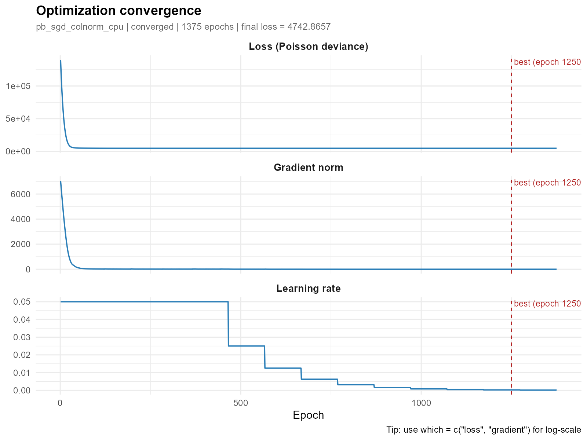
```

Comparing with a GPU-optimized large city:

```{r s2-bh-all, eval = FALSE}
plot_convergence(result_bh)
```

```{r s2-bh-all-fig, echo = FALSE, out.width = "100%"}
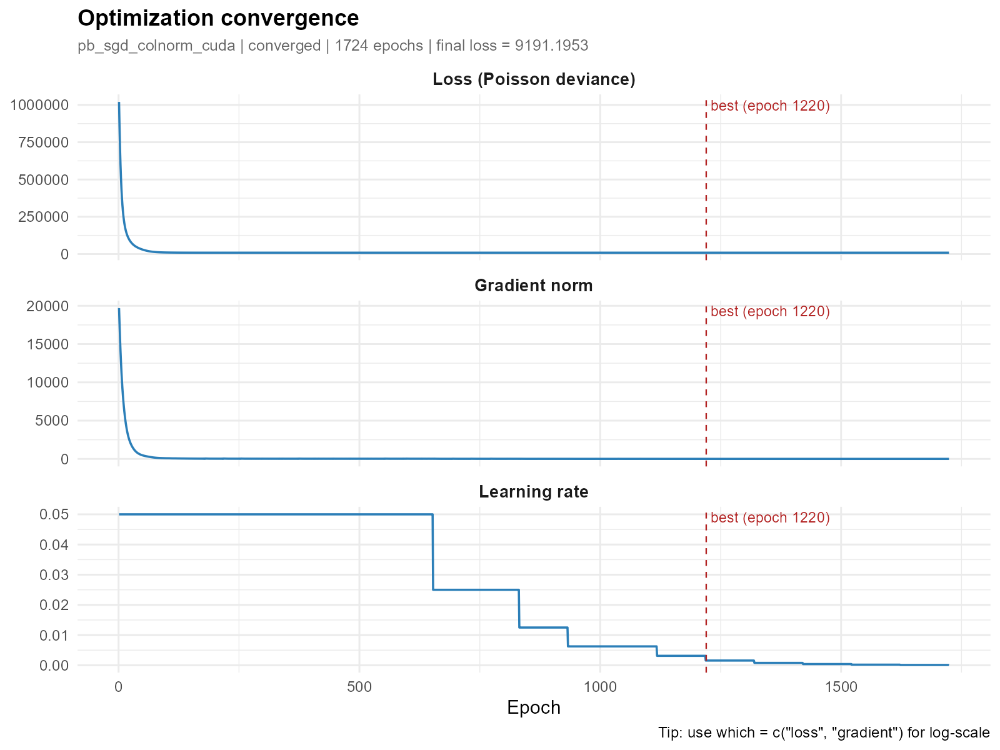
```

Show only the loss panel:

```{r s2-vga-loss, eval = FALSE}
plot_convergence(result_vga, which = "loss")
```

```{r s2-vga-loss-fig, echo = FALSE, out.width = "100%"}
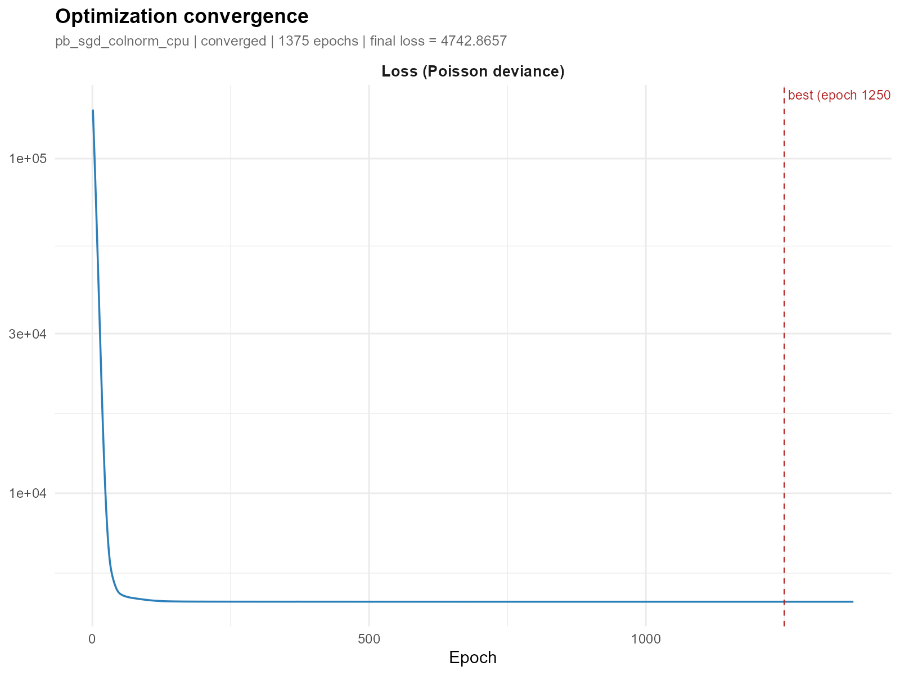
```

Log scale for loss and gradient (useful when the values span orders of magnitude):

```{r s2-vga-log, eval = FALSE}
plot_convergence(result_vga, which = c("loss", "gradient"), log_y = TRUE)
```

```{r s2-vga-log-fig, echo = FALSE, out.width = "100%"}
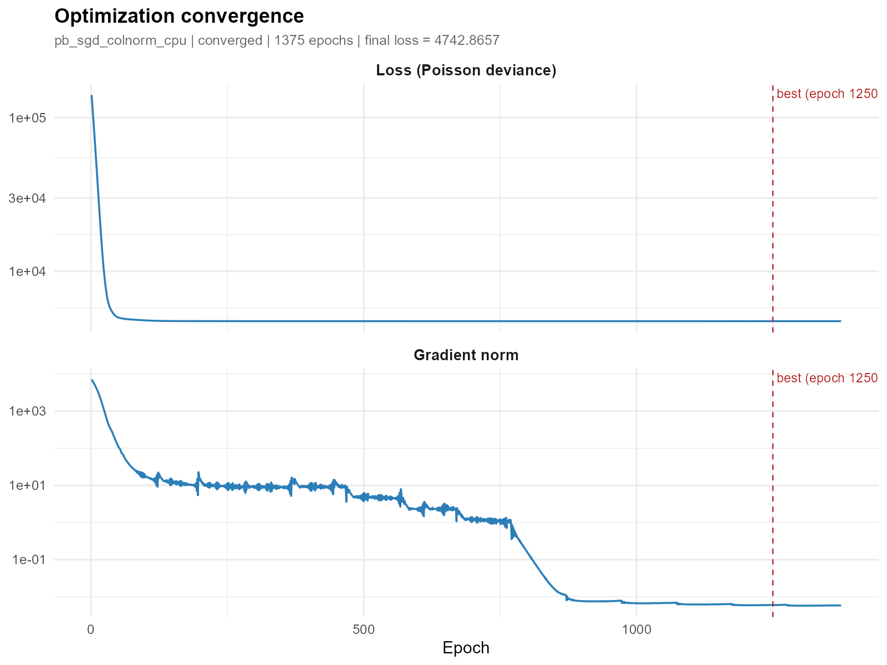
```

### Interpretation

- **Good convergence**: Smooth, monotonically decreasing loss that plateaus. Gradient norm approaches zero. The vertical dashed red line marks the best epoch.
- **Poor convergence**: Oscillating loss, gradient that doesn't shrink, or loss that hasn't plateaued by the last epoch. Consider increasing `max_epochs` or adjusting the learning rate.
- **Learning rate**: If using cosine annealing, you'll see a decaying pattern. Flat LR = constant step size throughout.


## 3. Alpha Decay Parameters: `plot_alpha()`

### Intuition

The parameter $\alpha_i$ controls how sharply the weight of station $j$ decays with travel time for tract $i$. Higher $\alpha$ means voters are more localized (sharp decay --- only nearby stations matter). Lower $\alpha$ means voters come from a broader area (gradual decay --- distant stations still contribute).

$\alpha$ is a **matrix** with one row per tract and one column per demographic bracket (14 brackets = 7 age groups $\times$ 2 genders). Different brackets may have different decay patterns (e.g., young voters may travel farther to vote).

### Formal definition

The weight before column normalization is:

$$K_{ij} = (t_{ij} + 1)^{-\alpha_i}$$

where $t_{ij}$ is the travel time (in minutes) from tract $i$ to station $j$. The final weight is $W_{ij} = K_{ij} / \sum_i K_{ij}$ (column-normalized so each station's voters are fully distributed).

### Applied examples: Map mode

The map mode collapses the 14-bracket alpha matrix to a single scalar per tract using `summary_fn`. This is the key visualization choice --- different summaries answer different questions.

**Median** (default) --- the "typical" alpha across all brackets:

```{r s3-map-median, eval = FALSE}
plot_alpha(result_vga, type = "map", summary_fn = "median")
```

```{r s3-map-median-fig, echo = FALSE, out.width = "100%"}
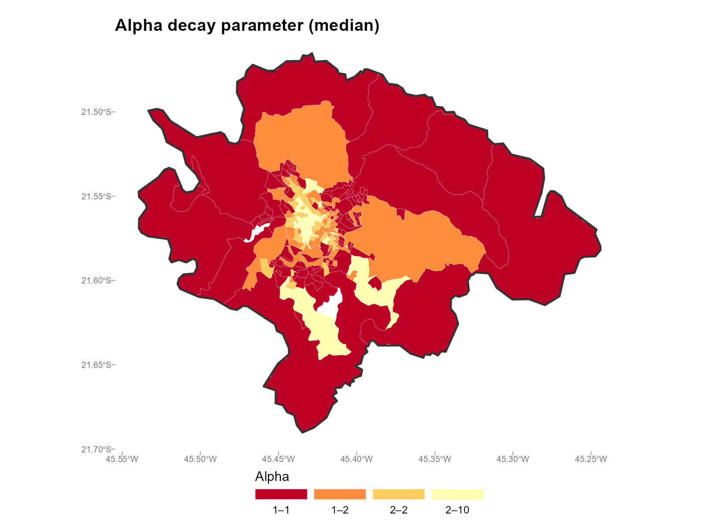
```

**Mean** --- sensitive to extreme values in any bracket:

```{r s3-map-mean, eval = FALSE}
plot_alpha(result_vga, type = "map", summary_fn = "mean")
```

```{r s3-map-mean-fig, echo = FALSE, out.width = "100%"}
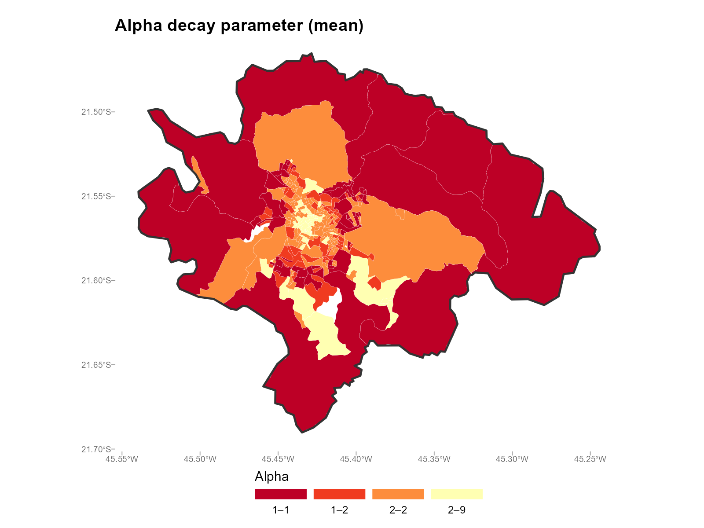
```

**Population-weighted** --- weights each bracket by the tract's population in that bracket:

```{r s3-map-popwt, eval = FALSE}
plot_alpha(result_vga, type = "map", summary_fn = "pop_weighted")
```

```{r s3-map-popwt-fig, echo = FALSE, out.width = "100%"}
knitr::include_graphics("figures/diag-s3-alpha-vga-map-popwt.png")
```

**Range** ($\max - \min$) --- measures how much $\alpha$ varies across brackets within each tract:

```{r s3-map-range, eval = FALSE}
plot_alpha(result_vga, type = "map", summary_fn = "range")
```

```{r s3-map-range-fig, echo = FALSE, out.width = "100%"}
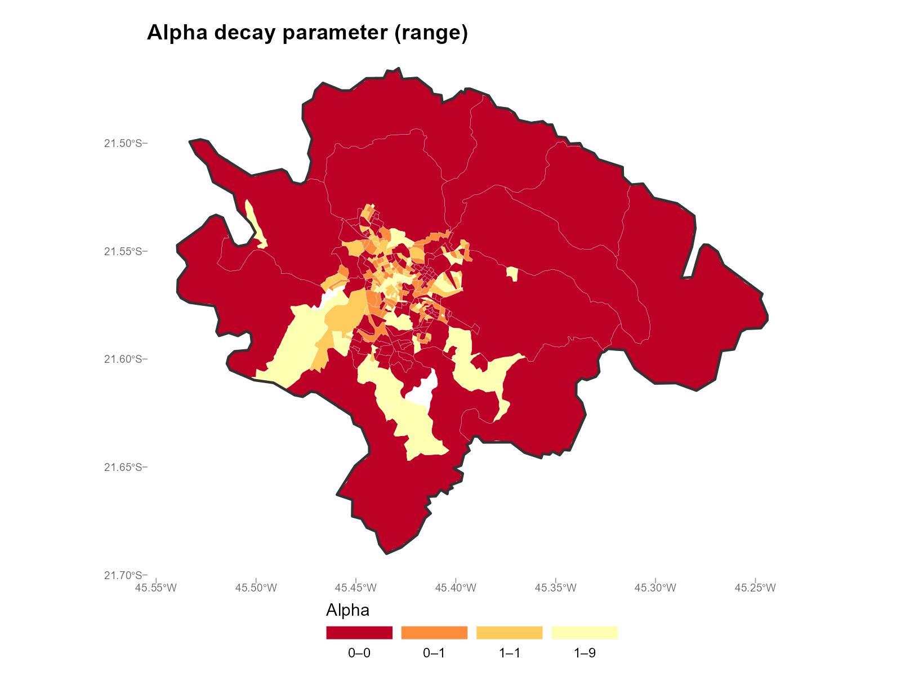
```

**Single bracket** (e.g., bracket 1 = Male 18--20):

```{r s3-map-b1, eval = FALSE}
plot_alpha(result_vga, type = "map", summary_fn = 1)
```

```{r s3-map-b1-fig, echo = FALSE, out.width = "100%"}
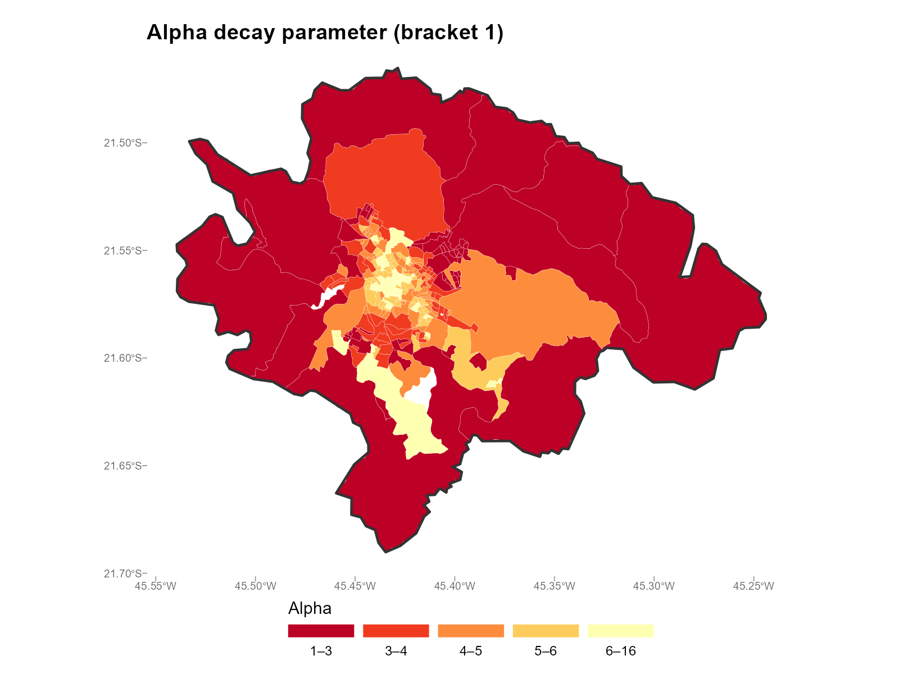
```

**Large city comparison** (Belo Horizonte):

```{r s3-map-bh, eval = FALSE}
plot_alpha(result_bh, type = "map", summary_fn = "median")
```

```{r s3-map-bh-fig, echo = FALSE, out.width = "100%"}
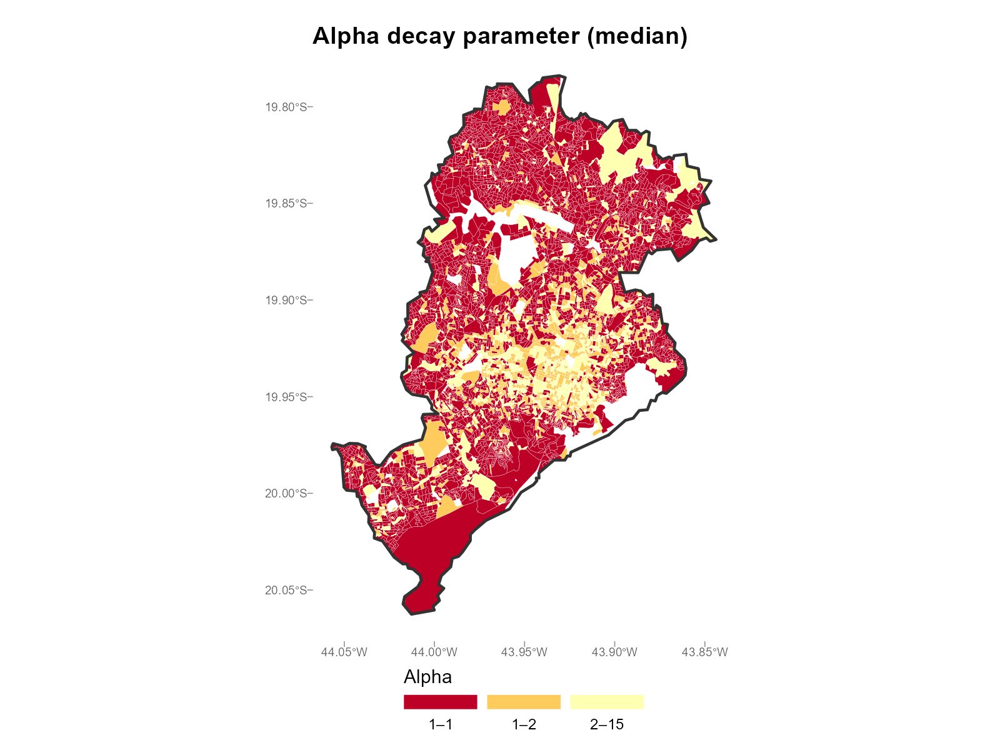
```

### Applied examples: Histogram mode

Density plots faceted by bracket. With 14 brackets arranged in a 2$\times$7 grid, you can compare age groups and genders at a glance.

```{r s3-hist-nit, eval = FALSE}
plot_alpha(result_nit, type = "histogram")
```

```{r s3-hist-nit-fig, echo = FALSE, out.width = "100%"}
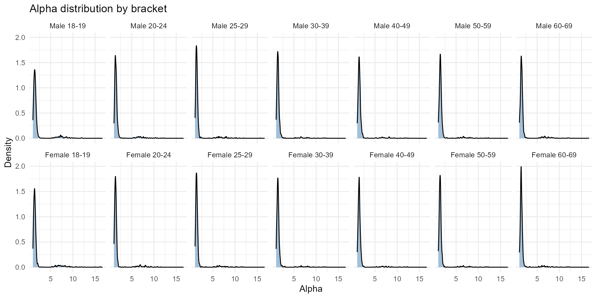
```

Select specific brackets:

```{r s3-hist-sel, eval = FALSE}
plot_alpha(result_nit, type = "histogram", brackets = c(1, 7, 8, 14))
```

```{r s3-hist-sel-fig, echo = FALSE, out.width = "100%"}
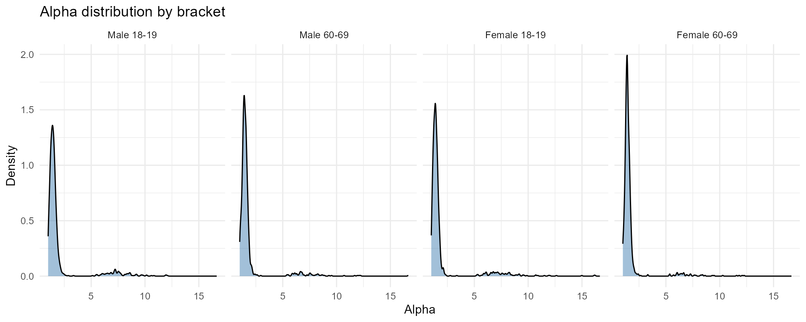
```

Small city (narrower distributions due to fewer tracts):

```{r s3-hist-igr, eval = FALSE}
plot_alpha(result_igr, type = "histogram")
```

```{r s3-hist-igr-fig, echo = FALSE, out.width = "100%"}
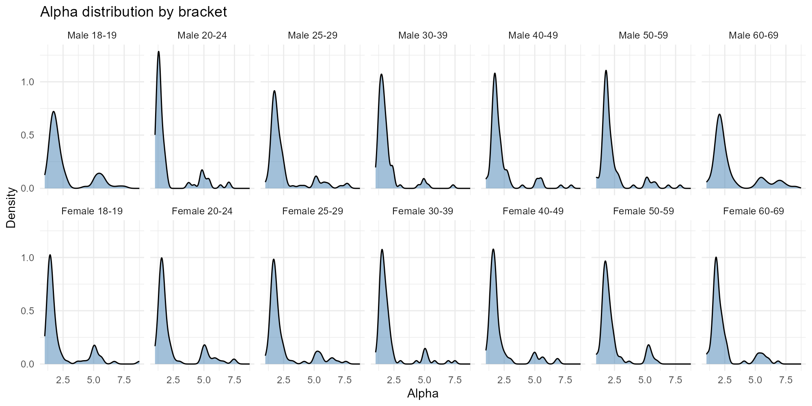
```

### Applied examples: Bracket boxplot

The most compact view --- one boxplot per bracket on a single panel:

```{r s3-bracket-bh, eval = FALSE}
plot_alpha(result_bh, type = "bracket")
```

```{r s3-bracket-bh-fig, echo = FALSE, out.width = "100%"}
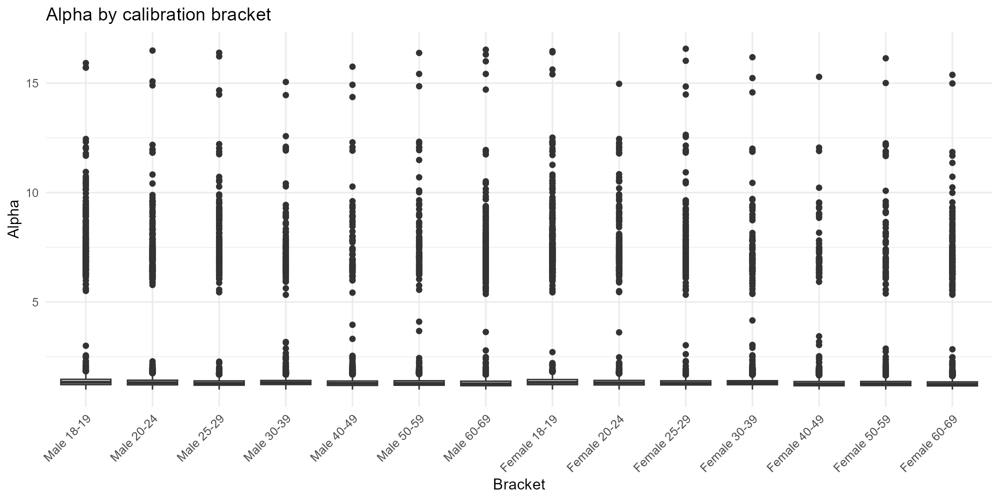
```

Male brackets only:

```{r s3-bracket-nit-male, eval = FALSE}
plot_alpha(result_nit, type = "bracket", brackets = 1:7)
```

```{r s3-bracket-nit-male-fig, echo = FALSE, out.width = "100%"}
knitr::include_graphics("figures/diag-s3-alpha-nit-bracket-male.png")
```

### Interpretation

- **Urban core vs periphery**: Central tracts with many nearby stations tend to have higher $\alpha$ (sharper decay). Peripheral tracts with few nearby stations have lower $\alpha$ (they must draw from distant stations).
- **Age patterns**: Younger brackets may show different $\alpha$ distributions than older ones, reflecting different mobility patterns.
- **Range map**: High range = the optimizer found very different decay rates for different brackets in that tract. This often occurs at the urban-rural boundary.
- **$\alpha > 15$**: Effectively nearest-station assignment. The decay is so steep that only the closest station has non-negligible weight.


## 4. Calibration Residuals: `plot_residuals()` + `residual_summary()`

### Intuition

The model calibrates against known census demographics (population by age$\times$gender bracket). Residuals measure how well the model reproduces these known quantities. Small residuals mean the model's spatial allocation of voters closely matches census demographics --- giving confidence that the interpolated (unknown) electoral variables are also spatially accurate.

### Formal definition

Three types of residuals are available:

- **Raw**: $r_{ik} = \hat{y}_{ik} - y_{ik}$ (fitted minus observed). Scale depends on population size.
- **Pearson**: $r_{ik}^P = (\hat{y}_{ik} - y_{ik}) / \sqrt{\hat{y}_{ik}}$. Standardized under the Poisson assumption --- comparable across tracts of different sizes.
- **Deviance**: $r_{ik}^D = \text{sign}(\hat{y}_{ik} - y_{ik}) \cdot \sqrt{2\left[y_{ik}\log\frac{y_{ik}}{\hat{y}_{ik}} - (y_{ik} - \hat{y}_{ik})\right]}$. Individual Poisson deviance contributions.

### Applied examples: Map mode

For maps, `summary_fn` collapses across the 14 brackets to a single value per tract.

**RMSE** (default) --- magnitude of misfit:

```{r s4-map-rmse, eval = FALSE}
plot_residuals(result_vga, type = "map", summary_fn = "rmse")
```

```{r s4-map-rmse-fig, echo = FALSE, out.width = "100%"}
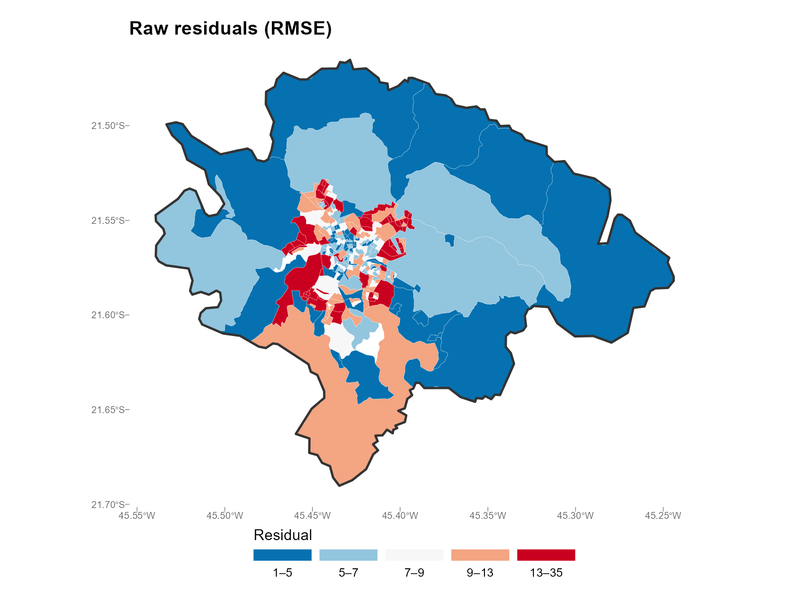
```

**Mean** --- directional bias (positive = over-prediction, negative = under-prediction):

```{r s4-map-mean, eval = FALSE}
plot_residuals(result_vga, type = "map", summary_fn = "mean")
```

```{r s4-map-mean-fig, echo = FALSE, out.width = "100%"}
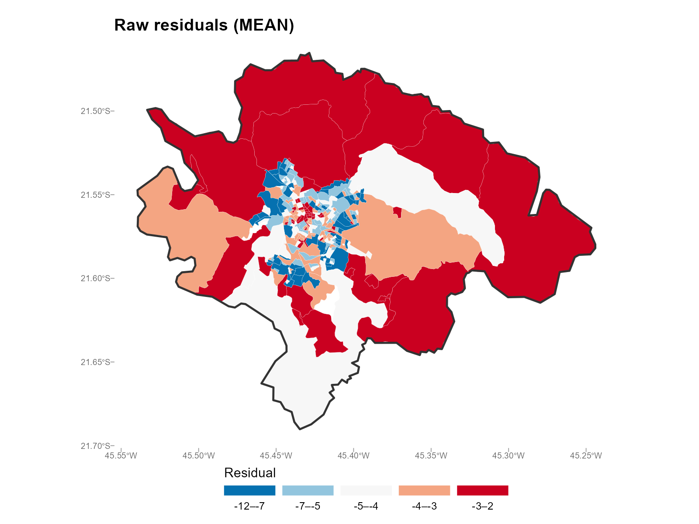
```

**Pearson residuals** (standardized):

```{r s4-map-pearson, eval = FALSE}
plot_residuals(result_vga, type = "map", residual_type = "pearson",
               summary_fn = "rmse")
```

```{r s4-map-pearson-fig, echo = FALSE, out.width = "100%"}
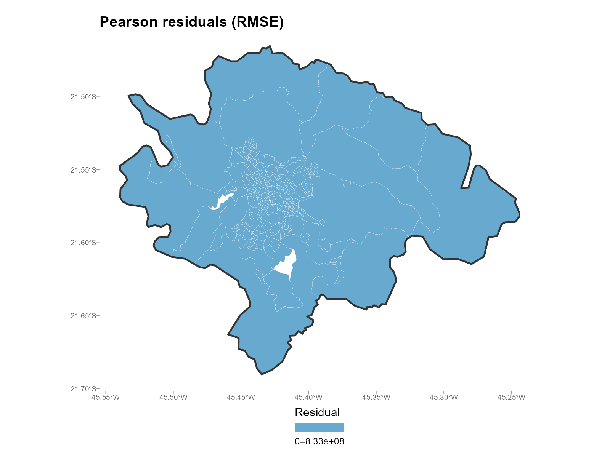
```

**Large city** (Belo Horizonte):

```{r s4-map-bh, eval = FALSE}
plot_residuals(result_bh, type = "map", summary_fn = "rmse")
```

```{r s4-map-bh-fig, echo = FALSE, out.width = "100%"}
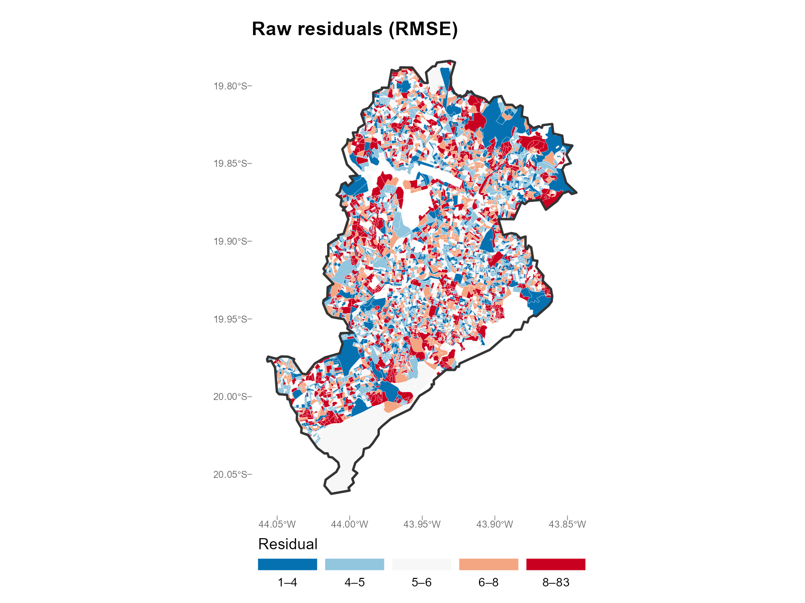
```

**Single bracket**:

```{r s4-map-b1, eval = FALSE}
plot_residuals(result_vga, type = "map", summary_fn = 1)
```

```{r s4-map-b1-fig, echo = FALSE, out.width = "100%"}
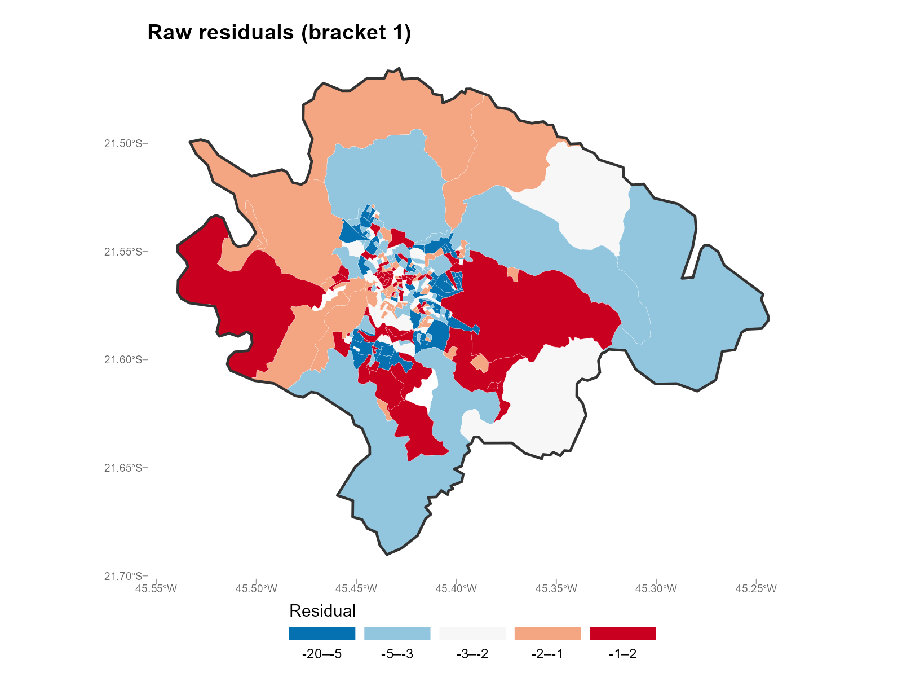
```

### Applied examples: Histogram mode

```{r s4-hist-raw, eval = FALSE}
plot_residuals(result_nit, type = "histogram")
```

```{r s4-hist-raw-fig, echo = FALSE, out.width = "100%"}
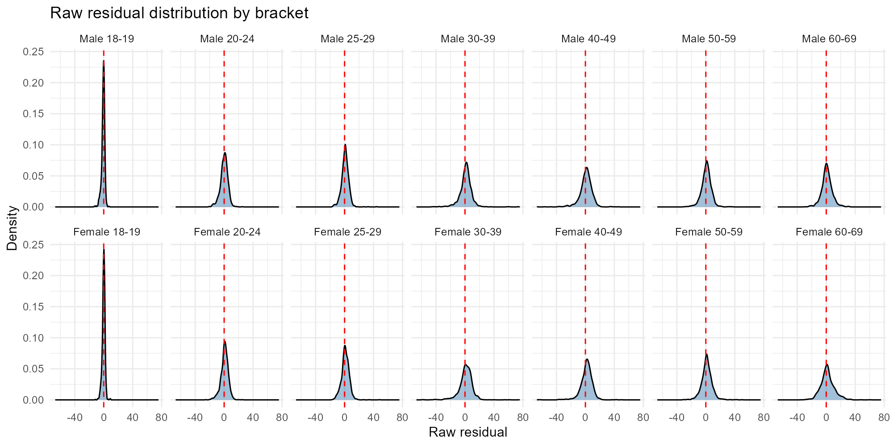
```

Compare with Pearson residuals:

```{r s4-hist-pearson, eval = FALSE}
plot_residuals(result_nit, type = "histogram", residual_type = "pearson")
```

```{r s4-hist-pearson-fig, echo = FALSE, out.width = "100%"}
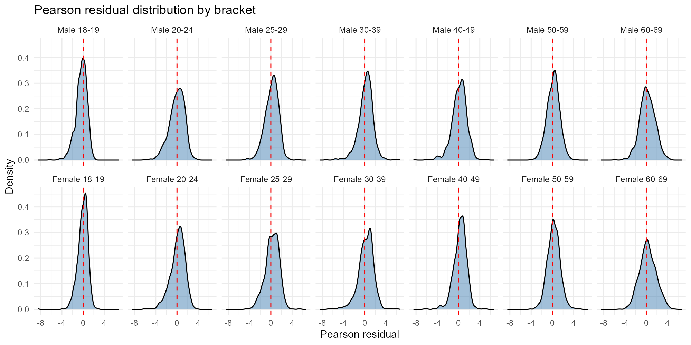
```

### Applied examples: Bracket boxplot

```{r s4-bracket-raw, eval = FALSE}
plot_residuals(result_bh, type = "bracket")
```

```{r s4-bracket-raw-fig, echo = FALSE, out.width = "100%"}
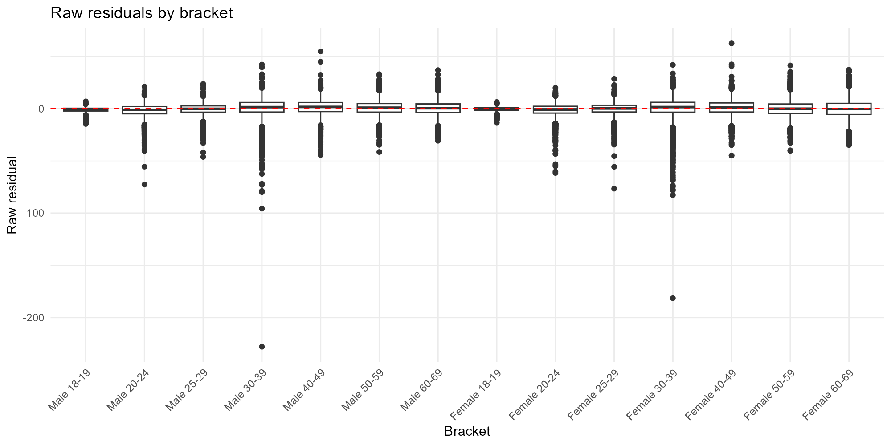
```

Deviance scale:

```{r s4-bracket-dev, eval = FALSE}
plot_residuals(result_bh, type = "bracket", residual_type = "deviance")
```

```{r s4-bracket-dev-fig, echo = FALSE, out.width = "100%"}
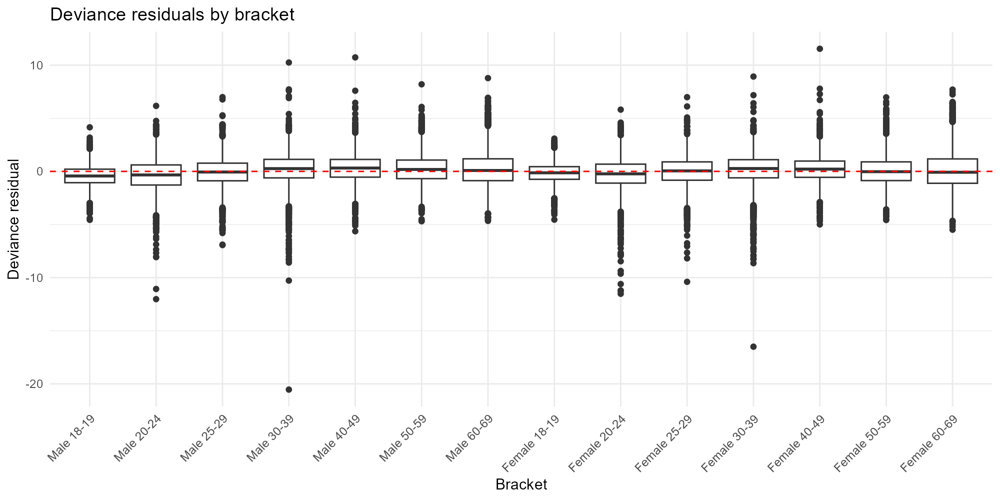
```

### Applied examples: Scatter (fitted vs observed)

```{r s4-scatter-igr, eval = FALSE}
plot_residuals(result_igr, type = "scatter")
```

```{r s4-scatter-igr-fig, echo = FALSE, out.width = "100%"}
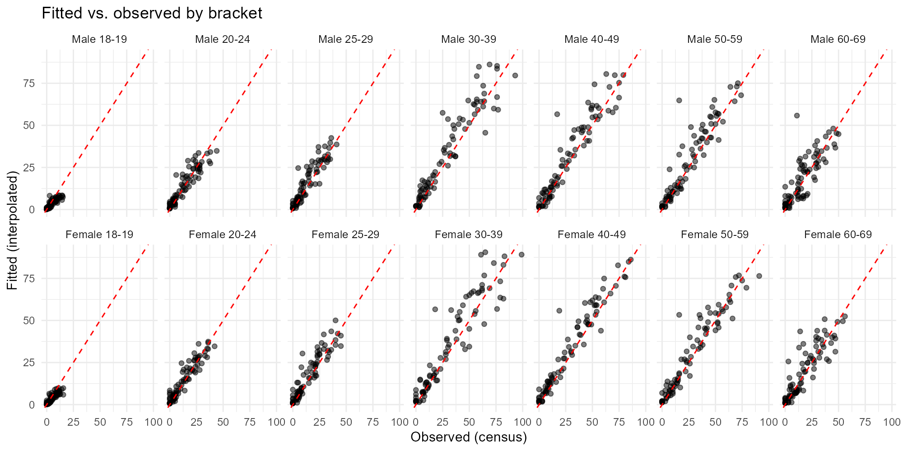
```

Selected brackets:

```{r s4-scatter-sel, eval = FALSE}
plot_residuals(result_vga, type = "scatter", brackets = c(1, 14))
```

```{r s4-scatter-sel-fig, echo = FALSE, out.width = "100%"}
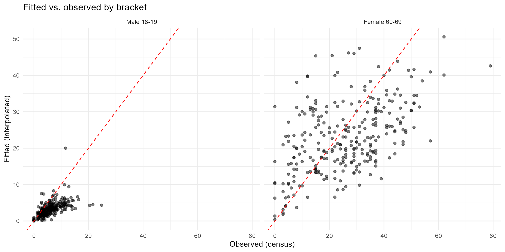
```

### Tabular summary: `residual_summary()`

```{r s4-ressumm, eval = FALSE}
residual_summary(result_vga)
```

```{r s4-ressumm-out, echo = FALSE}
cat(readLines("figures/diag-s4-ressumm-vga-raw.txt"), sep = "\n")
```

### Interpretation

- **Raw residuals**: Scale depends on tract population. A residual of 10 means different things in a tract with 50 people vs 5,000. Use Pearson or deviance for fair comparison.
- **Pearson residuals**: Standardized --- values around $\pm 2$ are typical. Values $> 3$ are outliers under the Poisson assumption.
- **Bracket comparison**: If one bracket consistently has larger residuals, the model may have trouble with that demographic group --- check whether the census data for that bracket is reliable.
- **Scatter plot**: Points should cluster tightly around the 45-degree line. Systematic departures indicate bias.


## 5. Weight Structure

### Intuition

The weight matrix $W$ (dimensions $n \times m$, tracts $\times$ sources) is the heart of the interpolation. It determines how voters from each station are allocated to each tract. Understanding the structure of $W$ reveals:

- **Catchment areas**: which stations serve which tracts
- **Concentration**: does a tract depend on one station or many?
- **Fragility**: tracts dependent on a single station are sensitive to that station's data

### Formal definition

Since $W$ is column-normalized ($\sum_i W_{ij} = 1$), the row sums are NOT 1. For concentration measures, we row-normalize: $p_{ij} = W_{ij} / \sum_j W_{ij}$.

- **Shannon entropy**: $H_i = -\sum_j p_{ij} \ln p_{ij}$
- **Effective number of sources**: $\exp(H_i)$ --- the equivalent number of equal-weight stations
- **Herfindahl-Hirschman Index**: $\text{HHI}_i = \sum_j p_{ij}^2$ --- ranges from $1/m$ (perfect equality) to 1 (monopoly by one station)

### Tabular summary: `weight_summary()`

```{r s5-wsumm, eval = FALSE}
head(weight_summary(result_vga), 15)
```

```{r s5-wsumm-out, echo = FALSE}
cat(readLines("figures/diag-s5-wsumm-vga.txt"), sep = "\n")
```

### Entropy map: `plot_weights(type = "entropy")`

```{r s5-entropy-vga, eval = FALSE}
plot_weights(result_vga, type = "entropy")
```

```{r s5-entropy-vga-fig, echo = FALSE, out.width = "100%"}
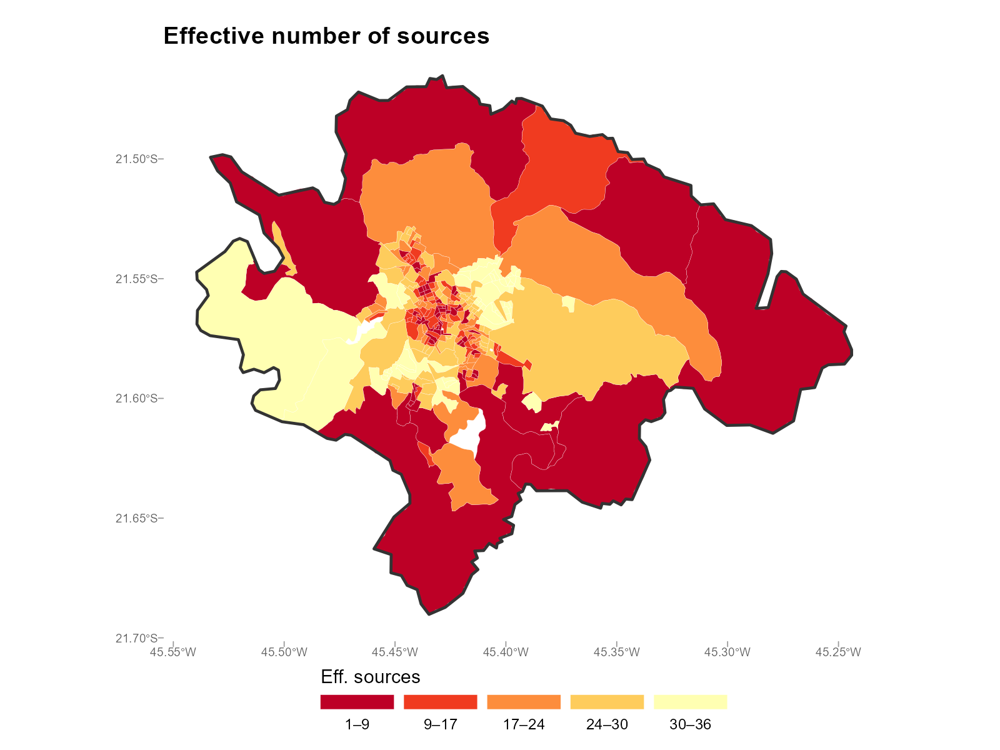
```

Large city comparison:

```{r s5-entropy-bh, eval = FALSE}
plot_weights(result_bh, type = "entropy")
```

```{r s5-entropy-bh-fig, echo = FALSE, out.width = "100%"}
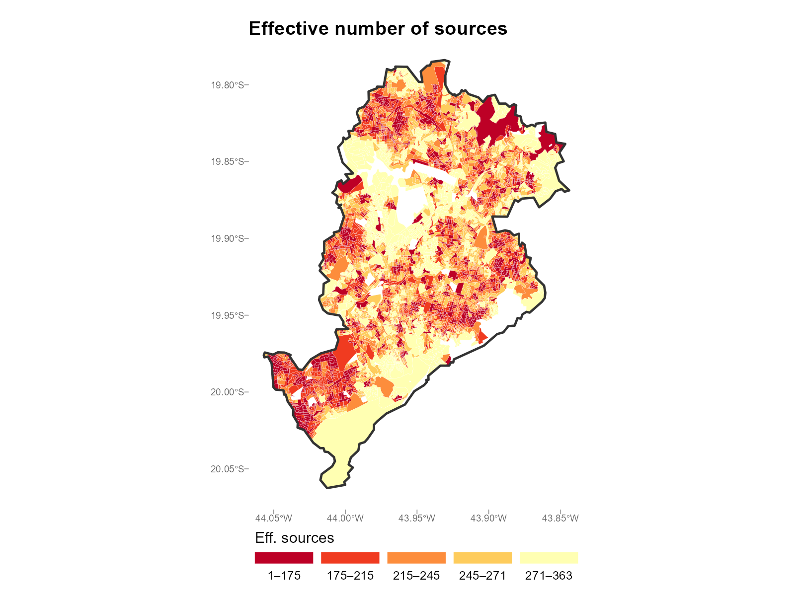
```

### Dominant station map: `plot_weights(type = "dominant")`

```{r s5-dominant-vga, eval = FALSE}
plot_weights(result_vga, type = "dominant")
```

```{r s5-dominant-vga-fig, echo = FALSE, out.width = "100%"}
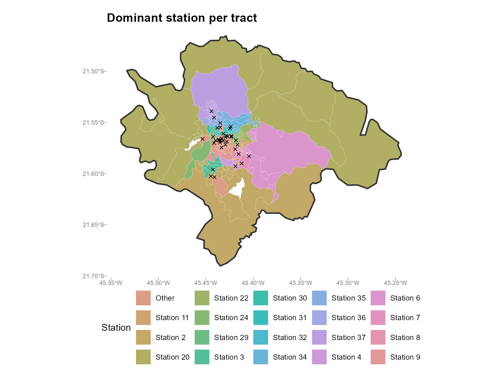
```

```{r s5-dominant-nit, eval = FALSE}
plot_weights(result_nit, type = "dominant")
```

```{r s5-dominant-nit-fig, echo = FALSE, out.width = "100%"}
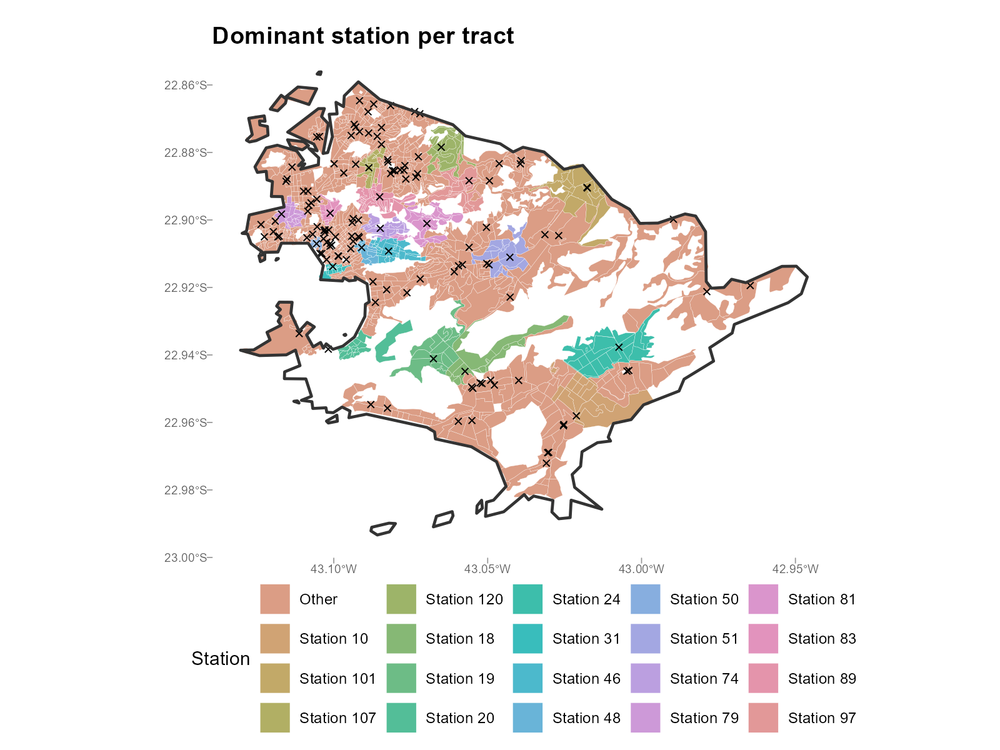
```

### Catchment mode: `plot_weights(type = "catchment")`

Auto-selects the tract with highest effective number of sources:

```{r s5-catchment-auto, eval = FALSE}
plot_weights(result_vga, type = "catchment")
```

```{r s5-catchment-auto-fig, echo = FALSE, out.width = "100%"}
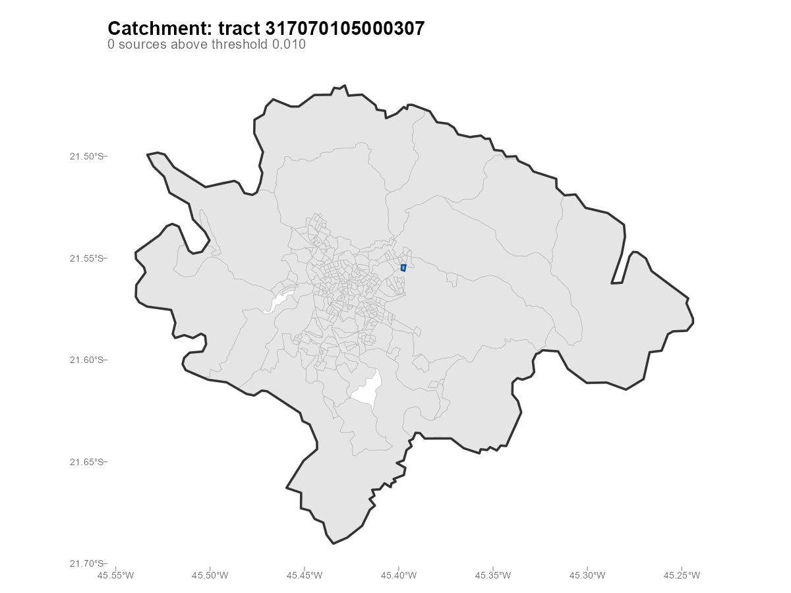
```

Filtered view with `top_k` and `threshold`:

```{r s5-catchment-filt, eval = FALSE}
plot_weights(result_vga, type = "catchment", tract = 1,
             top_k = 3, threshold = 0.05)
```

```{r s5-catchment-filt-fig, echo = FALSE, out.width = "100%"}
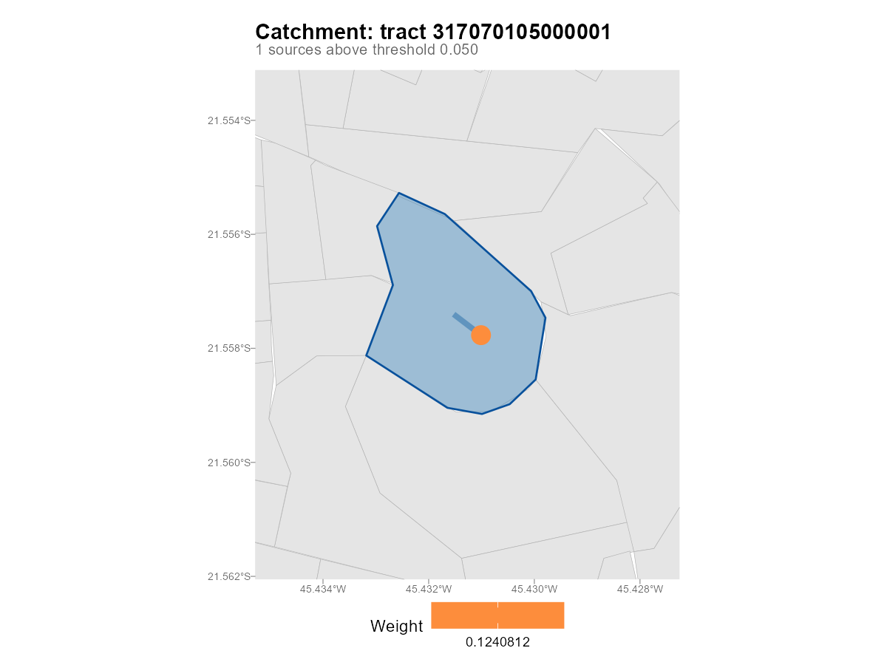
```

### Connections: `plot_connections()`

Overview --- one spoke per tract to its dominant station:

```{r s5-conn-overview, eval = FALSE}
plot_connections(result_vga)
```

```{r s5-conn-overview-fig, echo = FALSE, out.width = "100%"}
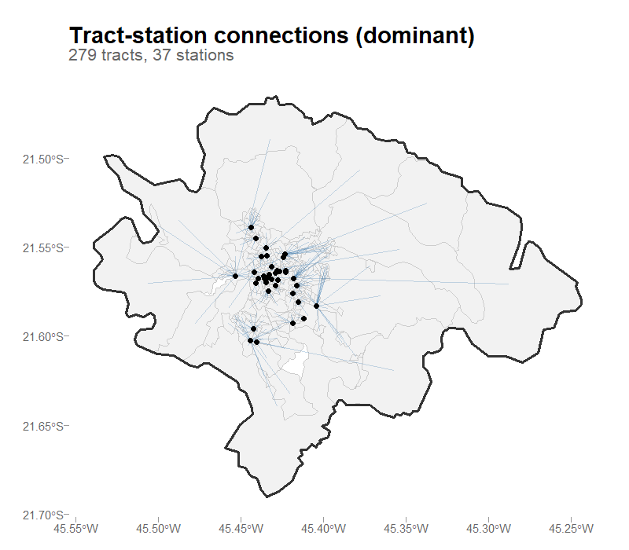
```

Large city:

```{r s5-conn-bh, eval = FALSE}
plot_connections(result_bh)
```

```{r s5-conn-bh-fig, echo = FALSE, out.width = "100%"}
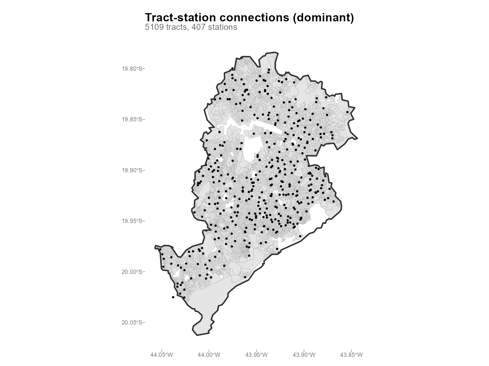
```

Detail for a specific tract:

```{r s5-conn-detail, eval = FALSE}
plot_connections(result_vga, tract = 1)
```

```{r s5-conn-detail-fig, echo = FALSE, out.width = "100%"}
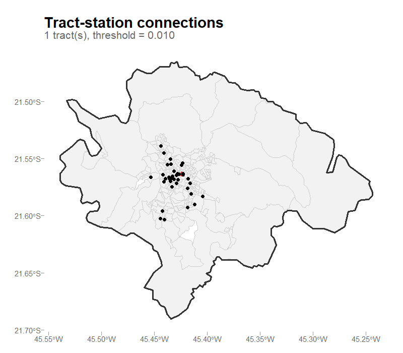
```

### Interpretation

- **Low entropy tracts** (effective N close to 1): The interpolation for this tract depends almost entirely on a single station. If that station's data is atypical, the interpolated values may be unreliable.
- **Dominant station map**: Produces a Voronoi-like partition. If catchment areas don't match geographic intuition, check the travel time matrix.
- **Connections**: The spoke pattern should make geographic sense --- tracts should connect to nearby stations. Long-distance connections suggest routing issues.


## 6. Travel Time Data Quality: `plot_travel_times()`

### Intuition

The travel time matrix is the input that drives everything: $\alpha$ optimization, weight computation, and ultimately the spatial allocation of voters. Poor travel time data (unreachable pairs, disconnected road networks) directly degrades interpolation quality.

### Applied examples

**Histogram** --- distribution of all $n \times m$ travel times:

```{r s6-hist-vga, eval = FALSE}
plot_travel_times(result_vga, type = "histogram")
```

```{r s6-hist-vga-fig, echo = FALSE, out.width = "100%"}
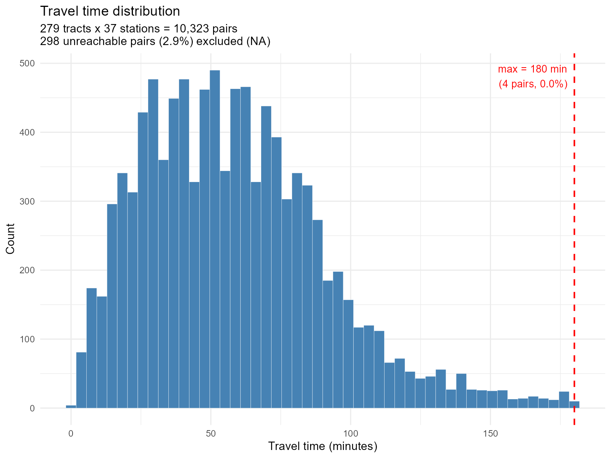
```

Large city:

```{r s6-hist-bh, eval = FALSE}
plot_travel_times(result_bh, type = "histogram")
```

```{r s6-hist-bh-fig, echo = FALSE, out.width = "100%"}
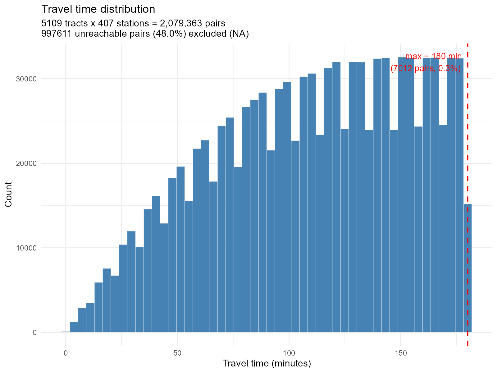
```

**Heatmap** --- rows = tracts (ordered by latitude), columns = stations. Block-diagonal structure reveals spatial locality:

```{r s6-heatmap, eval = FALSE}
plot_travel_times(result_vga, type = "heatmap")
```

```{r s6-heatmap-fig, echo = FALSE, out.width = "100%"}
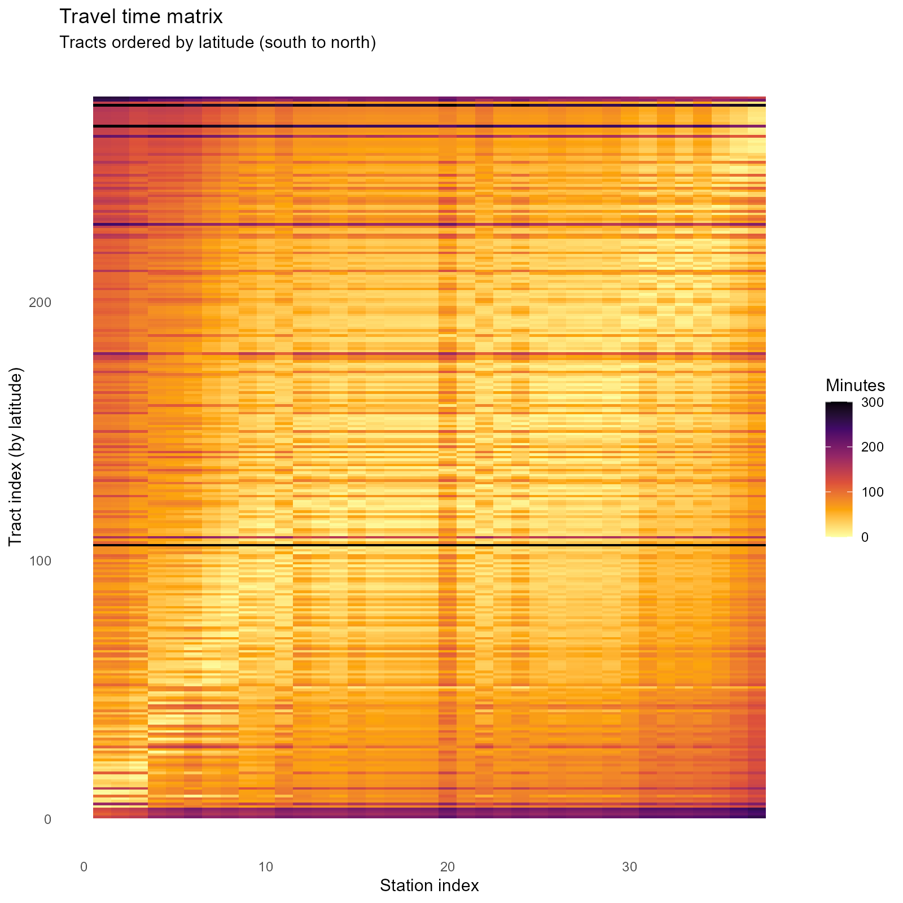
```

**Map** --- station points colored by travel time for a specific tract:

```{r s6-map, eval = FALSE}
plot_travel_times(result_vga, type = "map", tract = 1)
```

```{r s6-map-fig, echo = FALSE, out.width = "100%"}
knitr::include_graphics("figures/diag-s6-tt-vga-map.png")
```

### Interpretation

- **Spike at maximum value**: These are "fill" values for unreachable pairs. A large spike means the routing engine couldn't find paths for many pairs.
- **Bimodal distribution**: May indicate disconnected graph components (e.g., separated by a river without bridge in the OSM network).
- **Block-diagonal heatmap**: Expected --- nearby tracts have similar travel times to the same stations. Absence of block structure suggests the travel times lack spatial coherence.


## 7. Spatial Autocorrelation: `plot_residual_autocorrelation()` + `plot_moran()`

### Intuition

**Residual autocorrelation**: If residuals are spatially clustered (nearby tracts have similar residuals), the model is missing spatial structure --- a misspecification signal.

**Moran's I on interpolated variables**: If the interpolated vote shares show expected spatial concentration (e.g., PT strongholds in low-income areas), the method is preserving realistic political geography.

### Formal definition

**Global Moran's I**:
$$I = \frac{n}{\sum_{i,j} w_{ij}} \cdot \frac{\sum_{i,j} w_{ij}(x_i - \bar{x})(x_j - \bar{x})}{\sum_i (x_i - \bar{x})^2}$$

where $w_{ij}$ are spatial weights (queen contiguity). Range: $[-1, +1]$. Positive = clustering, $\approx 0$ = random, negative = dispersion.

**LISA (Local Moran's I)**: $I_i = \frac{(x_i - \bar{x})}{s^2} \sum_j w_{ij}(x_j - \bar{x})$. Classification: HH (high-high cluster), LL (low-low), HL (high surrounded by low), LH (low surrounded by high).

### Applied examples: Residual autocorrelation

```{r s7-resid-vga, eval = FALSE}
plot_residual_autocorrelation(result_vga)
```

```{r s7-resid-vga-fig, echo = FALSE, out.width = "100%"}
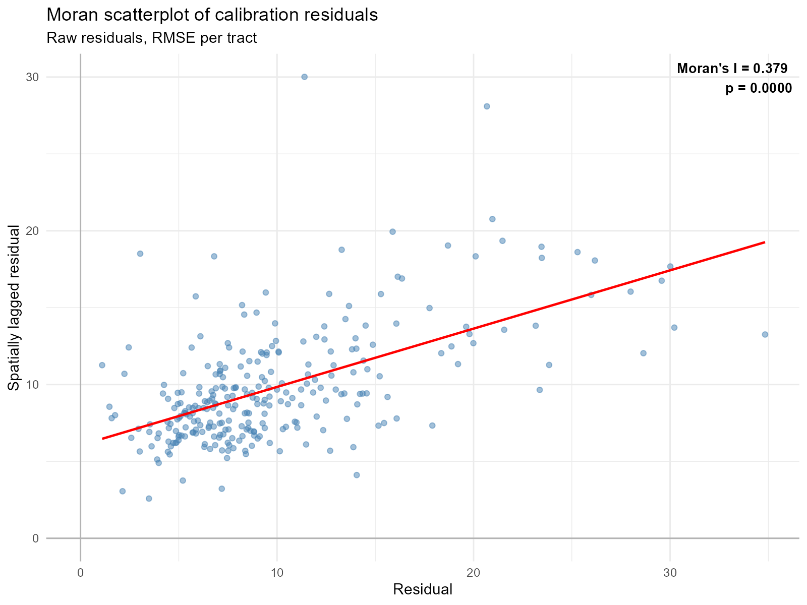
```

Pearson residuals:

```{r s7-resid-pear, eval = FALSE}
plot_residual_autocorrelation(result_vga, residual_type = "pearson")
```

```{r s7-resid-pear-fig, echo = FALSE, out.width = "100%"}
knitr::include_graphics("figures/diag-s7-moran-resid-vga-pear.png")
```

### Applied examples: LISA cluster maps

```{r s7-lisa-vga, eval = FALSE}
plot_moran(result_vga, variable = "Lula", type = "lisa")
```

```{r s7-lisa-vga-fig, echo = FALSE, out.width = "100%"}
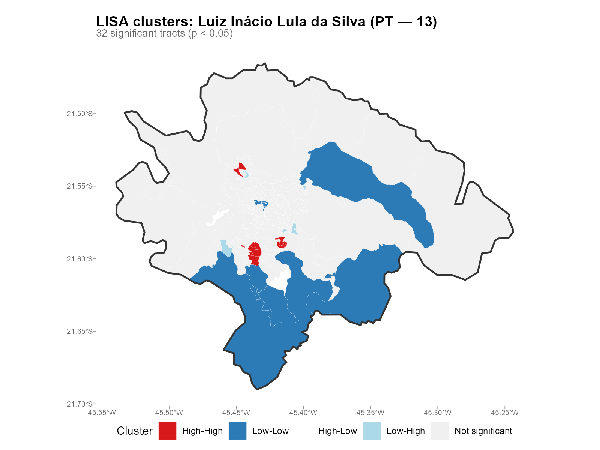
```

Moran scatterplot:

```{r s7-moran-vga, eval = FALSE}
plot_moran(result_vga, variable = "Lula", type = "moran")
```

```{r s7-moran-vga-fig, echo = FALSE, out.width = "100%"}
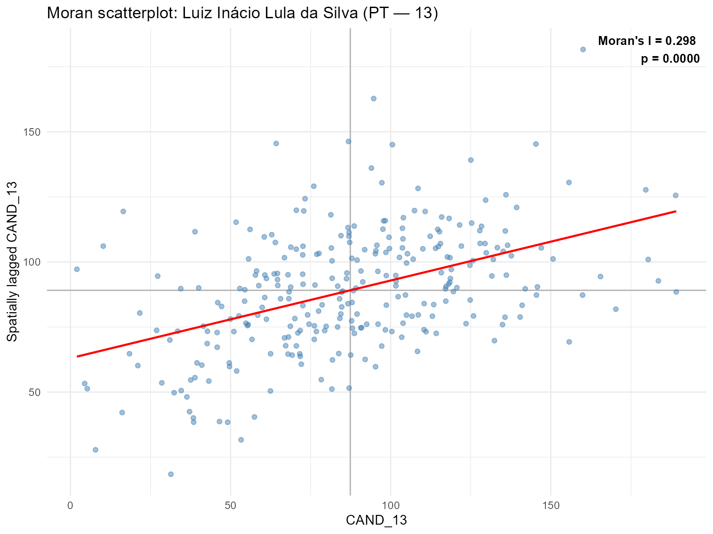
```

Large city:

```{r s7-lisa-bh, eval = FALSE}
plot_moran(result_bh, variable = "Lula", type = "lisa")
```

```{r s7-lisa-bh-fig, echo = FALSE, out.width = "100%"}
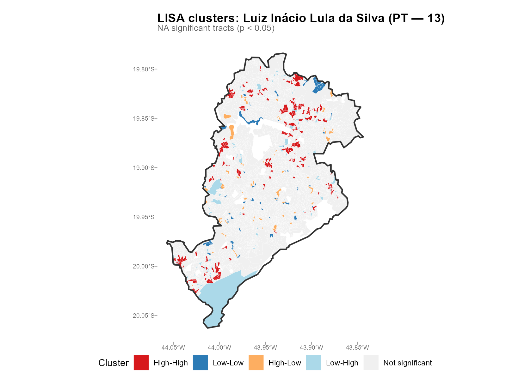
```

By party:

```{r s7-lisa-nit-pt, eval = FALSE}
plot_moran(result_nit, variable = "PT", type = "lisa")
```

```{r s7-lisa-nit-pt-fig, echo = FALSE, out.width = "100%"}
knitr::include_graphics("figures/diag-s7-lisa-nit-pt.png")
```

### Interpretation

- **Significant Moran's I on residuals** (p < 0.05): The model has spatially structured error. Consider whether the travel time data has systematic problems in certain areas.
- **HH clusters of Lula votes**: Expected in low-income neighborhoods (PT strongholds). Their presence validates that the interpolation preserves known political geography.
- **HL/LH clusters**: Spatial outliers --- tracts with high vote share surrounded by low (or vice versa). May indicate local effects or data irregularities.


## 8. Baseline Comparisons: `compare_baselines()` + `leave_one_out()`

### Intuition

Is the optimized IDW actually better than simpler alternatives? And how robust is the interpolation to removing individual stations?

### Formal definition

**Baselines**:
- **Nearest**: $W_{ij^*} = 1$ for $j^* = \arg\min_j t_{ij}$, $W_{ij} = 0$ otherwise (binary assignment to closest station)
- **Uniform**: $W_{ij} = 1/m$ (equal weight to all stations, column-normalized)
- **Areal**: $W$ based on spatial intersection areas between tract and station Voronoi cells

**Leave-one-out**: Remove station $j$, predict its demographics using remaining $m-1$ stations with the full-model alpha values. Compare predicted vs actual. This is the only form of out-of-sample validation possible (there is no tract-level ground truth).

### Applied examples: `compare_baselines()`

```{r s8-base-vga, eval = FALSE}
compare_baselines(result_vga)
```

```{r s8-base-vga-out, echo = FALSE}
cat(readLines("figures/diag-s8-baselines-vga.txt"), sep = "\n")
```

```{r s8-base-bh, eval = FALSE}
compare_baselines(result_bh, methods = c("nearest", "uniform"))
```

```{r s8-base-bh-out, echo = FALSE}
cat(readLines("figures/diag-s8-baselines-bh.txt"), sep = "\n")
```

### Applied examples: `leave_one_out()`

```{r s8-loo-igr, eval = FALSE}
leave_one_out(result_igr)
```

```{r s8-loo-igr-out, echo = FALSE}
cat(readLines("figures/diag-s8-loo-igr.txt"), sep = "\n")
```

```{r s8-loo-vga, eval = FALSE}
leave_one_out(result_vga)
```

```{r s8-loo-vga-out, echo = FALSE}
cat(readLines("figures/diag-s8-loo-vga.txt"), sep = "\n")
```

### Interpretation

- **Positive improvement %**: The optimized IDW has lower RMSE/deviance than the baseline. The optimization adds value.
- **Negative improvement %**: This should not happen. If it does, the optimization may have overfitted or the data has issues.
- **LOO degradation**: LOO RMSE should be comparable to full-model RMSE. If LOO RMSE is much larger, the model may be overfitting to specific station configurations.


## 9. Ecological Validation

### 9a. Implied Turnout Rates: `plot_turnout_rates()`

#### Intuition

For each tract and demographic bracket, the implied turnout rate is:

$$\text{rate}_{i,b} = \frac{\text{fitted voters}_{i,b}}{\text{census population}_{i,b}}$$

In Brazil, voting is **compulsory** for ages 18--69, so expected turnout is ~75--85%. For 16--17 and 70+, voting is optional and rates should be lower. Rates exceeding 100% indicate tracts where the model allocates more voters than residents --- signaling boundary effects or registration mismatches.

#### Applied examples

Bracket boxplot:

```{r s9-turnout-bracket-vga, eval = FALSE}
plot_turnout_rates(result_vga, type = "bracket")
```

```{r s9-turnout-bracket-vga-fig, echo = FALSE, out.width = "100%"}
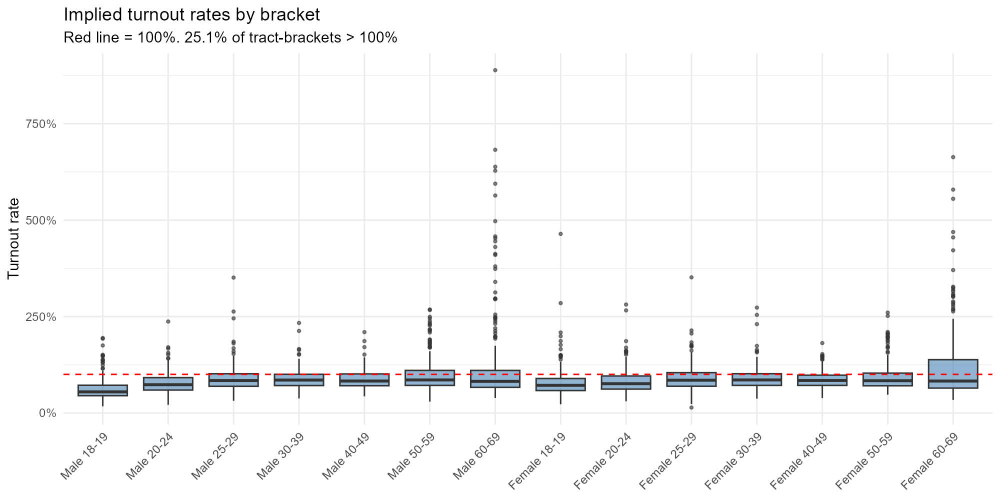
```

```{r s9-turnout-bracket-nit, eval = FALSE}
plot_turnout_rates(result_nit, type = "bracket")
```

```{r s9-turnout-bracket-nit-fig, echo = FALSE, out.width = "100%"}
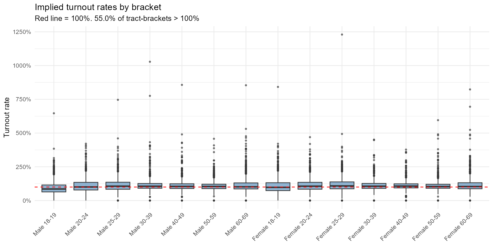
```

Spatial pattern:

```{r s9-turnout-map-bh, eval = FALSE}
plot_turnout_rates(result_bh, type = "map")
```

```{r s9-turnout-map-bh-fig, echo = FALSE, out.width = "100%"}
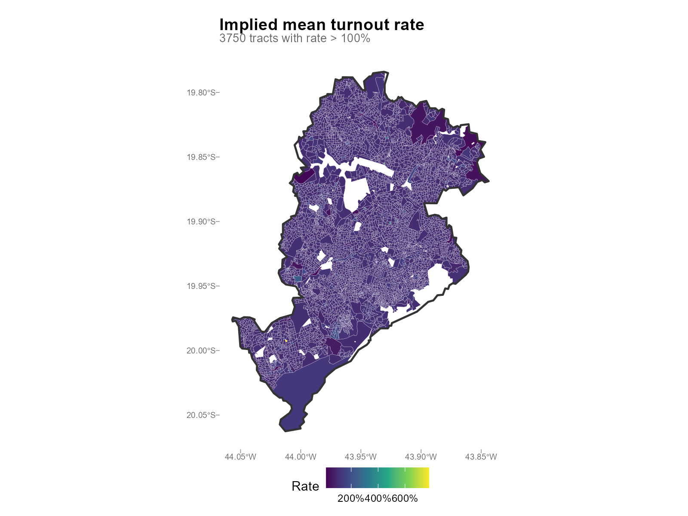
```

Faceted histogram:

```{r s9-turnout-hist-vga, eval = FALSE}
plot_turnout_rates(result_vga, type = "histogram")
```

```{r s9-turnout-hist-vga-fig, echo = FALSE, out.width = "100%"}
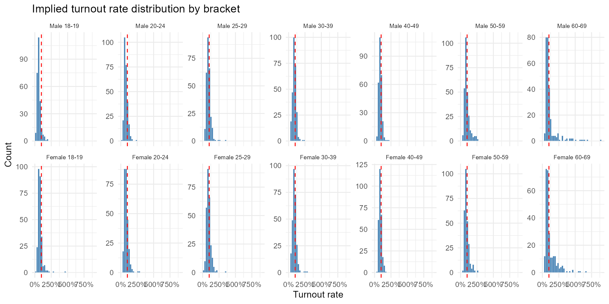
```

#### Interpretation

- **Compulsory brackets clustering around 80%**: Expected for ages 18--69.
- **Optional brackets lower**: 16--17 and 70+ should show lower turnout.
- **Rates > 100%**: Voters registered in one municipality who may actually reside in another (commuters, students). These boundary effects are a known limitation of the model.

### 9b. Income-Vote Correlation: `plot_income()`

#### Intuition

The negative correlation between PT vote share and income is one of the best-documented patterns in Brazilian political science (the "PT-income gradient"). If the interpolation preserves this gradient, it builds confidence that the spatial allocation of votes is realistic. If it destroys it, something is wrong.

Income data comes from censobr (Census Bureau microdata), which provides mean household head income by tract. No deflation is applied --- within a single census year, the correlation is scale-invariant.

#### Applied examples

Lula (PT) vs income --- expect negative correlation:

```{r s9-income-lula, eval = FALSE}
plot_income(result_vga, variable = "Lula", type = "scatter")
```

```{r s9-income-lula-fig, echo = FALSE, out.width = "100%"}
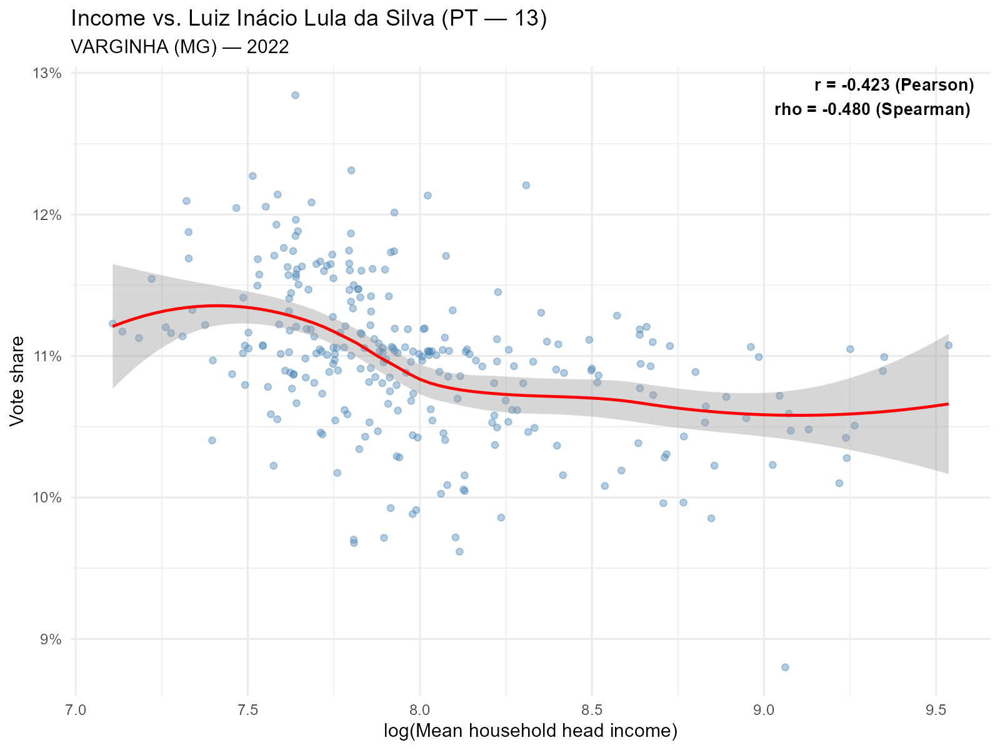
```

Bolsonaro (PL) vs income --- expect positive correlation:

```{r s9-income-bolso, eval = FALSE}
plot_income(result_vga, variable = 22, type = "scatter")
```

```{r s9-income-bolso-fig, echo = FALSE, out.width = "100%"}
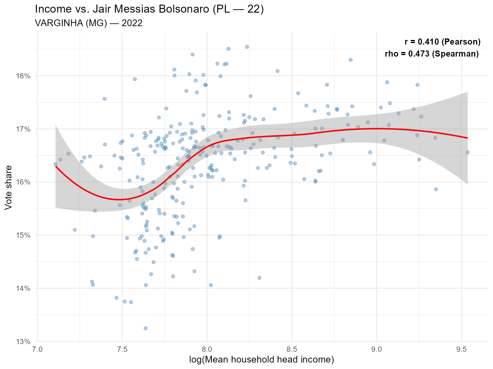
```

Larger city:

```{r s9-income-bh, eval = FALSE}
plot_income(result_bh, variable = "Lula", type = "scatter")
```

```{r s9-income-bh-fig, echo = FALSE, out.width = "100%"}
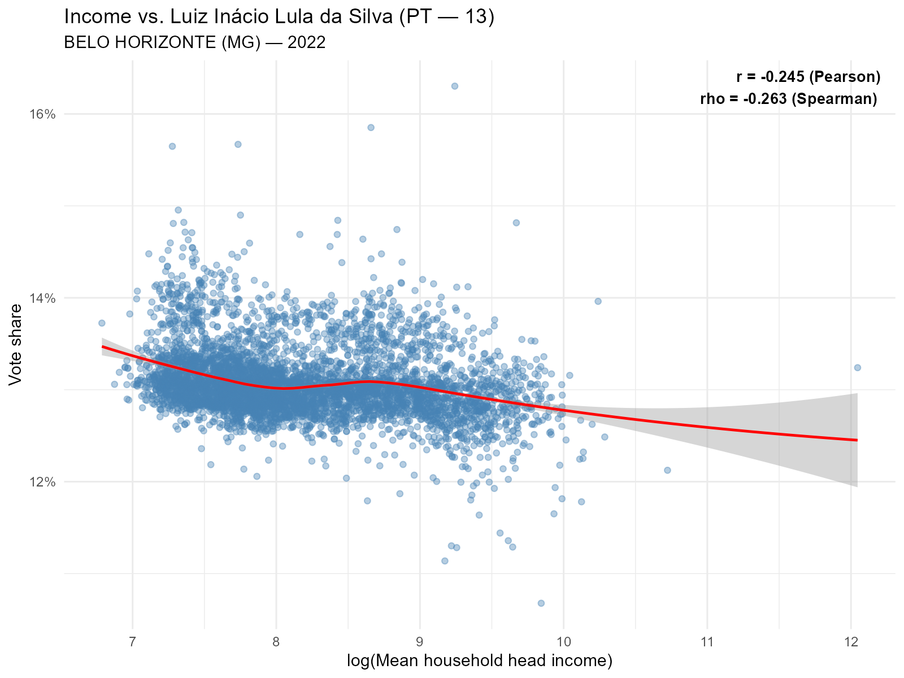
```

Side-by-side maps:

```{r s9-income-map, eval = FALSE}
plot_income(result_nit, variable = "Lula", type = "map")
```

```{r s9-income-map-fig, echo = FALSE, out.width = "100%"}
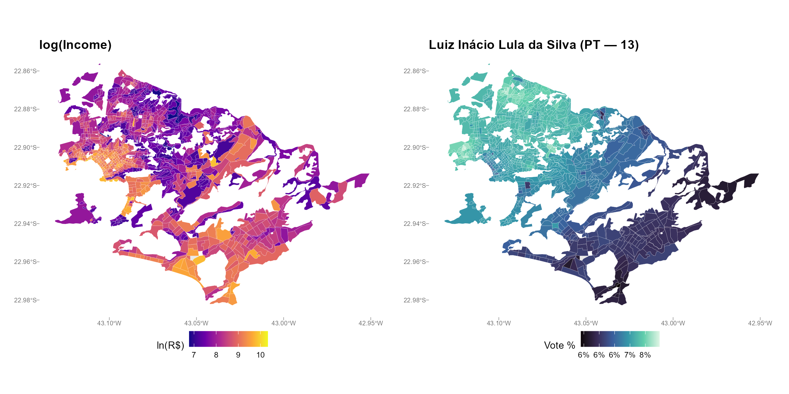
```

### 9c. Cross-Round Consistency: `plot_ecological()`

#### Intuition

Political geography is sticky. Neighborhoods that vote strongly for a candidate in round 1 should vote even more strongly in round 2 (where only 2 candidates remain). A high correlation between turno 1 and turno 2 tract-level vote shares validates that the interpolation preserves spatial patterns.

#### Applied examples

```{r s9-ecol-scatter, eval = FALSE}
plot_ecological(result_vga, result_vga2,
                variable = "Lula", type = "scatter")
```

```{r s9-ecol-scatter-fig, echo = FALSE, out.width = "100%"}
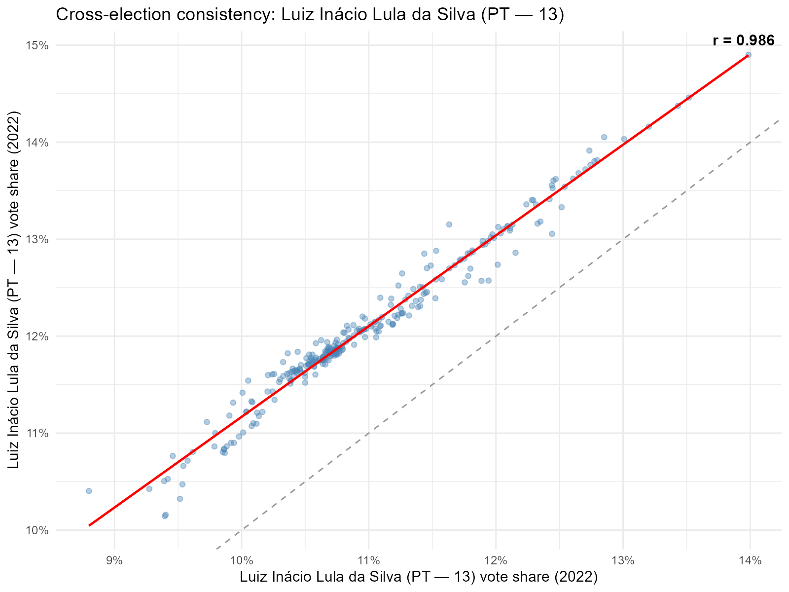
```

Side-by-side maps:

```{r s9-ecol-map, eval = FALSE}
plot_ecological(result_vga, result_vga2,
                variable = "Lula", type = "map")
```

```{r s9-ecol-map-fig, echo = FALSE, out.width = "100%"}
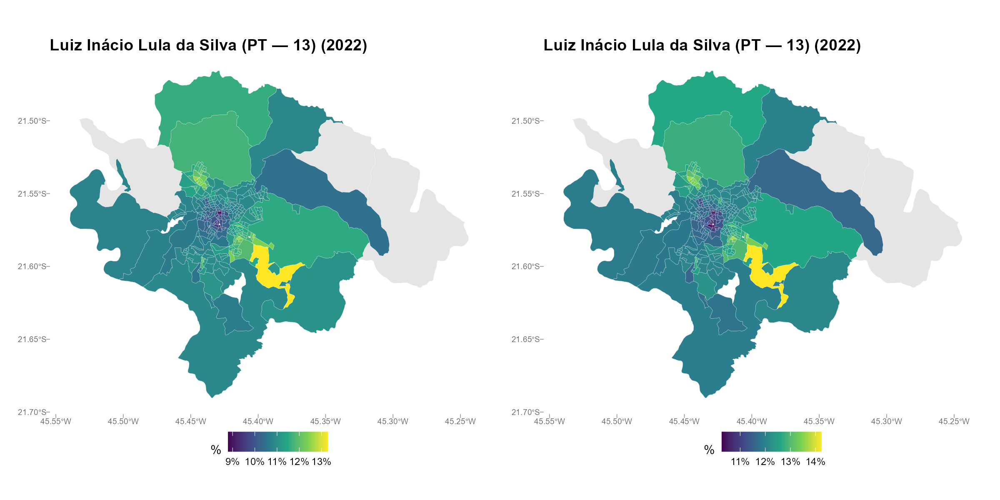
```

#### Interpretation

- **Strong positive correlation** between rounds: The spatial patterns are consistent, as expected. The method is recovering stable partisan geography.
- **Weak or no correlation**: The interpolation may be injecting noise rather than recovering signal. Investigate whether the travel time data or optimization is causing problems.


## 10. Quick Reference

| Function | Question it answers | Key arguments | When to worry |
|:---------|:--------------------|:--------------|:--------------|
| `diagnostics()` | Is anything obviously wrong? | `verbose` | Any FAIL or multiple WARNs |
| `plot_convergence()` | Did the optimizer converge? | `which`, `log_y` | Oscillating loss, non-shrinking gradient |
| `plot_alpha()` | How does distance decay vary? | `type`, `summary_fn`, `brackets` | Many tracts with $\alpha > 15$ |
| `plot_residuals()` | How well are demographics reproduced? | `type`, `residual_type`, `summary_fn` | Large systematic bias, Pearson > 3 |
| `residual_summary()` | Which brackets/tracts fit worst? | `type` | One bracket much worse than others |
| `weight_summary()` | How concentrated are the weights? | --- | Many tracts with effective N = 1 |
| `plot_weights()` | Where are catchment areas? | `type`, `tract`, `top_k` | Catchments that defy geography |
| `plot_connections()` | Which stations serve which tracts? | `tract`, `top_k`, `threshold` | Long-distance connections |
| `plot_travel_times()` | Is the travel time matrix clean? | `type`, `tract` | Large spike at max value |
| `plot_residual_autocorrelation()` | Are residuals spatially clustered? | `residual_type`, `summary_fn` | Significant Moran's I (p < 0.05) |
| `plot_moran()` | Is vote geography realistic? | `variable`, `type` | No spatial clustering |
| `compare_baselines()` | Is IDW better than naive methods? | `methods` | Negative improvement |
| `leave_one_out()` | Is the model overfitting? | `max_stations` | LOO RMSE >> full RMSE |
| `plot_turnout_rates()` | Are implied turnout rates plausible? | `type` | Many tracts > 100% |
| `plot_income()` | Does the PT-income gradient hold? | `variable`, `type` | Wrong sign on correlation |
| `plot_ecological()` | Are spatial patterns consistent? | `variable`, `type` | Weak cross-round correlation |
