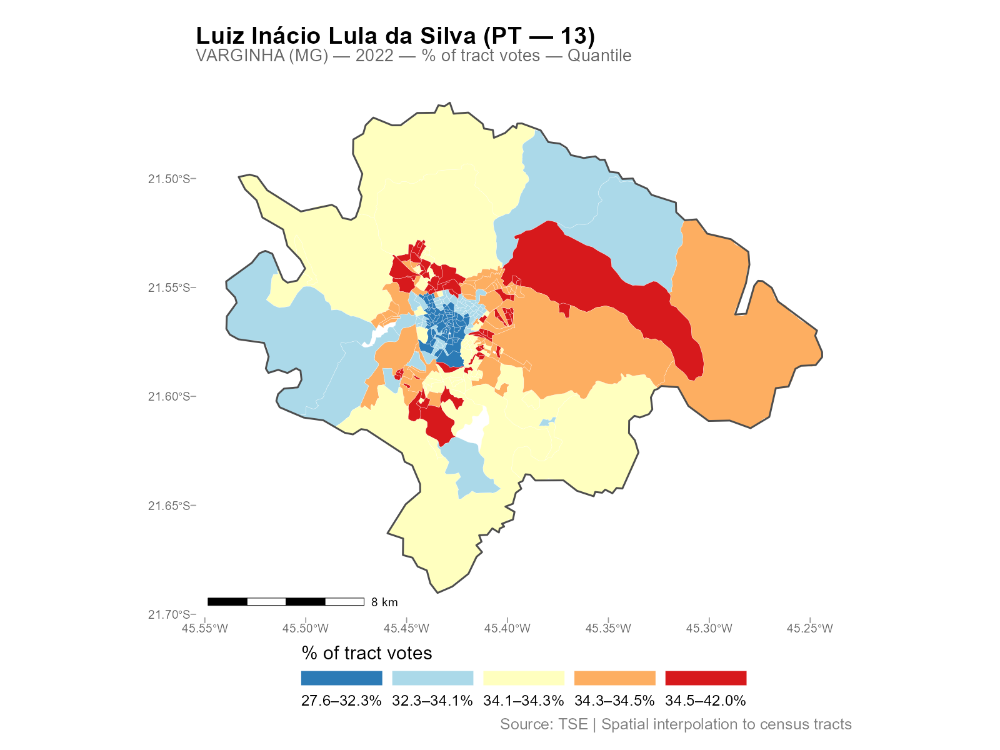
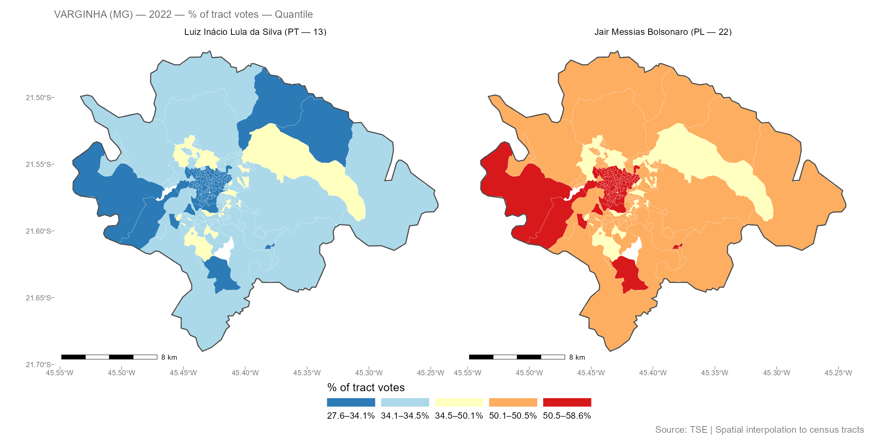
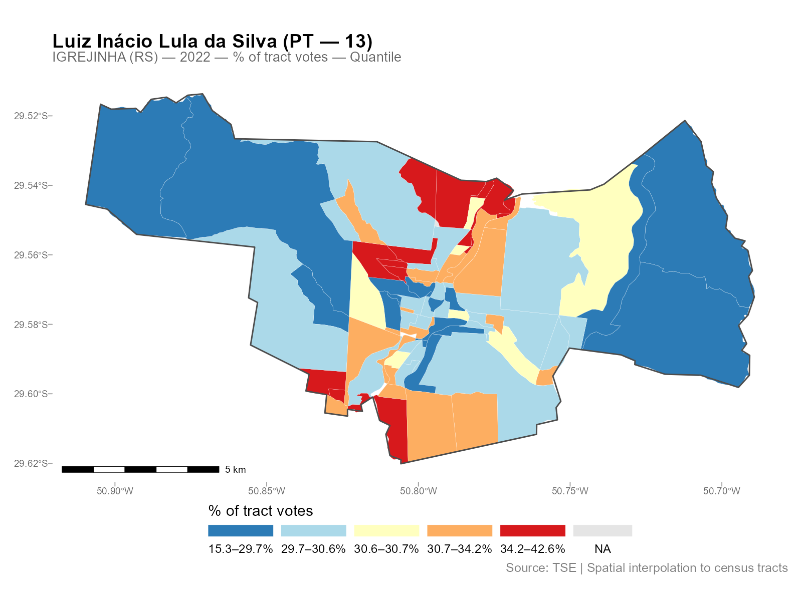

```{r setup, include = FALSE}
VIGNETTE_EVAL <- dir.exists("figures")
knitr::opts_chunk$set(
  collapse = TRUE,
  comment = "#>",
  fig.width = 7,
  fig.height = 5,
  out.width = "100%",
  eval = VIGNETTE_EVAL
)
library(interpElections)
```

## Introduction

interpElections interpolates data from source points (polling stations, schools,
hospitals) into target polygons (census tracts, districts, neighborhoods) using
travel-time-based inverse distance weighting with column-normalized weights. The
decay parameter for each zone is calibrated against known demographic totals,
ensuring that source totals are conserved.

**Before you start**, install the optional dependencies:

```r
setup_torch()     # GPU optimization (CUDA, MPS, or CPU fallback)
setup_java()      # Java 21 for r5r travel-time routing
```

## Example 1: Varginha (MG)

The simplest way to use interpElections with Brazilian data is the
`interpolate_election_br()` wrapper. It downloads census data, electoral
results, and road networks automatically.

```{r vga-run, eval = FALSE}
result_vga <- interpolate_election_br(
  "Varginha", year = 2022,
  cargo = "presidente",
  what = c("candidates", "turnout"),
  keep = "electoral_sf"
)
```

The console output shows the progress:

```
[1/9] Resolving municipality identifiers...
  VARGINHA (MG) - IBGE: 3170701, TSE: 54135
  Census year: 2022 (election 2022)
[2/9] Preparing census population data...
[3/9] Preparing census tract geometries...
[4/9] Preparing electoral data...
[5/9] Matching calibration brackets...
[6/9] Downloading OSM road network...
[7/9] Computing travel times...
[8/9] Optimizing alpha...
  PB-SGD colnorm (cpu, float32): full-data gradient, max 200 epochs
  Completed 85 epochs (52.3s), objective=502,361 (converged)
[9/9] Interpolating...
  Interpolated 42 variables into 279 census tracts
Done.
```

```{r vga-load, include = FALSE}
# Load pre-computed result
rds_path <- system.file("doc/precomputed/varginha_2022.rds",
                         package = "interpElections")
if (file.exists(rds_path)) {
  vga_data <- readRDS(rds_path)
  result_vga <- vga_data$result
} else {
  # Try vignettes directory (for pkgdown build)
  rds_path2 <- "precomputed/varginha_2022.rds"
  if (file.exists(rds_path2)) {
    vga_data <- readRDS(rds_path2)
    result_vga <- vga_data$result
  }
}
```

```{r vga-print, eval = FALSE}
result_vga
```

```
interpElections result -- Brazilian election
  Municipality: VARGINHA (MG)
  IBGE: 3170701 | TSE: 54135 | Election: 2022 | Census: 2022
  Census tracts: 279 | Sources: 37

  Variables: 42
    Candidates:    13 (CAND_30, CAND_44, CAND_12, CAND_13, ...)
    Turnout:       1 (QT_COMPARECIMENTO)
    Calibration:   gender x 7 age brackets

  Optimizer: pb_sgd_colnorm_cpu (obj = 502361.44)
  Alpha:     279 x 14 matrix [0.010, 20.000] (mean 3.027)

  Contents:
    result$tracts_sf       sf with census tracts + interpolated columns
    result$interpolated    numeric matrix [279 x 42]
    ...
```

Three lines downloaded all data, computed travel times, optimized
parameters, and interpolated all vote counts into 279 census tracts.

```{r vga-plot-lula, eval = FALSE}
plot(result_vga, variable = "Lula")
```

```{r vga-lula-fig, echo = FALSE, out.width = "100%"}

```

Compare two candidates side by side:

```{r vga-plot-faceted, eval = FALSE}
plot(result_vga, variable = c("Lula", "Bolsonaro"), type = "pct_tract")
```

```{r vga-faceted-fig, echo = FALSE, out.width = "100%"}

```

## Example 2: Igrejinha (RS)

A smaller city, with the same workflow:

```{r igr-run, eval = FALSE}
result_igr <- interpolate_election_br(
  "Igrejinha", year = 2022,
  cargo = "presidente",
  what = c("candidates", "turnout")
)
```

```{r igr-print, eval = FALSE}
result_igr
```

```
interpElections result -- Brazilian election
  Municipality: IGREJINHA (RS)
  IBGE: 4310108 | TSE: 87033 | Election: 2022 | Census: 2022
  Census tracts: 85 | Sources: 17

  Variables: 42
    Candidates:    13 (CAND_13, CAND_12, CAND_30, CAND_22, ...)
    Turnout:       1 (QT_COMPARECIMENTO)
    Calibration:   gender x 7 age brackets

  Optimizer: pb_sgd_colnorm_cpu (obj = 248107.37)
  Alpha:     85 x 14 matrix [0.010, 15.682] (mean 4.089)
```

```{r igr-plot, eval = FALSE}
plot(result_igr, variable = "Lula")
```

```{r igr-fig, echo = FALSE, out.width = "100%"}

```

Different city, different spatial patterns, same three-line workflow.

## Exploring the Results

The result object has several S3 methods for inspection:

```{r explore, eval = FALSE}
# Detailed summary with per-variable statistics
summary(result_vga)

# Alpha decay parameters (n x k matrix: tracts x brackets)
head(coef(result_vga))

# Export as plain data frame (drops geometry)
df <- as.data.frame(result_vga)
head(df[, 1:5])

# Interactive map (opens in browser)
plot_interactive(result_vga, variable = "Lula")
```

See `vignette("working-with-results")` for the full reference on S3
methods, all plot types, residual analysis, and areal aggregation.

## Controlling What Gets Interpolated

The `what` parameter controls which variables are interpolated:

```{r what-options, eval = FALSE}
# Just candidates (default)
result <- interpolate_election_br("Varginha", year = 2022,
  what = "candidates")

# Parties (aggregated by party abbreviation)
result <- interpolate_election_br("Varginha", year = 2022,
  what = "parties")

# Turnout and abstention
result <- interpolate_election_br("Varginha", year = 2022,
  what = "turnout")

# Voter demographics (gender, education)
result <- interpolate_election_br("Varginha", year = 2022,
  what = "demographics")

# Everything at once
result <- interpolate_election_br("Varginha", year = 2022,
  what = c("candidates", "parties", "turnout", "demographics"))
```

Filter specific candidates or parties:

```{r filter, eval = FALSE}
# By ballot number
result <- interpolate_election_br("Varginha", year = 2022,
  cargo = "presidente", candidates = c(13, 22))

# By name (accent-insensitive substring matching)
result <- interpolate_election_br("Varginha", year = 2022,
  cargo = "presidente", candidates = "LULA")

# Specific parties
result <- interpolate_election_br("Varginha", year = 2022,
  what = "parties", parties = c("PT", "PL"))
```

Other useful parameters:

- `cargo`: `"presidente"`, `"governador"`, `"senador"`,
  `"deputado_federal"`, `"deputado_estadual"`, `"prefeito"`, `"vereador"`
- `turno`: `1` (first round, default) or `2` (runoff)
- `census_year`: auto-selected from election year, or override manually
- `data(muni_crosswalk)`: lookup table with all 5,710 municipalities

## What's Happening Under the Hood

The wrapper `interpolate_election_br()` calls these internal steps in
sequence (you don't need to call them directly):

```{r pipeline, eval = FALSE}
# 1. Census population by age bracket (internal)
pop_data <- interpElections:::br_prepare_population("Varginha", year = 2022)

# 2. Census tract geometries with population columns (internal)
tracts_sf <- interpElections:::br_prepare_tracts(3170701, pop_data)

# 3. Electoral data at polling stations (internal)
electoral <- interpElections:::br_prepare_electoral(
  code_muni_ibge = "3170701", code_muni_tse = "54135",
  uf = "MG", year = 2022, cargo = "presidente",
  what = c("candidates", "turnout")
)

# 4. Travel times via r5r walking routes
time_matrix <- compute_travel_times(tracts_sf, electoral_sf)

# 5. Optimize per-tract decay parameters
optim_result <- optimize_alpha(time_matrix, pop_matrix, source_matrix)

# 6. Use weight matrix from optimization and interpolate
W <- optim_result$W
interpolated <- W %*% electoral_data
```

See `vignette("methodology")` for the full technical treatment with
equations, visualizations, and worked examples using real data.

## Custom Data: Any Point-to-Polygon Problem

interpElections works with any point-to-polygon disaggregation, not just
Brazilian elections. Here is a synthetic example:

```{r custom-example, eval = (VIGNETTE_EVAL && torch::torch_is_installed())}
library(interpElections)

# Synthetic data: 5 zones, 3 sources, 2 calibration variables
set.seed(42)
tt <- matrix(
  c(5, 15, 30, 25, 40,
    20, 8, 12, 35, 45,
    35, 30, 18, 10, 7),
  nrow = 5, ncol = 3,
  dimnames = list(paste0("zone_", 1:5), paste0("src_", 1:3))
)

# Calibration: population counts known at both levels
pop_matrix <- matrix(
  c(100, 300, 150, 200, 250,   # young population per zone
    80, 250, 120, 180, 220),   # old population per zone
  nrow = 5, ncol = 2,
  dimnames = list(NULL, c("pop_young", "pop_old"))
)

source_matrix <- matrix(
  c(250, 400, 350,    # young counts at sources
    210, 350, 290),   # old counts at sources
  nrow = 3, ncol = 2,
  dimnames = list(NULL, c("count_young", "count_old"))
)

# Optimize alpha (uses per-bracket SGD)
optim_result <- optimize_alpha(
  time_matrix = tt + 1,   # offset already applied
  pop_matrix = pop_matrix,
  source_matrix = source_matrix,
  offset = 0,             # offset already in tt
  verbose = FALSE
)

cat("Optimized alpha (5 x 2 matrix):\n")
print(round(optim_result$alpha, 2))

# Use weight matrix from optimization
W <- optim_result$W

# Interpolate a variable measured at sources
revenue <- c(5000, 8000, 6500)
interpolated_revenue <- as.numeric(W %*% revenue)

cat("Source total:", sum(revenue), "\n")
cat("Interpolated total:", round(sum(interpolated_revenue)), "\n")
cat("Per-zone:", round(interpolated_revenue), "\n")
```

Conservation: the interpolated total matches the source total exactly.

## Core Functions: Maximum Flexibility

For full control, use the core functions directly:

```{r core, eval = (VIGNETTE_EVAL && torch::torch_is_installed())}
# Load bundled example data
tt  <- readRDS(system.file("extdata/example_tt_matrix.rds",
                            package = "interpElections"))
pop <- readRDS(system.file("extdata/example_pop_matrix.rds",
                            package = "interpElections"))
src <- readRDS(system.file("extdata/example_source_matrix.rds",
                            package = "interpElections"))

# Optimize
result <- optimize_alpha(tt, pop, src, verbose = FALSE)
result

# Weight matrix is returned from optimization
W <- result$W

# Verify conservation
cat("Column sums (should be ~1):", round(colSums(W), 4), "\n")
cat("Row sum range:", round(range(rowSums(W)), 4), "\n")
```

## Next Steps

- `vignette("methodology")`: full pipeline walkthrough with equations,
  visualizations, and real-data examples from Varginha (MG)
- `vignette("working-with-results")`: all S3 methods, plot types,
  residual analysis, and areal aggregation with Niteroi and Belo
  Horizonte examples
