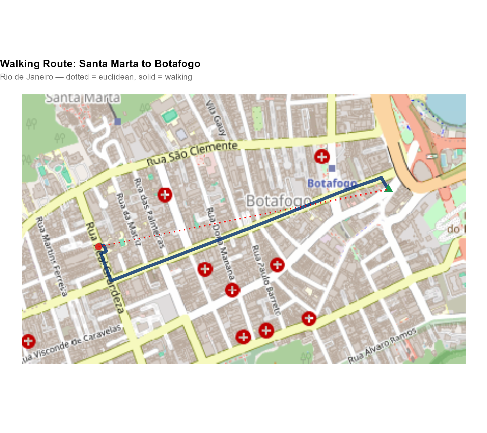
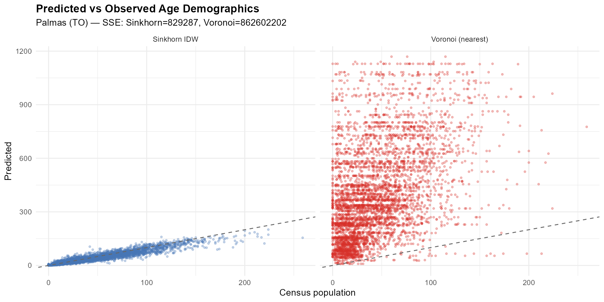
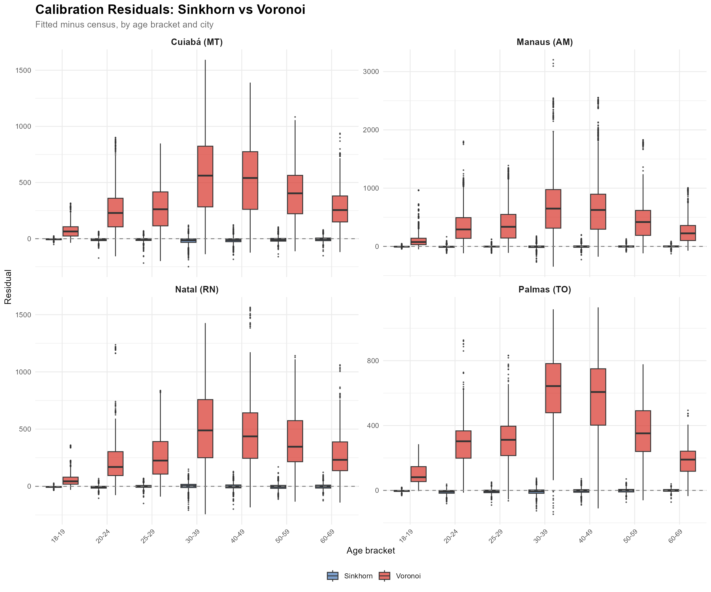

```{r setup, include = FALSE}
knitr::opts_chunk$set(
  collapse = TRUE,
  comment = "#>",
  fig.width = 7,
  fig.height = 5,
  out.width = "100%"
)
library(interpElections)
```

```{r load-precomputed, include = FALSE}
# Load pre-computed data (generated by precompute.R)
vga <- NULL
for (path in c("precomputed/varginha_2022.rds",
               system.file("doc/precomputed/varginha_2022.rds",
                           package = "interpElections"))) {
  if (file.exists(path)) {
    vga <- readRDS(path)
    break
  }
}
```

This vignette walks through the complete interpElections methodology step
by step. Computationally heavy steps show pre-rendered outputs and
figures. Small toy examples (`eval = TRUE`) can be run interactively.


# Part I: Motivation and Pipeline Overview

## 1. Why Sub-Municipal Electoral Geography Matters

Electoral analysis in Brazil faces a fundamental data gap. Votes are
counted at **polling stations** --- points on a map, not geographic zones.
The Superior Electoral Court (TSE) publishes detailed results per
station: how many votes each candidate received, turnout statistics, the
age and gender composition of registered voters. But polling stations do
not have defined geographic boundaries. A voter who lives in tract A and
walks past tract B may vote at a station located in tract C.

Meanwhile, the Census Bureau (IBGE) organizes demographic data by
**census tracts** --- small geographic polygons with known population
counts by age, gender, education, and income. These tracts are the
finest spatial unit at which demographic data is available.

The question is: **how did each neighborhood vote?** To answer this, we
need to bridge two incompatible data systems: point-level electoral data
and polygon-level census data. That is what this package does.

### Age structure as a proxy for socioeconomic status

The bridge between these two systems is the **age structure** of the
population. Age brackets are observed at both levels: the census records
how many people of each age live in each tract, and the TSE records how
many voters of each age voted at each station.

But why is age structure useful? Because it encodes far more than just
demographics. In Brazilian cities, the age composition of a neighborhood
is strongly correlated with its socioeconomic profile. Consider two
neighborhoods in Rio de Janeiro:

```{r fig-rocinha-copacabana, echo = FALSE, out.width = "100%"}
knitr::include_graphics("figures/age-pyramids-rocinha-copacabana.png")
```

**Rocinha**, one of Brazil's largest favelas, has a young population:
large cohorts in the 18--29 age range, tapering off sharply after 50.
**Copacabana**, one of Rio's wealthiest neighborhoods, shows the
opposite pattern: a narrower base of young adults and a large proportion
of residents over 50. This difference reflects fertility rates, life
expectancy, and migration patterns that are tightly linked to income,
education, and living conditions.

Because these age signatures differ systematically across neighborhoods,
they carry information about socioeconomic composition --- and, by
extension, about voting behavior. The method we describe exploits this:
it finds weights that reproduce the census age structure at each tract
when applied to station-level voter data. If the weights are correct for
demographics, they should also produce good estimates for vote counts.


## 2. The Problem: Many-to-Many Spatial Disaggregation

Imagine you are a researcher who wants to know how Copacabana voted in
the 2022 presidential election. The TSE can tell you how each polling
station in the area voted. But several things make this harder than it
seems:

- **One station, many neighborhoods**: a school in Botafogo may receive
  voters from Botafogo, Humaitá, and even from the Santa Marta favela
  up the hill. The station's vote total is a mix of all these
  populations.
- **One neighborhood, many stations**: Copacabana voters may be assigned
  to polling stations in Copacabana itself, in neighboring Ipanema, or
  in Leme. The neighborhood's voters are split across multiple stations.
- **No lookup table**: unlike in some countries, there is no official
  mapping from residential addresses to polling stations. The
  relationship is **many-to-many**, and there is no administrative data
  to resolve it.

This is not a standard areal interpolation problem. In areal
interpolation, both source and target are polygons, and the overlap area
provides natural weights. Here, the sources are **points** (stations),
not polygons. Area-weighted interpolation does not apply. Nor is it a
simple point-in-polygon assignment: since the mapping is many-to-many,
assigning each tract to its nearest station (Voronoi) would lose
information and produce poor estimates (we demonstrate this in
Section 17).

### The approach: estimating the association structure

Our solution estimates the **association structure** between tracts and
stations --- a weight matrix $W$ of dimension $[N \times M]$ where each
entry $W_{ij}$ captures how much station $j$ "serves" tract $i$.

Two fundamental properties are enforced:

1. **Source conservation** (column constraint): each station distributes
   exactly 100% of its data. The total votes in the municipality are
   preserved exactly: $\sum_i W_{ij} = 1$ for all $j$.
2. **Population proportionality** (row constraint): each tract receives
   total weight proportional to its population share:
   $\sum_j W_{ij} \propto \text{pop}_i$.

The method **does not assume** a fixed assignment of voters to stations.
Instead, it estimates a smooth probabilistic mapping, calibrated against
known demographic data.

### Walking to vote: a behavioral assumption

The key behavioral assumption is that **voters walk to their polling
stations**. This grounds the spatial model: closer stations receive more
weight because voters are more likely to walk to them.

This assumption is supported by empirical evidence. Pereira et al.
(2023) studied the effect of free public transit on election day in
Brazilian cities, finding that it increased turnout --- implying that
transportation costs (including walking distance) are a meaningful
barrier. Brazilian electoral law requires that voters be assigned to
polling stations near their registered address, reinforcing the spatial
proximity assumption.

> Pereira, R. H. M., Braga, C. K. V., Serra, B., & Nadalin, V. (2023).
> "Free public transit and voter turnout." *Available at:*
> <https://www.urbandemographics.org/files/2023_Pereira_et_al_free_public_transit_voter_turnout.pdf>

We use realistic **walking travel times** computed on the OpenStreetMap
road network, not straight-line distances. Mountains, rivers, and the
street layout all affect the actual travel time and are captured by the
routing engine (see Section 9).


## 3. Pipeline Overview

The full interpolation pipeline has six steps:

1. **Census data**: population counts by age bracket per tract
   (`br_prepare_population()`)
2. **Tract geometries**: census tract polygons from IBGE
   (`br_prepare_tracts()`)
3. **Electoral data**: votes, turnout, and voter demographics per station
   (`br_prepare_electoral()`)
4. **Travel times**: walking routes from tract representative points to
   stations (`compute_travel_times()`)
5. **Optimization**: find per-tract decay parameters $\alpha$ that
   minimize demographic mismatch (`optimize_alpha()`)
6. **Interpolation**: apply the optimized weight matrix to any
   station-level variable ($\hat{X} = W \times V$)

```{r fig-pipeline, echo = FALSE, out.width = "100%"}
knitr::include_graphics("figures/pipeline-stacked-maps.png")
```

The figure above illustrates the spatial data layers involved. Starting
from the bottom: the municipality boundary, census tracts colored by
population, polling station locations, and the final interpolated
results at the tract level.


# Part II: Data

## 4. Census Population Data

```{r pop-call, eval = FALSE}
pop_data <- br_prepare_population("Varginha", year = 2010)
head(pop_data)
```

```
  code_tract    code_muni pop_18_20 pop_21_24 pop_25_29 pop_30_39 pop_40_49 pop_50_59 pop_60_69
1 3170701xxxxx  3170701      82       103       125       258       220       178       142
2 3170701xxxxx  3170701      45        62        71       130       115        93        80
...
```

The `pop_*` columns contain census population counts by age bracket.
These brackets are chosen to match the TSE voter registration age groups
--- they are the **calibration variables** that bridge census tracts and
polling stations.

| Census column | Age range | TSE equivalent |
|---|---|---|
| `pop_18_20` | 18--20 years | `votantes_18_20` |
| `pop_21_24` | 21--24 years | `votantes_21_24` |
| `pop_25_29` | 25--29 years | `votantes_25_29` |
| `pop_30_39` | 30--39 years | `votantes_30_39` |
| `pop_40_49` | 40--49 years | `votantes_40_49` |
| `pop_50_59` | 50--59 years | `votantes_50_59` |
| `pop_60_69` | 60--69 years | `votantes_60_69` |

These 7 matched brackets are the key insight: they are observed at
**both** levels, enabling calibration.

```{r fig-pop-pyramid, echo = FALSE, out.width = "90%"}
knitr::include_graphics("figures/pop-pyramid.png")
```


## 5. Census Tract Geometries

```{r tracts-call, eval = FALSE}
tracts_sf <- br_prepare_tracts(3170701, pop_data)
```

This downloads tract geometries from `geobr`, removes green areas
(parks, water bodies with zero population), transforms to EPSG:5880
(equal-area projection for accurate spatial operations), and joins the
population columns.

```{r fig-tracts-pop, echo = FALSE, out.width = "100%"}
knitr::include_graphics("figures/tracts-pop-map.png")
```

Note the urban-rural gradient: small, densely populated tracts in the
city center; large, sparsely populated tracts on the periphery.


## 6. Electoral Data at Polling Stations

```{r electoral-call, eval = FALSE}
electoral <- br_prepare_electoral(
  code_muni_ibge = "3170701",
  code_muni_tse  = "54135",
  uf = "MG", year = 2022,
  cargo = "presidente", turno = 1,
  what = c("candidates", "turnout")
)
```

The result contains one row per polling station with:

- **Vote columns** (`CAND_13`, `CAND_22`, ...): votes per candidate
  (ballot number as suffix; 95 = blank, 96 = null)
- **Turnout** (`QT_COMPARECIMENTO`): total voters who showed up
- **Voter age profiles** (`votantes_18_20`, ..., `votantes_65_69`):
  TSE's fine-grained age registration brackets, aggregated to match the
  7 census brackets
- **Coordinates** (`lat`, `long`): geocoded polling station locations
- **Column dictionary**: `attr(electoral, "column_dictionary")` contains
  metadata for each column (type, cargo, candidate name, party)

The `what` parameter controls what gets included:

- `"candidates"`: one column per candidate
- `"parties"`: aggregated by party (`PARTY_PT`, `PARTY_PL`, ...)
- `"turnout"`: `QT_COMPARECIMENTO`, `QT_APTOS`, `QT_ABSTENCOES`
- `"demographics"`: `GENERO_*` and `EDUC_*` columns

```{r fig-stations, echo = FALSE, out.width = "100%"}
knitr::include_graphics("figures/electoral-stations-map.png")
```


## 7. Calibration Variables: Comparing Source and Target

The calibration variables are the bridge between census tracts and
polling stations. The same age brackets are observed at both levels:

- **Census**: "How many people aged 18--20 live in this tract?" (from
  IBGE)
- **Electoral**: "How many registered voters aged 18--20 voted at this
  station?" (from TSE)

These are the same age brackets we saw distinguishing Rocinha from
Copacabana in Section 1. The demographic signature that varies across
neighborhoods is precisely what the method uses to calibrate the weights.

```{r fig-pyramids, echo = FALSE, out.width = "100%"}
knitr::include_graphics("figures/age-pyramids-comparison.png")
```

The shapes are similar but totals differ: the census counts residents,
the TSE counts registered voters. Not everyone of voting age is
registered, and registration rates vary by age bracket.

The optimization finds alpha values so that the **interpolated** voter
age profiles match the **census** age profiles at each tract. If the
weights are correct for demographics, they should also be correct for
vote counts.


# Part III: Geography

## 8. Representative Points: From Tracts to Routable Origins

Routing engines need **point-to-point** queries, but tracts are
polygons. We need a single representative point per tract. Three methods
are available:

| Method | Function | Guarantee |
|---|---|---|
| `"centroid"` | `sf::st_centroid()` | Fast. May fall outside concave polygons. |
| `"point_on_surface"` | `sf::st_point_on_surface()` | Guaranteed inside. Default. |
| `"pop_weighted"` | WorldPop raster lookup | Most populated cell. Best for large tracts. |

The choice of representative point matters most for **large, irregularly
shaped tracts** in rural and peri-urban areas. Consider the southern
periphery of São Paulo, where census tracts extend over several square
kilometers of mixed urban and forested land:

```{r fig-rep-points-sp, echo = FALSE, out.width = "100%"}
knitr::include_graphics("figures/rep-points-saopaulo-comparison.png")
```

The three-panel comparison shows the same set of large tracts in south
São Paulo. The red dots (centroids) frequently fall in uninhabited areas
--- in the middle of Mata Atlântica forest or in empty fields. The blue
dots (point on surface) are guaranteed to be inside the polygon, but may
still be far from where people actually live. The green dots
(pop-weighted) use the WorldPop population raster to find the most
densely populated cell within each tract, placing the representative
point where residents actually are.

```{r fig-rep-points-zoom, echo = FALSE, out.width = "80%"}
knitr::include_graphics("figures/rep-points-zoom-inset.png")
```

Zooming into the largest tract, the centroid falls in dense forest while
the pop-weighted point correctly identifies the settlement area. This
difference can affect travel time calculations by tens of minutes.

```{r rep-points, eval = FALSE}
pts_pos <- compute_representative_points(tracts_sf,
  method = "point_on_surface")
pts_pop <- compute_representative_points(tracts_sf,
  method = "pop_weighted")
```

The `pop_weighted` method downloads the WorldPop Brazil Constrained 2020
raster (~48 MB, cached) and finds the raster cell with the highest
population density within each tract.

The `pop_min_area` parameter (default: 1 km²) controls the threshold:
tracts smaller than this use `point_on_surface` regardless of the chosen
method, since small urban tracts are dense enough that any interior
point is a reasonable proxy.


## 9. Travel Times: Building the Distance Matrix

### 9.1 Why walking travel time?

In Brazil, voters are assigned to polling stations near their registered
address. On election day, most voters **walk** to their polling station.
This is not merely an assumption of convenience --- it is grounded in
the geographic design of the Brazilian electoral system and in empirical
evidence.

Pereira et al. (2023) studied the introduction of free public transit on
election days in Brazilian cities. Their finding that free transit
significantly increased turnout implies that the **cost of getting to
the polls** --- primarily walking distance --- is a real barrier that
affects participation. If distance matters for whether people vote at
all, it certainly matters for *where* they vote.

We therefore use **realistic walking travel times** computed on the
OpenStreetMap road network, not Euclidean (straight-line) distances. The
routing engine (r5r) accounts for the actual street layout, elevation,
one-way streets, pedestrian paths, and physical barriers.

### 9.2 Euclidean distance vs. walking routes

Why not just use straight-line distance? Because geography creates
dramatic discrepancies between Euclidean distance and actual walking
time. Two examples:

**Example 1: Mountains (Rio de Janeiro)**

The Santa Marta favela sits on a steep hillside in Botafogo, Rio de
Janeiro. A polling station at the bottom of the hill may be only 500
meters away in a straight line, but the actual walking route --- along
switchback streets, staircases, and steep alleys --- can take 20--30
minutes.

```{r fig-routes-rj, echo = FALSE, out.width = "100%"}

```

The solid blue line shows the actual walking route computed by r5r on
the OSM road network. The dotted red line shows the straight-line
distance. In mountainous terrain, these can differ by a factor of 3--5x.

**Example 2: River barrier (Recife)**

The Capibaribe river divides central Recife. Two points on opposite
banks may be only 200 meters apart, but the walking route must follow
the river to the nearest bridge, adding significant distance.

```{r fig-routes-recife, echo = FALSE, out.width = "100%"}
knitr::include_graphics("figures/routes-recife-river.png")
```

### 9.3 Building the travel time matrix

```{r tt-call, eval = FALSE}
time_matrix <- compute_travel_times(
  tracts_sf = tracts_sf,
  points_sf = electoral_sf,
  network_path = network_path,
  tract_id = "id",
  point_id = "id"
)
```

This builds an **[N tracts × M stations] matrix** of walking travel
times in minutes, using the r5r routing engine on OpenStreetMap data.

- **Origins**: representative points (from Section 8)
- **Destinations**: polling station coordinates
- **Mode**: walking (default), configurable
- **Max trip duration**: 300 minutes; unreachable pairs get this value

The OSM data is downloaded via `download_r5r_data()`, which fetches
state-level `.pbf` files and clips them to the municipality bounding box
using osmium.

```{r fig-tt-heatmap, echo = FALSE, out.width = "90%"}
knitr::include_graphics("figures/tt-heatmap.png")
```

The heatmap shows spatial structure: a block-diagonal pattern where
nearby tract-station pairs have short travel times.

```{r fig-tt-accessibility, echo = FALSE, out.width = "100%"}
knitr::include_graphics("figures/tt-accessibility-map.png")
```

Tracts in the center have short travel times to the nearest station;
peripheral tracts are farther away.

**The offset**: before applying the IDW kernel, we add 1 to all travel
times (`time_matrix + 1`) to avoid singularity when $t = 0$.


# Part IV: The Weight Matrix

## 10. The IDW Kernel: Turning Distance into Influence

### Intuition: gravitational pull

Think of each polling station as exerting a "gravitational pull" on
nearby tracts. Closer stations pull harder. The IDW (Inverse Distance
Weighting) kernel translates this intuition into numbers: given a travel
time between a tract and a station, it produces a weight that decreases
with distance.

### A concrete example

Suppose a tract has three nearby stations at 5, 12, and 30 minutes
walking distance. How much should each station contribute to this
tract's estimate? With a decay parameter $\alpha = 2$:

```{r idw-example, eval = TRUE}
tt <- c(5, 12, 30)  # travel times in minutes
alpha <- 2
raw_weights <- (tt + 1)^(-alpha)
normalized <- raw_weights / sum(raw_weights)
cat("Travel times:", tt, "minutes\n")
cat("Raw weights: ", round(raw_weights, 5), "\n")
cat("Normalized:  ", round(normalized, 3), "\n")
cat("The 5-min station gets", round(normalized[1] * 100),
    "% of this tract's weight\n")
```

The nearest station (5 min) gets the lion's share of the weight. The
30-minute station contributes very little.

### The formula

The raw weight between tract $i$ and station $j$:

$$W^{\text{raw}}_{ij} = (t_{ij} + 1)^{-\alpha_i}$$

where:

- $t_{ij}$: travel time from tract $i$ to station $j$ (minutes)
- $\alpha_i$: decay parameter for tract $i$ (to be optimized)

### How alpha controls the decay

```{r weight-decay, eval = TRUE, fig.height = 4}
tt_range <- 0:60
alphas <- c(0.5, 1, 2, 5, 10)
decay_df <- do.call(rbind, lapply(alphas, function(a) {
  data.frame(time = tt_range, weight = (tt_range + 1)^(-a),
             alpha = paste0("alpha = ", a))
}))
decay_df$alpha <- factor(decay_df$alpha,
                          levels = paste0("alpha = ", alphas))

library(ggplot2)
ggplot(decay_df, aes(x = time, y = weight, color = alpha)) +
  geom_line(linewidth = 0.8) +
  scale_y_log10() +
  labs(title = "Weight Decay Curves",
       subtitle = "Higher alpha = steeper decay = more concentrated weights",
       x = "Travel time (minutes)", y = "Weight (log scale)",
       color = "") +
  theme_minimal() +
  theme(plot.title = element_text(face = "bold"),
        legend.position = "right")
```

- $\alpha = 0.5$: nearly flat --- all stations contribute almost equally
- $\alpha = 2$: moderate --- stations within 10 minutes dominate
- $\alpha = 10$: steep cliff --- only the nearest station matters

### Why per-tract alpha?

A single global $\alpha$ cannot capture the heterogeneity of urban
geography. Urban centers have many overlapping station catchments ---
these tracts need a low $\alpha$ to spread weight across several
stations. Isolated peripheral tracts with one nearby station need a high
$\alpha$ to concentrate weight. The optimizer finds the best $\alpha$
for each tract independently.


## 11. Why Single-Sided Standardization Fails

Before introducing the Sinkhorn algorithm, let us understand why simpler
approaches do not work. We need to normalize the raw weight matrix so
that the weights sum to meaningful quantities. There are two natural
choices --- and both fail on their own.

### 11.1 Column-only standardization

The first approach: divide each column by its sum so that each station
distributes 100% of its data:

$$W^{\text{col}}_{ij} = \frac{W^{\text{raw}}_{ij}}{\sum_i W^{\text{raw}}_{ij}}$$

Column sums = 1 (**source conservation**: every vote is distributed
exactly once). But there is no constraint on row sums.

```{r col-std-problem, eval = TRUE}
# Toy example: 5 tracts, 3 stations
tt_toy <- matrix(
  c(2,  10, 25, 30, 50,   # station 1: close to tract 1
    15,  3, 12, 28, 45,   # station 2: close to tract 2
    40, 35, 20,  5,  8),  # station 3: close to tracts 4-5
  nrow = 5, ncol = 3
)
pop_toy <- c(100, 300, 150, 200, 250)  # population per tract

alpha_toy <- rep(2, 5)
W_raw <- (tt_toy + 1)^(-alpha_toy)

# Column standardize
W_col <- t(t(W_raw) / colSums(W_raw))

cat("Column sums (should be 1 — OK):\n")
round(colSums(W_col), 4)

cat("\nRow sums (uncontrolled — BAD):\n")
round(rowSums(W_col), 4)

cat("\nPopulation shares (what rows should look like):\n")
round(pop_toy / sum(pop_toy) * 3, 4)
```

Tract 1 has only 10% of the population but receives a disproportionate
share because it is close to station 1. Municipal totals are preserved,
but the *distribution* across tracts is wrong.

### 11.2 Row-only standardization

The opposite approach: normalize rows to match population shares.

```{r row-std-problem, eval = TRUE}
# Row standardize to population-proportional targets
m <- ncol(tt_toy)
row_targets_toy <- pop_toy / sum(pop_toy) * m

W_row <- W_raw * (row_targets_toy / rowSums(W_raw))

cat("Row sums (should match population targets — OK):\n")
round(rowSums(W_row), 4)

cat("\nColumn sums (should be 1 — BAD):\n")
round(colSums(W_row), 4)
```

Now the rows are correct, but the column sums are wrong. Some stations
"distribute" more than 100% of their votes, others less than 100%. The
municipal total is no longer conserved: if we multiply these weights by
vote counts, we get more (or fewer) total votes than actually existed.

### The dilemma

- Column-only: preserves totals but distributes them incorrectly
- Row-only: distributes correctly but does not preserve totals
- **We need both constraints simultaneously.**


## 12. Sinkhorn Balancing: Double Conservation

### 12.1 The idea: balancing a table

Imagine you have a table of estimated phone calls between 5 cities. Each
cell contains your best guess of how many calls go from city $i$ to city
$j$. You also know the total calls **from** each city (the row totals)
and the total calls **to** each city (the column totals) from telephone
billing records.

Your initial estimates don't match these known totals. But you want to
adjust the table so that:

1. Each row sums to the known row total
2. Each column sums to the known column total
3. The relative **pattern** within each row and column is preserved
   (if city A calls city B twice as much as city C, this ratio is
   maintained)

This is exactly what Iterative Proportional Fitting (IPF) does. It
alternates between scaling rows to match row totals and scaling columns
to match column totals. After a few rounds, both sets of totals are
satisfied simultaneously.

In our context:

- The table is the weight matrix $W$ (tracts × stations)
- Row totals are population-proportional targets
  ($r_i = \text{pop}_i / \sum \text{pop} \times m$)
- Column totals are all 1 (each station distributes 100%)
- The initial pattern comes from the IDW kernel (travel-time-based
  weights)

### 12.2 Who is Sinkhorn?

Richard Sinkhorn was an American mathematician who proved in 1964 that
any square matrix with all positive entries can be made **doubly
stochastic** (all rows and columns sum to 1) by alternately normalizing
rows and columns. This elegant result — "A relationship between
arbitrary positive matrices and doubly stochastic matrices" — was later
extended to rectangular matrices with arbitrary prescribed marginals.

The same idea appears independently in several fields under different
names:

- **IPF (Iterative Proportional Fitting)** in statistics and demography
  (Deming & Stephan, 1940)
- **RAS method** in economics (input-output tables)
- **Matrix balancing** in transportation planning (trip distribution)
- **Sinkhorn-Knopp algorithm** in numerical linear algebra

All describe the same procedure: alternate row and column normalization
until both marginal constraints are satisfied.

### 12.3 Step-by-step worked example

Let us trace the algorithm by hand on a small example. We have a 3×3
raw weight matrix and want to achieve specific row and column sums:

```{r sinkhorn-step-by-step, eval = TRUE}
# Small 3x3 example for hand-tracing
W_ex <- matrix(c(
  0.8, 0.1, 0.05,  # tract 1: near station 1
  0.3, 0.6, 0.1,   # tract 2: near station 2
  0.05, 0.2, 0.9   # tract 3: near station 3
), nrow = 3, byrow = TRUE)

row_targets_ex <- c(1.5, 0.9, 0.6)  # population-proportional
col_targets_ex <- c(1, 1, 1)        # source conservation

cat("=== Initial matrix ===\n")
print(round(W_ex, 3))
cat("Row sums:", round(rowSums(W_ex), 3), "\n")
cat("Targets: ", row_targets_ex, "\n")

# --- Iteration 1: Row scaling ---
cat("\n=== Iteration 1: Scale rows ===\n")
row_factors <- row_targets_ex / rowSums(W_ex)
cat("Row scale factors:", round(row_factors, 3), "\n")
W_ex <- W_ex * row_factors  # multiply each row
cat("After row scaling:\n")
print(round(W_ex, 3))
cat("Row sums now:", round(rowSums(W_ex), 3), "(match targets)\n")
cat("Col sums now:", round(colSums(W_ex), 3), "(not yet 1)\n")

# --- Iteration 1: Column scaling ---
cat("\n=== Iteration 1: Scale columns ===\n")
col_factors <- col_targets_ex / colSums(W_ex)
cat("Col scale factors:", round(col_factors, 3), "\n")
W_ex <- t(t(W_ex) * col_factors)
cat("After column scaling:\n")
print(round(W_ex, 3))
cat("Row sums now:", round(rowSums(W_ex), 3), "(shifted slightly)\n")
cat("Col sums now:", round(colSums(W_ex), 3), "(match targets)\n")

# --- Iteration 2 ---
cat("\n=== Iteration 2: Scale rows again ===\n")
row_factors <- row_targets_ex / rowSums(W_ex)
W_ex <- W_ex * row_factors
col_factors <- col_targets_ex / colSums(W_ex)
W_ex <- t(t(W_ex) * col_factors)
cat("After iteration 2:\n")
print(round(W_ex, 3))
cat("Row sums:", round(rowSums(W_ex), 4), "\n")
cat("Col sums:", round(colSums(W_ex), 4), "\n")
cat("Max error:", round(max(
  abs(rowSums(W_ex) - row_targets_ex),
  abs(colSums(W_ex) - col_targets_ex)
), 6), "\n")
```

After just 2 iterations, both row and column sums are very close to
their targets. The relative pattern within each row is preserved: tract
1 still gets most of its weight from station 1, tract 3 from station 3.
But the absolute values have been adjusted so that the population and
source constraints are satisfied.

### 12.4 Convergence

The algorithm converges rapidly — typically to machine precision within
15--50 iterations:

```{r sinkhorn-convergence, eval = TRUE, fig.height = 4.5}
# Convergence demo with the 5-tract toy example
m <- ncol(tt_toy)
row_targets <- pop_toy / sum(pop_toy) * m
col_targets <- rep(1, m)

W <- W_raw  # from section 11
max_err_history <- numeric(50)
for (k in 1:50) {
  rs <- rowSums(W); rs[rs == 0] <- 1
  W <- W * (row_targets / rs)
  cs <- colSums(W); cs[cs == 0] <- 1
  W <- t(t(W) * (col_targets / cs))
  max_err_history[k] <- max(
    abs(rowSums(W) - row_targets),
    abs(colSums(W) - col_targets)
  )
}

conv_df <- data.frame(iteration = 1:50, max_error = max_err_history)
ggplot(conv_df, aes(x = iteration, y = max_error)) +
  geom_line(color = "#4575b4", linewidth = 0.8) +
  geom_point(color = "#4575b4", size = 1) +
  scale_y_log10() +
  labs(title = "Sinkhorn Convergence",
       subtitle = "Marginal error converges to machine precision in ~15 iterations",
       x = "Iteration", y = "Max marginal error (log scale)") +
  theme_minimal() +
  theme(plot.title = element_text(face = "bold"))
```

### 12.5 The formal algorithm

Using the package function:

```{r sinkhorn-verify, eval = TRUE}
W_balanced <- sinkhorn_balance(W_raw,
  row_targets = row_targets,
  col_targets = col_targets
)

cat("Row sums (should match targets):\n")
cbind(target = round(row_targets, 4),
      actual = round(rowSums(W_balanced), 4))

cat("\nColumn sums (should be 1):\n")
round(colSums(W_balanced), 4)
```

The algorithm pseudocode:

```
W <- W_raw
for iter in 1..max_iter:
  W <- W * (row_targets / rowSums(W))        # scale rows
  W <- t(t(W) * (col_targets / colSums(W)))  # scale columns
  if max marginal error < tol: break
```

### 12.6 Before and after: what Sinkhorn changes

```{r sinkhorn-comparison, eval = TRUE, fig.height = 4.5}
W_std_long <- expand.grid(tract = 1:5, station = 1:3)
W_std_long$weight <- as.vector(W_col)
W_std_long$method <- "Column standardized"

W_bal_long <- expand.grid(tract = 1:5, station = 1:3)
W_bal_long$weight <- as.vector(W_balanced)
W_bal_long$method <- "Sinkhorn balanced"

both <- rbind(W_std_long, W_bal_long)
both$method <- factor(both$method,
  levels = c("Column standardized", "Sinkhorn balanced"))

ggplot(both, aes(x = station, y = tract, fill = weight)) +
  geom_tile(color = "white") +
  geom_text(aes(label = round(weight, 3)), size = 3) +
  facet_wrap(~method) +
  scale_fill_viridis_c(option = "viridis", direction = -1) +
  labs(title = "Weight Matrix: Before and After Sinkhorn",
       x = "Station", y = "Tract") +
  theme_minimal() +
  theme(plot.title = element_text(face = "bold"))
```

Sinkhorn redistributes weight: over-weighted tracts (near many stations)
get less, under-weighted tracts get more. The geographic "shape" of each
row is preserved, but the "scale" changes to match population.

**Key properties**:

- The balanced matrix is **unique** for given row/column targets
- **Non-negative**: if input is non-negative, output is non-negative
- **Convergence guaranteed** when `sum(row_targets) = sum(col_targets)`
- Unreachable tracts (all-zero rows) remain zero and are flagged


# Part V: Calibration and Optimization

## 13. The Calibration Objective

### 13.1 The key insight

We have all the ingredients: travel times, an IDW kernel parametrized by
$\alpha$, and Sinkhorn balancing to enforce constraints. Now we need to
find the right $\alpha$.

Here is the calibration logic: **if the weights are correct, then
interpolating voter age profiles from stations should recover the census
age profiles at each tract.**

Consider a concrete example. Census data says tract X has 200 people
aged 30--39. If our weights are good, then multiplying the weight row
for tract X by the station-level voter counts for the 30--39 age
bracket should give us approximately 200. If it gives 150 or 300, the
weights are wrong — the geographic allocation is biased.

The optimization finds $\alpha$ values that minimize this mismatch
across all tracts and all age brackets simultaneously.

### 13.2 The iterative procedure

The optimization is a loop:

```{r fig-optim-loop, echo = FALSE, out.width = "80%"}
knitr::include_graphics("figures/optimization-loop-diagram.png")
```

In words:

1. **Initialize**: set $\alpha_i = 1$ for all tracts (moderate decay)
2. **Build the IDW kernel**: compute raw weights from travel times and
   current $\alpha$
3. **Sinkhorn balance**: enforce row and column constraints
4. **Interpolate demographics**: multiply balanced weights by
   station-level age profiles
5. **Compare with census**: compute the squared error between
   interpolated and census age profiles
6. **Adjust $\alpha$**: use the gradient (via automatic differentiation)
   to nudge $\alpha$ in the direction that reduces error
7. **Repeat** until the error stops decreasing

Each iteration of this loop evaluates the complete forward pass:
$\alpha \to \text{kernel} \to \text{Sinkhorn} \to \text{interpolation}
\to \text{error}$.

### 13.3 The formal objective

$$f(\alpha) = \sum_i \sum_k \left( \hat{V}_{ik} - P_{ik} \right)^2$$

where:

- $\hat{V} = W_{\text{sinkhorn}}(\alpha) \times S$ --- interpolated
  voter demographics per tract
- $P$ --- census demographics per tract
- $k$ = age bracket index (7 brackets)

```{r objective-landscape, eval = TRUE, fig.height = 4.5}
# Simplified case: all tracts share the same alpha
tt_adj <- tt_toy + 1
pop_matrix_toy <- matrix(pop_toy, ncol = 1)
src_matrix_toy <- matrix(c(250, 400, 350), ncol = 1)

alpha_range <- seq(0.1, 8, by = 0.1)
sse_values <- sapply(alpha_range, function(a) {
  sinkhorn_objective(
    alpha = rep(a, 5),
    time_matrix = tt_adj,
    pop_matrix = pop_matrix_toy,
    source_matrix = src_matrix_toy,
    row_targets = pop_toy / sum(pop_toy) * 3,
    sinkhorn_iter = 50
  )
})

ggplot(data.frame(alpha = alpha_range, sse = sse_values),
       aes(x = alpha, y = sse)) +
  geom_line(color = "#4575b4", linewidth = 0.8) +
  geom_vline(xintercept = alpha_range[which.min(sse_values)],
             linetype = "dashed", color = "#d73027") +
  labs(title = "Objective Function Landscape",
       subtitle = sprintf(
         "Minimum at alpha = %.1f (shared across all tracts)",
         alpha_range[which.min(sse_values)]),
       x = expression(alpha), y = "SSE") +
  theme_minimal() +
  theme(plot.title = element_text(face = "bold"))
```

The landscape has a clear minimum. In practice, each tract has its own
alpha, creating a high-dimensional optimization problem.

### 13.4 Why K = 5 Sinkhorn iterations during optimization?

Full Sinkhorn convergence (K = 1000) is expensive. During optimization,
we only need the gradient to point in roughly the right direction. K = 5
iterations give an approximate balance that produces a useful gradient.
The final weight computation (after optimization converges) uses full
Sinkhorn convergence.


## 14. Optimization: Torch ADAM with Log-Domain Sinkhorn

### 14.1 Why automatic differentiation?

The objective function involves $K$ iterations of Sinkhorn scaling. Each
iteration multiplies, divides, sums — all standard operations. But
writing the analytical gradient of the loss function through $K$
unrolled Sinkhorn iterations by hand is tedious and error-prone.

Torch's **automatic differentiation** handles this: we define the
forward pass (kernel → Sinkhorn → interpolation → loss), and torch
computes the gradient of the loss with respect to $\alpha$ automatically
by recording every operation and applying the chain rule backward.

### 14.2 Why log-domain Sinkhorn?

The standard Sinkhorn algorithm multiplies weights directly. But when
$\alpha$ is large and travel times vary widely, some weights become
astronomically small:

```{r underflow-demo, eval = TRUE}
# Demonstrate the underflow problem
tt_demo <- c(5, 20, 60, 120, 200)  # travel times (minutes)
alpha_high <- 8

raw <- (tt_demo + 1)^(-alpha_high)
cat("Raw weights at alpha = 8:\n")
cat(formatC(raw, format = "e", digits = 2), "\n")
cat("\nIn float32, values below ~1.2e-38 become exactly 0\n")
cat("Zero weights cause division by zero in Sinkhorn scaling\n")
```

In 32-bit floating point (standard for GPU computation), numbers smaller
than about $1.2 \times 10^{-38}$ underflow to zero. When a weight
becomes exactly zero, the Sinkhorn row/column scaling produces
$0/0 = \text{NaN}$, and the optimization collapses.

**The log-domain solution**: instead of storing the tiny weights
directly, store their **logarithms**. A weight of $10^{-20}$ has
$\log(10^{-20}) = -46$, which is perfectly representable in float32.

### 14.3 Deriving the log-domain Sinkhorn updates

Start from the standard Sinkhorn row update. In the classical algorithm,
we maintain scaling vectors $u$ and $v$ such that
$W_{ij} = u_i \cdot K_{ij} \cdot v_j$:

$$u_i = \frac{r_i}{\sum_j K_{ij} \cdot v_j}$$

Take the logarithm of both sides:

$$\log u_i = \log r_i - \log\left(\sum_j K_{ij} \cdot v_j\right)$$

Rewrite the sum inside the log by expressing everything in log space:

$$\log u_i = \log r_i - \log\left(\sum_j \exp(\log K_{ij} + \log v_j)\right)$$

The operation $\log\left(\sum_j \exp(x_j)\right)$ is the **logsumexp**
function — a numerically stable primitive available in torch:

$$\log u_i = \log r_i - \text{logsumexp}_j(\log K_{ij} + \log v_j)$$

Similarly, the column update (with column target $c_j = 1$, so
$\log c_j = 0$):

$$\log v_j = -\text{logsumexp}_i(\log K_{ij} + \log u_i)$$

And the log-kernel is simply:

$$\log K_{ij} = -\alpha_i \cdot \log(t_{ij} + 1)$$

### 14.4 The complete log-domain Sinkhorn algorithm

```
Input: log_t[n,m], alpha[n], log_r[n], K_sink iterations

# Log-kernel
log_K[i,j] = -alpha[i] * log_t[i,j]

# Initialize scaling factors
log_u = zeros(n, 1)
log_v = zeros(1, m)

for k = 1 to K_sink:
    # Row update
    log_u[i] = log_r[i] - logsumexp_j(log_K[i,j] + log_v[j])
    # Column update
    log_v[j] = 0 - logsumexp_i(log_K[i,j] + log_u[i])

# Recover balanced weights
W[i,j] = exp(log_u[i] + log_K[i,j] + log_v[j])

# Forward pass: interpolated demographics
V_hat = W @ source_matrix

# Loss
loss = sum((V_hat - pop_matrix)^2)
```

Every operation — log, exp, logsumexp, matrix multiply, subtraction,
squaring — has a defined backward pass in torch. The gradient
$\nabla_\alpha f$ flows backward through all $K$ Sinkhorn iterations
automatically.

This matches the implementation in `optimize-torch.R` (lines 161--181
of the package source).

### 14.5 ADAM optimizer with learning rate scheduling

We use the **ADAM** optimizer (Adaptive Moment Estimation), which
maintains per-parameter learning rates that adapt based on first and
second moment estimates of the gradient. This is particularly well-suited
to our problem because different tracts may have very different gradient
magnitudes.

The learning rate schedule uses **multi-phase annealing**:

- **Phase 1**: linear warmup (10 steps from LR = 0 to `gpu_lr_init`)
- **Subsequent phases**: each runs inner iterations with decreasing LR
- **LR decays** by `gpu_lr_decay` (default 0.6) between phases
- **Gradient clipping** at norm 1.0 prevents divergence
- **Alpha clamped** to `[lower_bound, upper_bound]` (default [0, 20])
  after each step

```{r optimize-call, eval = FALSE}
optim_result <- optimize_alpha(
  time_matrix   = time_matrix,
  pop_matrix    = pop_matrix,
  source_matrix = source_matrix,
  row_targets   = row_targets,
  sinkhorn_iter = 5,       # K=5 inside ADAM (fast, approximate)
  use_gpu       = FALSE,   # CPU for small problems
  gpu_iterations = 20,     # 20 outer LR phases
  gpu_lr_init   = 0.1,     # initial learning rate
  gpu_lr_decay  = 0.6      # LR multiplier between phases
)
```

```{r fig-optim-convergence, echo = FALSE, out.width = "90%"}
knitr::include_graphics("figures/optim-convergence.png")
```

Rapid descent in the first few phases, then fine-tuning as the learning
rate decays.

**Key tuning parameters**:

| Parameter | Default | Effect |
|---|---|---|
| `sinkhorn_iter` | 5 | Sinkhorn iterations per ADAM step. Higher = more accurate gradient. |
| `gpu_iterations` | 20 | Number of outer LR phases. |
| `gpu_lr_init` | 0.1 | Initial learning rate. Reduce for numerical stability. |
| `gpu_lr_decay` | 0.6 | LR multiplier between phases. |
| `dtype` | `"float32"` | `"float64"` for more precision (2x memory). |
| `lower_bound` / `upper_bound` | 0, 20 | Alpha clamp range. |


# Part VI: Results and Validation

## 15. The Effect of Alpha: Spatial Interpretation

```{r fig-alpha-hist, echo = FALSE, out.width = "80%"}
knitr::include_graphics("figures/alpha-histogram.png")
```

Most alphas cluster in a moderate range, with tails extending toward 0
(uniform allocation) and the upper bound (nearest-station-only).

```{r fig-alpha-map, echo = FALSE, out.width = "100%"}
knitr::include_graphics("figures/alpha-map.png")
```

- **Low alpha** (blue, urban core): weight is spread across many nearby
  stations. Multiple stations overlap, and the optimizer distributes
  influence broadly.
- **High alpha** (red, periphery): weight is concentrated on the
  nearest station. Isolated tracts with one dominant station.

```{r alpha-effect, eval = TRUE, fig.height = 4}
# How alpha changes the weight distribution for a fixed tract
tt_one_tract <- c(3, 8, 15, 25, 40)
alphas_demo <- c(1, 3, 5, 10)
wt_df <- do.call(rbind, lapply(alphas_demo, function(a) {
  w <- (tt_one_tract + 1)^(-a)
  w <- w / sum(w)
  data.frame(station = 1:5, weight = w,
             alpha = paste0("alpha = ", a))
}))
wt_df$alpha <- factor(wt_df$alpha,
                        levels = paste0("alpha = ", alphas_demo))

ggplot(wt_df, aes(x = factor(station), y = weight, fill = alpha)) +
  geom_col(position = "dodge") +
  labs(title = "Weight Distribution as Alpha Increases",
       subtitle = "Fixed tract, 5 stations at 3, 8, 15, 25, 40 min",
       x = "Station (sorted by distance)",
       y = "Normalized weight", fill = "") +
  theme_minimal() +
  theme(plot.title = element_text(face = "bold"))
```

At $\alpha = 1$, weights are nearly uniform. At $\alpha = 10$, the
nearest station dominates with ~85% of the weight.

**Interpretation guide**:

- $\alpha < 1$: draws information almost equally from all stations.
  Unusual --- check for data issues.
- $\alpha \in [1, 3]$: several nearby stations contribute. Typical for
  dense urban areas.
- $\alpha \in [3, 6]$: a few stations dominate. Typical for suburban
  areas.
- $\alpha > 6$: one station dominates almost entirely. Typical for
  isolated tracts.


## 16. The Interpolation: From Weights to Tract-Level Estimates

The weight matrix $W$ encodes the geographic relationship between tracts
and stations. Multiplying by any station-level variable produces
tract-level estimates:

$$\hat{X} = W \times V$$

where $W$ is [N × M], $V$ is [M × 1], and $\hat{X}$ is [N × 1]. For
multiple variables: $\hat{X} = W \times V_{\text{matrix}}$ where
$V_{\text{matrix}}$ is [M × P].

```{r interpolation-code, eval = FALSE}
W <- sinkhorn_weights(time_matrix, optim_result$alpha,
  offset = 1, row_targets = row_targets)

electoral_data <- as.matrix(
  sources[, c("CAND_13", "CAND_22", "QT_COMPARECIMENTO")]
)
interpolated <- W %*% electoral_data

pct_lula <- interpolated[, "CAND_13"] /
  interpolated[, "QT_COMPARECIMENTO"] * 100
```

```{r fig-interp-lula, echo = FALSE, out.width = "100%"}
knitr::include_graphics("figures/interp-lula.png")
```

```{r fig-interp-bolsonaro, echo = FALSE, out.width = "100%"}
knitr::include_graphics("figures/interp-bolsonaro.png")
```

Geographic polarization becomes visible at the tract level --- a spatial
pattern that was previously impossible to observe with station-level
data alone.

**Calibration validation**: interpolated demographics should match census
demographics (the optimization objective).

```{r fig-scatter, echo = FALSE, out.width = "80%"}
knitr::include_graphics("figures/interp-scatter-calib.png")
```

Points cluster tightly around the 45-degree line, confirming that the
optimization found good weights.

**The reuse principle**: the weight matrix $W$ is a property of the
geography and the calibration. Once computed, it can interpolate **any**
variable measured at polling stations --- candidates, parties, turnout,
gender composition, education level --- without re-optimizing alpha.


## 17. Validation: How Well Did We Recover the Age Structure?

### 17.1 Conservation properties

**Column conservation** (source conservation):

$$\sum_i W_{ij} = 1 \quad \forall j$$

Each station distributes exactly 100% of its data. Municipal totals are
preserved exactly.

```{r conservation-demo, eval = TRUE}
votes <- c(500, 800, 700)
interpolated_votes <- as.numeric(W_balanced %*% votes)

cat("Source total:", sum(votes), "\n")
cat("Interpolated total:", round(sum(interpolated_votes)), "\n")
cat("Per-tract:", round(interpolated_votes), "\n")
```

**Row conservation** (population proportionality):

$$\sum_j W_{ij} = r_i = \frac{\text{pop}_i}{\sum \text{pop}} \times m$$

**Calibration residuals**:

```{r fig-residuals, echo = FALSE, out.width = "90%"}
knitr::include_graphics("figures/residuals-boxplot.png")
```

Residuals should be centered near zero with small magnitude. Outliers
may indicate boundary effects (voters crossing municipality borders) or
data quality issues.

### 17.2 Age pyramid recovery: Rocinha and Copacabana revisited

In Section 1, we showed that Rocinha and Copacabana have strikingly
different age structures. Does the interpolation recover these patterns?

```{r fig-age-recovery, echo = FALSE, out.width = "100%"}
knitr::include_graphics(
  "figures/age-recovery-rocinha-copacabana.png")
```

The blue bars show the census truth (population by age bracket) and the
yellow bars show the Sinkhorn-interpolated voter profiles. The
interpolation closely recovers the distinctive age patterns of both
neighborhoods: Rocinha's young skew and Copacabana's aging profile.

This is a demanding test. The method does not know anything about
Rocinha or Copacabana as neighborhoods --- it only sees census tracts and
polling stations. Yet the calibration against age brackets produces
weights that correctly recover the neighborhood-level demographic
signatures.

### 17.3 Comparison with Voronoi assignment

The simplest alternative to our method is **Voronoi assignment**: assign
each tract to its nearest polling station and use that station's data
directly. This is equivalent to constructing Voronoi (Thiessen) polygons
around each station and assigning each tract 100% of the weight from
one station.

We compare both methods using **Palmas (TO)**, the capital of Tocantins:

```{r fig-voronoi-map, echo = FALSE, out.width = "100%"}
knitr::include_graphics("figures/voronoi-palmas-map.png")
```

In the Voronoi approach, each tract inherits the complete demographic
and electoral profile of a single station. This ignores the many-to-many
structure: a tract near the boundary between two Voronoi cells gets
none of the influence from the station just across the boundary.

How well do the two methods recover the census age structure?

```{r fig-voronoi-scatter, echo = FALSE, out.width = "100%"}

```

The scatter plot shows predicted versus observed population by age
bracket for each tract. Sinkhorn points (left) cluster tightly around
the 45-degree line. Voronoi points (right) show much more scatter ---
many tracts have large prediction errors because they were assigned to a
station with a very different demographic composition.

```{r fig-voronoi-residuals, echo = FALSE, out.width = "100%"}

```

The residual boxplot confirms the pattern: Sinkhorn residuals are tightly
centered around zero, while Voronoi residuals have much larger spread.
The Sinkhorn method achieves dramatically lower squared error because it
uses smooth, calibrated weights instead of hard nearest-station
assignment.


# Part VII: Practical

## 18. Performance and Tuning

| Problem size (tracts) | Recommendation | Typical time |
|---|---|---|
| < 200 | CPU | < 5 seconds |
| 200--1,000 | CPU or GPU | 5--30 seconds |
| 1,000--5,000 | GPU recommended | 30s -- 2 min |
| > 5,000 | GPU strongly recommended | 2--10 min |

**Practical runtimes**:

- Varginha (~280 tracts, ~37 stations): 2--4s CPU
- Igrejinha (~85 tracts, ~17 stations): 1--2s CPU
- Niteroi (~1,200 tracts, ~135 stations): 5--15s GPU
- Belo Horizonte (~5,100 tracts, ~407 stations): 30--60s GPU
- São Paulo capital (~18,000 tracts, ~3,000 stations): 5--10 min GPU

**Memory**: approximately `3 * sinkhorn_iter + 10` copies of the N × M
matrix in GPU memory.

**RStudio**: torch inside RStudio IDE requires subprocess execution via
callr (automatic and transparent to the user). Standalone R scripts run
directly.


## 19. Setup: Torch, Java, and r5r

**Torch** (required for optimization):

```{r setup-torch, eval = FALSE}
setup_torch()    # installs torch + libtorch/lantern binaries
check_torch()    # diagnoses installation (R package, binaries, GPU)
```

GPU support: Windows (CUDA), macOS (MPS for Apple Silicon), Linux
(CUDA). CPU always works as fallback.

**Java + r5r** (required for travel time computation):

```{r setup-java, eval = FALSE}
setup_java()     # downloads and installs Java 21+
check_r5r()      # checks Java version and r5r readiness
setup_osmium()   # installs osmium-tool for OSM clipping
```

Memory: `options(java.parameters = "-Xmx8g")` before loading r5r for
large municipalities.

**Cache management**:

```{r cache, eval = FALSE}
get_interpElections_cache_dir()    # where downloads are stored
interpElections_cache()            # list cached files by category
interpElections_cache_clean()      # clear cache
```


## 20. Mathematical Appendix

### Notation

- $N$ = number of census tracts, $M$ = number of polling stations
- $K$ = number of calibration age brackets (7)
- $t \in \mathbb{R}^{N \times M}$: travel time matrix (minutes)
- $\alpha \in \mathbb{R}^N$: per-tract decay parameters
- $P \in \mathbb{R}^{N \times K}$: census population by age bracket
- $S \in \mathbb{R}^{M \times K}$: voter counts by age bracket at
  stations
- $r \in \mathbb{R}^N$: row targets
  ($r_i = \text{pop}_i / \sum \text{pop} \times M$)
- $c \in \mathbb{R}^M$: column targets ($c_j = 1$)

### IDW kernel

$$K_{ij} = (t_{ij} + 1)^{-\alpha_i}$$

### Log-domain kernel

$$\log K_{ij} = -\alpha_i \cdot \log(t_{ij} + 1)$$

### Sinkhorn iterations (log-domain)

Initialize: $\log u = \mathbf{0}_{N \times 1}$,
$\log v = \mathbf{0}_{1 \times M}$

For $k = 1$ to $K_{\text{sink}}$:
$$\log u_i \leftarrow \log r_i - \text{logsumexp}_j(\log K_{ij} + \log v_j)$$
$$\log v_j \leftarrow -\text{logsumexp}_i(\log K_{ij} + \log u_i)$$

### Balanced weight matrix

$$W_{ij} = \exp(\log u_i + \log K_{ij} + \log v_j)$$

### Objective function

$$f(\alpha) = \| W(\alpha) \cdot S - P \|_F^2 = \sum_{i,k} \left( \sum_j W_{ij} S_{jk} - P_{ik} \right)^2$$

### Gradient

Computed by torch autograd through $K$ unrolled Sinkhorn iterations.
Each operation in the forward pass (log, exp, logsumexp, matrix
multiply, subtraction, squaring) has a defined backward pass in torch:

$$\nabla_\alpha f = \frac{\partial}{\partial \alpha} \| \text{sinkhorn}_K(\text{kernel}(\alpha)) \cdot S - P \|_F^2$$
