```{r setup, include = FALSE}
VIGNETTE_EVAL <- dir.exists("figures")
knitr::opts_chunk$set(
  collapse = TRUE,
  comment = "#>",
  fig.width = 7,
  fig.height = 5,
  out.width = "100%",
  eval = VIGNETTE_EVAL
)
library(interpElections)
library(ggplot2)
```

```{r load-precomputed, include = FALSE}
# Load pre-computed data (generated by precompute.R)
vga <- NULL
for (path in c("precomputed/varginha_2022.rds",
               system.file("doc/precomputed/varginha_2022.rds",
                           package = "interpElections"))) {
  if (file.exists(path)) {
    vga <- readRDS(path)
    break
  }
}
```

This vignette walks through the complete interpElections methodology step
by step. Computationally heavy steps show pre-rendered outputs and
figures. Small toy examples (`eval = TRUE`) can be run interactively.


# Part I: Motivation and Pipeline Overview

## 1. Why Sub-Municipal Electoral Geography Matters

Electoral analysis in Brazil faces a fundamental data gap. Votes are
counted at **polling stations** --- points on a map, not geographic zones.
The Superior Electoral Court (TSE) publishes detailed results per
station: how many votes each candidate received, turnout statistics, the
age and gender composition of registered voters. But polling stations do
not have defined geographic boundaries. A voter who lives in tract A and
walks past tract B may vote at a station located in tract C.

Meanwhile, the Census Bureau (IBGE) organizes demographic data by
**census tracts** --- small geographic polygons with known population
counts by age, gender, education, and income. These tracts are the
finest spatial unit at which demographic data is available.

The question is: **how did each neighborhood vote?** To answer this, we
need to bridge two incompatible data systems: point-level electoral data
and polygon-level census data. That is what this package does.

### Age structure as a proxy for socioeconomic status

The bridge between these two systems is the **age structure** of the
population. Age brackets are observed at both levels: the census records
how many people of each age live in each tract, and the TSE records how
many voters of each age voted at each station.

But why is age structure useful? Because it encodes far more than just
demographics. In Brazilian cities, the age composition of a neighborhood
is strongly correlated with its socioeconomic profile. Consider two
neighborhoods in Rio de Janeiro:

```{r fig-rj-map, echo = FALSE, out.width = "100%"}
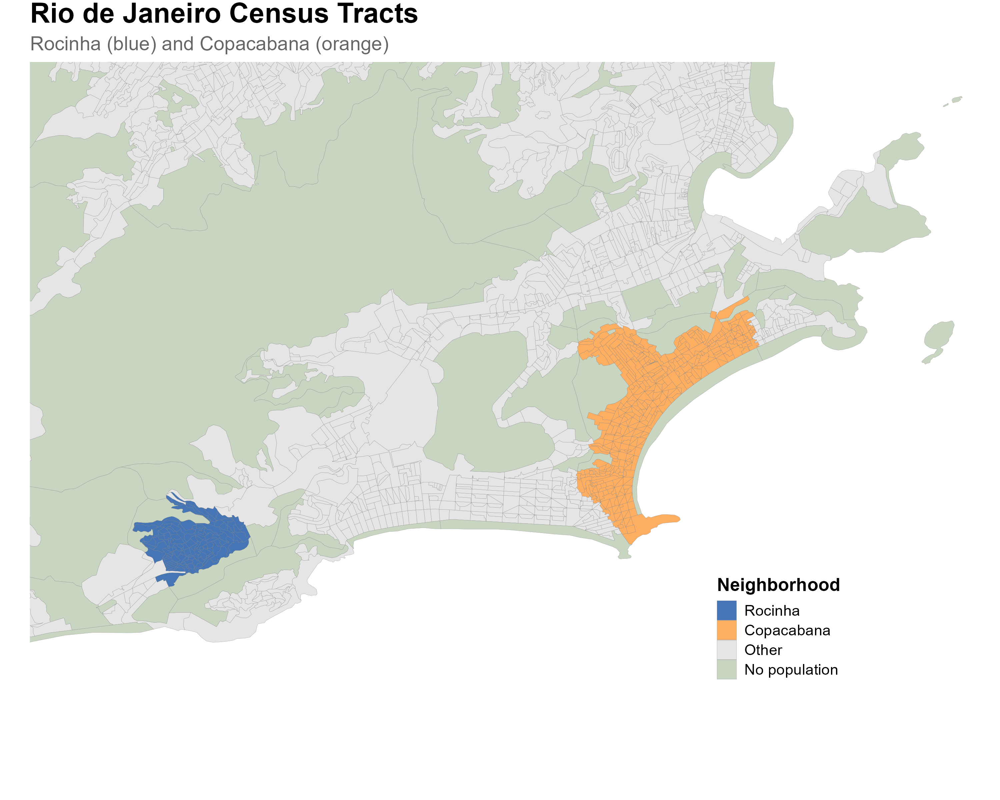
```

```{r fig-rocinha-copacabana, echo = FALSE, out.width = "100%"}
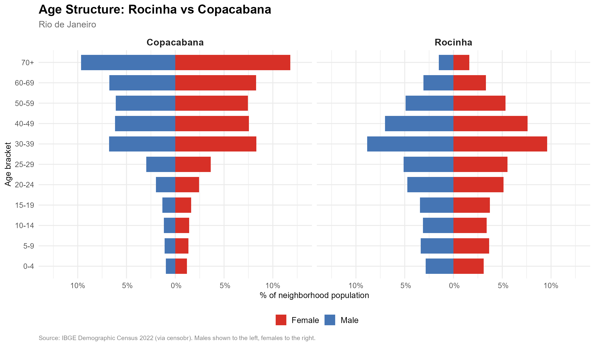
```

**Rocinha**, one of Brazil's largest favelas, has a young population:
large cohorts in the 18--29 age range, tapering off sharply after 50.
**Copacabana**, one of Rio's wealthiest neighborhoods, shows the
opposite pattern: a narrower base of young adults and a large proportion
of residents over 50. This difference reflects fertility rates, life
expectancy, and migration patterns that are tightly linked to income,
education, and living conditions.

> **Census tract codes.** Neighborhoods are defined by aggregating
> IBGE 2022 census tracts whose centroids fall within the 2010
> neighborhood boundaries (via `geobr::read_neighborhood()`).
> Rocinha comprises 115 tracts (codes starting with `330455705330`,
> subdistrict 0533); Copacabana comprises 420 tracts (codes starting
> with `330455705100`, subdistrict 0510). Tracts shown in green on
> the map have zero population and are excluded from the interpolation.

Because these age signatures differ systematically across neighborhoods,
they carry information about socioeconomic composition --- and, by
extension, about voting behavior. The method we describe exploits this:
it finds weights that reproduce the census age structure at each tract
when applied to station-level voter data. If the weights are correct for
demographics, they should also produce good estimates for vote counts.


## 2. The Problem: Many-to-Many Spatial Disaggregation

Imagine you are a researcher who wants to know how Copacabana voted in
the 2022 presidential election. The TSE can tell you how each polling
station in the area voted. But several things make this harder than it
seems:

- **One station, many neighborhoods**: a school in Botafogo may receive
  voters from Botafogo, Laranjeiras, and even from the Santa Marta
  favela up the hill. The station's vote total is a mix of all these
  populations.
- **One neighborhood, many stations**: Copacabana voters may be assigned
  to polling stations in Copacabana itself, in neighboring Ipanema, or
  in Leme. The neighborhood's voters are split across multiple stations.
- **No lookup table**: unlike in some countries, there is no official
  mapping from residential addresses to polling stations. The
  relationship is **many-to-many**, and there is no administrative data
  to resolve it.

This is not a standard areal interpolation problem. In areal
interpolation, both source and target are polygons, and the overlap area
provides natural weights. Here, the sources are **points** (stations),
not polygons. Area-weighted interpolation does not apply. Nor is it a
simple point-in-polygon assignment: since the mapping is many-to-many,
assigning each tract to its nearest station (Voronoi) would lose
information and produce poor estimates (we demonstrate this in
Section 17).

### The approach: estimating the association structure

Our solution estimates the **association structure** between tracts and
stations --- a weight matrix $W$ of dimension $[N \times M]$ where each
entry $W_{ij}$ captures how much station $j$ "serves" tract $i$.

Two fundamental properties are enforced:

1. **Source conservation** (column constraint): each station distributes
   exactly 100% of its data. The total votes in the municipality are
   preserved exactly: $\sum_i W_{ij} = 1$ for all $j$.
2. **Population proportionality** (row constraint): each tract receives
   total weight proportional to its population share:
   $\sum_j W_{ij} \propto \text{pop}_i$.

The method **does not assume** a fixed assignment of voters to stations.
Instead, it estimates a smooth probabilistic mapping, calibrated against
known demographic data.

### Walking to vote: a behavioral assumption

The key behavioral assumption is that **voters walk to their polling
stations**. This grounds the spatial model: closer stations receive more
weight because voters are more likely to walk to them.

This assumption is supported by empirical evidence. Pereira et al.
(2023) studied the effect of free public transit on election day in
Brazilian cities, finding that it increased turnout --- implying that
transportation costs (including walking distance) are a meaningful
barrier. Brazilian electoral law requires that voters be assigned to
polling stations near their registered address, reinforcing the spatial
proximity assumption.

> Pereira, R. H. M., Braga, C. K. V., Serra, B., & Nadalin, V. (2023).
> "Free public transit and voter turnout." *Available at:*
> <https://www.urbandemographics.org/files/2023_Pereira_et_al_free_public_transit_voter_turnout.pdf>

A second important assumption is that **voters reside in the
municipality where they are registered to vote**, which is the same
municipality captured by the census. This residential assumption is what
allows us to use census population data as the target distribution: the
age structure of voters at a polling station should reflect the age
structure of the surrounding population. Without this assumption, the
calibration step would not be valid.

We use realistic **walking travel times** computed on the OpenStreetMap
road network, not straight-line distances. Mountains, rivers, and the
street layout all affect the actual travel time and are captured by the
routing engine (see Section 9).


## 3. Pipeline Overview

The full interpolation pipeline has six steps:

1. **Census data**: population counts by age bracket per tract
   (`br_prepare_population()`)
2. **Tract geometries**: census tract polygons from IBGE
   (`br_prepare_tracts()`)
3. **Electoral data**: votes, turnout, and voter demographics per station
   (`br_prepare_electoral()`)
4. **Travel times**: walking routes from tract representative points to
   stations (`compute_travel_times()`)
5. **Optimization**: find per-tract decay parameters $\alpha$ that
   minimize demographic mismatch (`optimize_alpha()`)
6. **Interpolation**: use the column-normalized weight matrix from
   optimization (or rebuild with `compute_weight_matrix()`) and apply it to any station-level variable
   ($\hat{X} = W \times V$)

The convenience function `interpolate_election_br()` wraps all six steps
into a single call for Brazilian municipalities, handling data downloads,
geocoding, and default parameter selection automatically.

```{r fig-pipeline, echo = FALSE, out.width = "100%"}
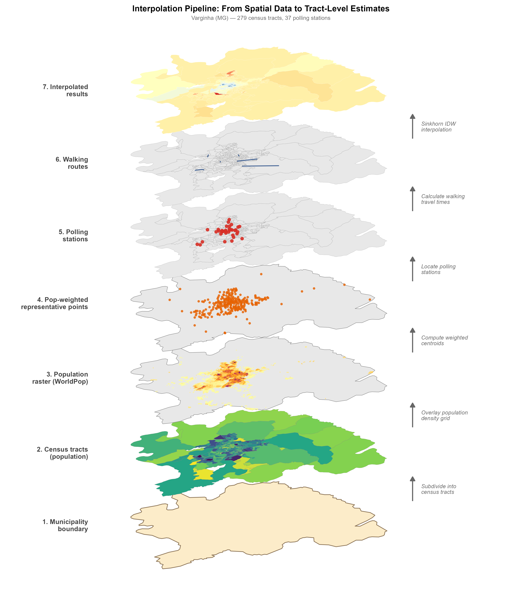
```

The figure above illustrates the spatial data layers involved. Starting
from the bottom: the municipality boundary, census tracts colored by
population, polling station locations, and the final interpolated
results at the tract level.


# Part II: Data

## 4. Census Population Data

```{r pop-call, eval = FALSE}
pop_data <- br_prepare_population("3170701", year = 2022)
head(pop_data[, 1:10])
```

```
  code_tract    code_muni pop_00_04 pop_05_09 pop_10_14 pop_15_19 pop_20_24 pop_25_29 pop_30_39 pop_40_49
1 3170701xxxxx  3170701      68        68        62        88        68        58       144       129
2 3170701xxxxx  3170701      37        36        47        38        47        44        83        95
...
```

The data frame also includes calibration columns that cross
gender (male/female) × 7 age brackets. These **calibration
variables** bridge census tracts and polling stations.

| Age bracket | Census column | TSE equivalent |
|---|---|---|
| 18--19 | `pop_hom_18_19`, `pop_mul_18_19` | `vot_hom_18_19`, `vot_mul_18_19` |
| 20--24 | `pop_hom_20_24`, `pop_mul_20_24` | `vot_hom_20_24`, `vot_mul_20_24` |
| 25--29 | `pop_hom_25_29`, `pop_mul_25_29` | `vot_hom_25_29`, `vot_mul_25_29` |
| 30--39 | `pop_hom_30_39`, `pop_mul_30_39` | `vot_hom_30_39`, `vot_mul_30_39` |
| 40--49 | `pop_hom_40_49`, `pop_mul_40_49` | `vot_hom_40_49`, `vot_mul_40_49` |
| 50--59 | `pop_hom_50_59`, `pop_mul_50_59` | `vot_hom_50_59`, `vot_mul_50_59` |
| 60--69 | `pop_hom_60_69`, `pop_mul_60_69` | `vot_hom_60_69`, `vot_mul_60_69` |

**How the 7 brackets are built.** The TSE voter profile data records
voters in 12 finer age bins (18, 19, 20, 21--24, 25--29, 30--34,
35--39, 40--44, 45--49, 50--54, 55--59, 60--64, 65--69).
`br_prepare_electoral()` aggregates these into the 7 groups above so
they align with the census age brackets. For the 2022 Census --- which
reports a 15--19 group instead of 18--20 --- the package applies a
$2/5$ proxy to approximate the 18--19 voting-age share.

These 7 matched brackets are the key insight: they are observed at
**both** levels (census tracts and polling stations), enabling
calibration. The calibration crosses gender × 7 age groups (14
brackets), providing a strong spatial signal because the optimizer
must simultaneously match the spatial distribution of each
gender--age subgroup.

```{r fig-pop-pyramid, echo = FALSE, out.width = "90%"}
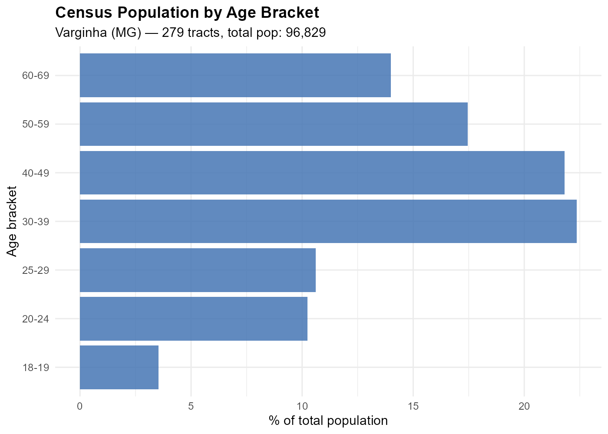
```


## 5. Census Tract Geometries

```{r tracts-call, eval = FALSE}
tracts_sf <- br_prepare_tracts(3170701, pop_data)
```

This downloads tract geometries from `geobr`, removes green areas
(parks, water bodies with zero population), transforms to EPSG:5880
(equal-area projection for accurate spatial operations), and joins the
population columns.

```{r fig-tracts-pop, echo = FALSE, out.width = "100%"}
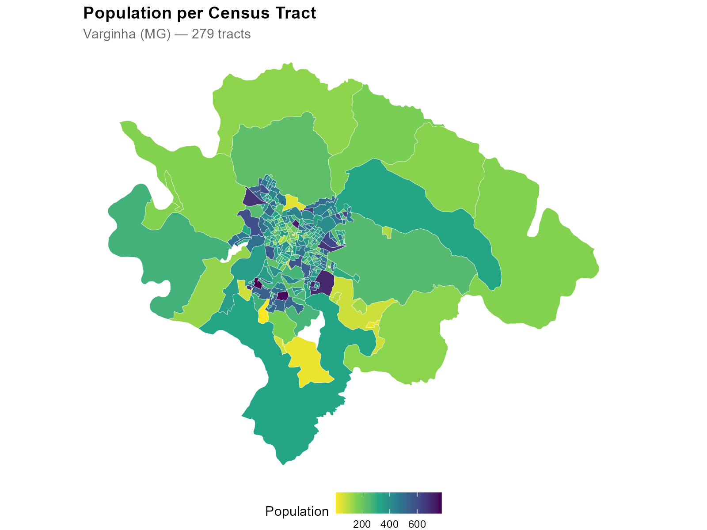
```

Note the urban-rural gradient: small, densely populated tracts in the
city center; large, sparsely populated tracts on the periphery.


## 6. Electoral Data at Polling Stations

```{r electoral-call, eval = FALSE}
electoral <- br_prepare_electoral(
  code_muni_ibge = "3170701",
  code_muni_tse  = "54135",
  uf = "MG", year = 2022,
  cargo = "presidente", turno = 1,
  what = c("candidates", "turnout")
)
```

The result contains one row per polling station with:

- **Vote columns** (`CAND_13`, `CAND_22`, ...): votes per candidate
  (ballot number as suffix; 95 = blank, 96 = null)
- **Turnout** (`QT_COMPARECIMENTO`): total voters who showed up
- **Voter age profiles** (`votantes_18_20`, ..., `votantes_65_69`):
  TSE's fine-grained age registration brackets, aggregated to match the
  7 census brackets
- **Coordinates** (`lat`, `long`): geocoded polling station locations
- **Column dictionary**: `attr(electoral, "column_dictionary")` contains
  metadata for each column (type, cargo, candidate name, party)

The `what` parameter controls what gets included:

- `"candidates"`: one column per candidate
- `"parties"`: aggregated by party (`PARTY_PT`, `PARTY_PL`, ...)
- `"turnout"`: `QT_COMPARECIMENTO`, `QT_APTOS`, `QT_ABSTENCOES`
- `"demographics"`: `GENERO_*` and `EDUC_*` columns

```{r fig-stations, echo = FALSE, out.width = "100%"}
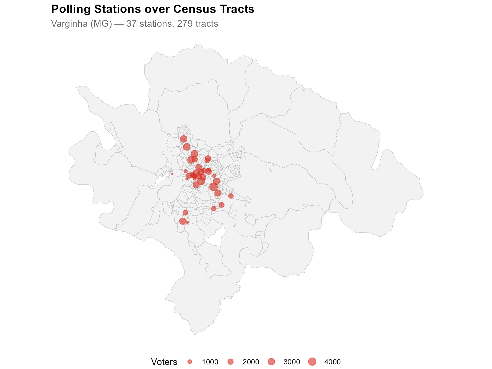
```


## 7. Calibration Variables: Comparing Source and Target

The calibration variables are the bridge between census tracts and
polling stations. The same age brackets are observed at both levels:

- **Census**: "How many people aged 18--20 live in this tract?" (from
  IBGE)
- **Electoral**: "How many registered voters aged 18--20 voted at this
  station?" (from TSE)

These are the same age brackets we saw distinguishing Rocinha from
Copacabana in Section 1. The demographic signature that varies across
neighborhoods is precisely what the method uses to calibrate the weights.

```{r fig-pyramids, echo = FALSE, out.width = "100%"}
knitr::include_graphics("figures/age-pyramids-comparison.png")
```

The shapes are similar but totals differ: the census counts residents,
the TSE counts registered voters. Not everyone of voting age is
registered, and registration rates vary by age bracket.

The optimization finds alpha values so that the **interpolated** voter
age profiles match the **census** age profiles at each tract. If the
weights are correct for demographics, they should also be correct for
vote counts.


# Part III: Geography

## 8. Representative Points: From Tracts to Routable Origins

Routing engines need **point-to-point** queries, but tracts are
polygons. We need a single representative point per tract. Three methods
are available:

| Method | Function | Guarantee |
|---|---|---|
| `"centroid"` | `sf::st_centroid()` | Fast. May fall outside concave polygons. |
| `"point_on_surface"` | `sf::st_point_on_surface()` | Guaranteed inside. Default. |
| `"pop_weighted"` | WorldPop raster lookup | Most populated cell. Best for large tracts. |

The choice of representative point matters most for **large, irregularly
shaped tracts** in rural and peri-urban areas. Consider the southern
periphery of São Paulo, where census tracts extend over several square
kilometers of mixed urban and forested land:

```{r fig-rep-points-sp, echo = FALSE, out.width = "100%"}
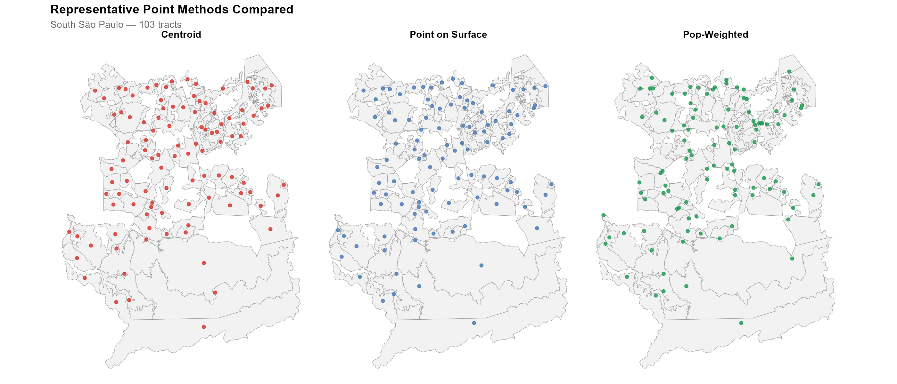
```

The three-panel comparison shows the same set of large tracts in south
São Paulo. The red dots (centroids) frequently fall in uninhabited areas
--- in the middle of Mata Atlântica forest or in empty fields. The blue
dots (point on surface) are guaranteed to be inside the polygon, but may
still be far from where people actually live. The green dots
(pop-weighted) use the WorldPop population raster to find the most
densely populated cell within each tract, placing the representative
point where residents actually are.

```{r fig-rep-points-zoom, echo = FALSE, out.width = "80%"}
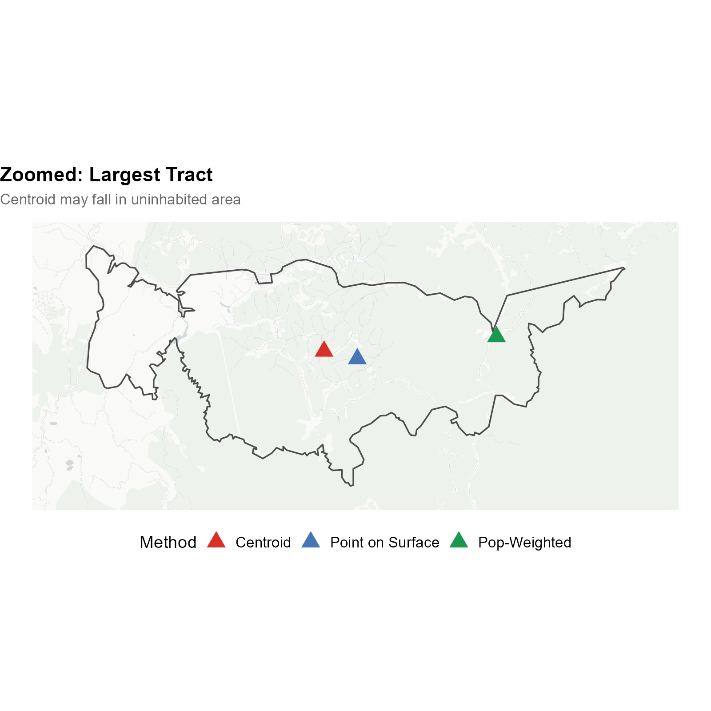
```

Zooming into the largest tract, the centroid falls in dense forest while
the pop-weighted point correctly identifies the settlement area. This
difference can affect travel time calculations by tens of minutes.

```{r rep-points, eval = FALSE}
pts_pos <- compute_representative_points(tracts_sf,
  method = "point_on_surface")
pts_pop <- compute_representative_points(tracts_sf,
  method = "pop_weighted")
```

The `pop_weighted` method downloads the WorldPop Brazil Constrained 2020
raster (~48 MB, cached) and finds the raster cell with the highest
population density within each tract.

The `min_area_for_pop_weight` parameter (default: 1 km²) controls the threshold:
tracts smaller than this use `point_on_surface` regardless of the chosen
method, since small urban tracts are dense enough that any interior
point is a reasonable proxy.


## 9. Travel Times: Building the Distance Matrix

### 9.1 Why walking travel time?

In Brazil, voters are assigned to polling stations near their registered
address. On election day, most voters **walk** to their polling station.
This is not merely an assumption of convenience --- it is grounded in
the geographic design of the Brazilian electoral system and in empirical
evidence.

Pereira et al. (2023) studied the introduction of free public transit on
election days in Brazilian cities. Their finding that free transit
significantly increased turnout implies that the **cost of getting to
the polls** --- primarily walking distance --- is a real barrier that
affects participation. If distance matters for whether people vote at
all, it certainly matters for *where* they vote.

We therefore use **realistic walking travel times** computed on the
OpenStreetMap road network, not Euclidean (straight-line) distances. The
routing engine (r5r) accounts for the actual street layout, elevation,
one-way streets, pedestrian paths, and physical barriers.

### 9.2 Euclidean distance vs. walking routes

Why not just use straight-line distance? Because geography creates
dramatic discrepancies between Euclidean distance and actual walking
time. Two examples:

**Example 1: Mountain barrier (Rio de Janeiro)**

A point in the Botafogo neighborhood lies at the base of the
Corcovado/Sumaré hills. A polling station in Laranjeiras sits on the
other side. In a straight line, the distance is modest --- but the
walking route must navigate around the steep terrain:

```{r fig-routes-rj, echo = FALSE, out.width = "100%"}
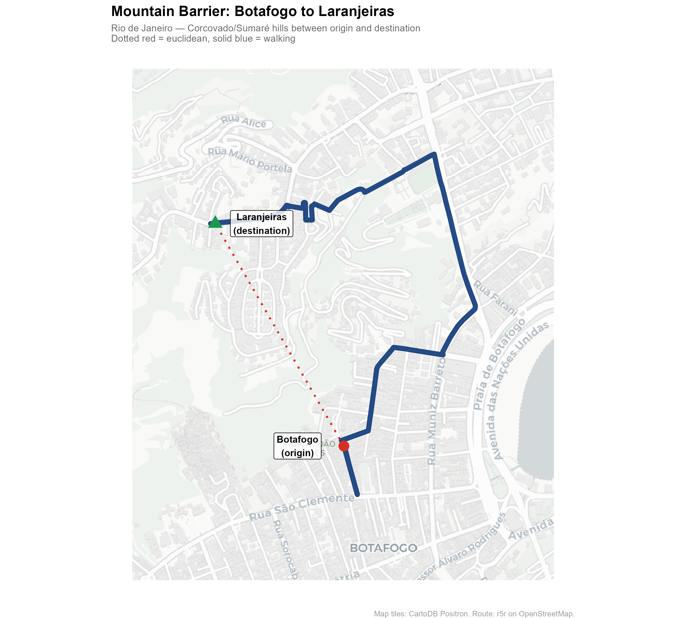
```

The solid blue line shows the actual walking route computed by r5r on
the OSM road network. The dotted red line shows the straight-line
distance. In mountainous terrain, these can differ by a factor of 3--5x.

**Example 2: Water barrier (Recife)**

A point in the Boa Vista neighborhood and a destination in the
Brasília Teimosa peninsula are separated by Recife's waterways.
The walking route must navigate around the estuary and cross bridges,
adding significant distance compared to the straight line.

```{r fig-routes-recife, echo = FALSE, out.width = "100%"}
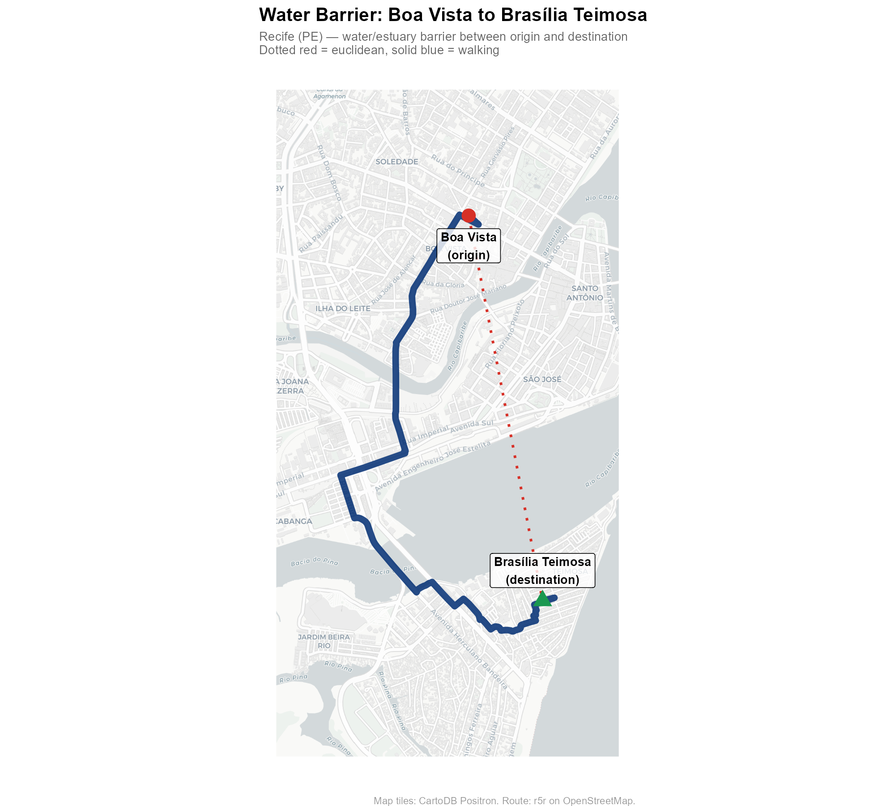
```

**Example 3: Water barrier (Florianópolis)**

Florianópolis, capital of Santa Catarina, is split between the mainland
and an island in the Atlantic. A point in Coqueiros (mainland) and a
destination at Costeira do Pirajubaé (island) are separated by the bay.
The walking route must detour to one of the bridges connecting the two
sides:

```{r fig-routes-florianopolis, echo = FALSE, out.width = "100%"}
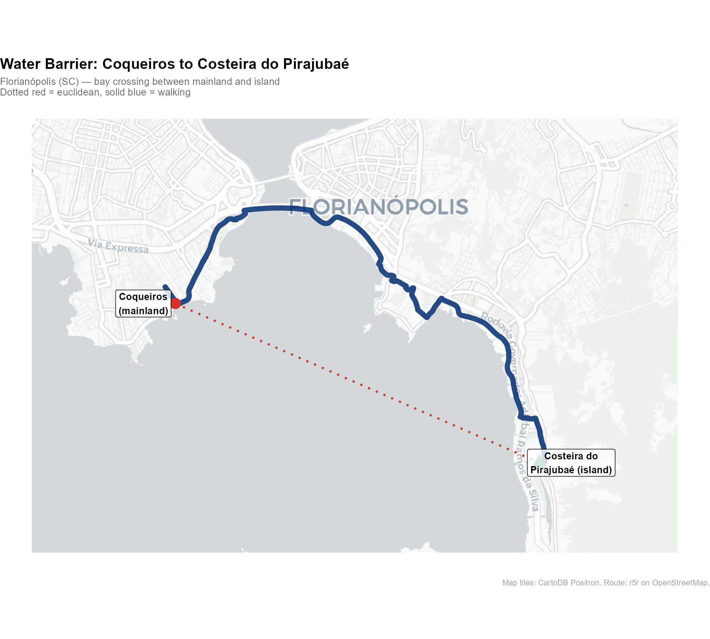
```

These examples illustrate why Euclidean distance is a poor proxy for
actual accessibility --- and why the routing engine matters.

### 9.3 Building the travel time matrix

```{r tt-call, eval = FALSE}
time_matrix <- compute_travel_times(
  tracts_sf = tracts_sf,
  points_sf = electoral_sf,
  network_path = network_path,
  tract_id = "id",
  point_id = "id"
)
```

This builds an **[N tracts × M stations] matrix** of walking travel
times in minutes, using the r5r routing engine on OpenStreetMap data.

- **Origins**: representative points (from Section 8)
- **Destinations**: polling station coordinates
- **Mode**: walking (default), configurable
- **Max trip duration**: 180 minutes (default); pairs beyond this threshold are `NA` (unreachable) and receive exactly zero weight

The OSM data is downloaded via `download_r5r_data()`, which fetches
state-level `.pbf` files and clips them to the municipality bounding box
using osmium.

```{r fig-tt-heatmap, echo = FALSE, out.width = "90%"}
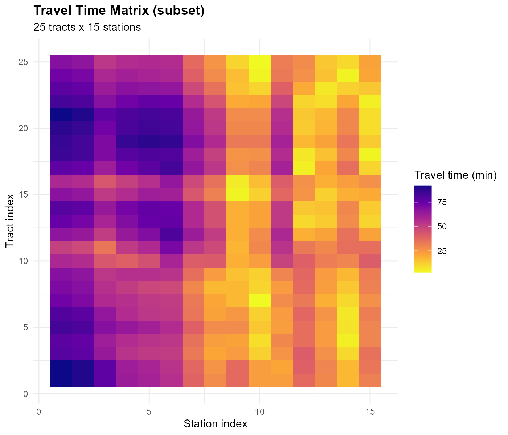
```

The heatmap shows spatial structure: a block-diagonal pattern where
nearby tract-station pairs have short travel times.

```{r fig-tt-accessibility, echo = FALSE, out.width = "100%"}
knitr::include_graphics("figures/tt-accessibility-map.png")
```

Tracts in the center have short travel times to the nearest station;
peripheral tracts are farther away.

**The offset**: before applying the power-law IDW kernel (the default), we add
1 to all travel times (`time_matrix + 1`) to avoid singularity when $t = 0$.
The exponential kernel does not need this offset (see Section 10).


# Part IV: The Weight Matrix

## 10. The IDW Kernel: Turning Distance into Influence

### Intuition: gravitational pull

Think of each polling station as exerting a "gravitational pull" on
nearby tracts. Closer stations pull harder. The IDW (Inverse Distance
Weighting) kernel translates this intuition into numbers: given a travel
time between a tract and a station, it produces a weight that decreases
with distance.

### A concrete example

Suppose a tract has three nearby stations at 5, 12, and 30 minutes
walking distance. How much should each station contribute to this
tract's estimate? With a decay parameter $\alpha = 2$:

```{r idw-example}
tt <- c(5, 12, 30)  # travel times in minutes
alpha <- 2
raw_weights <- (tt + 1)^(-alpha)
normalized <- raw_weights / sum(raw_weights)
cat("Travel times:", tt, "minutes\n")
cat("Raw weights: ", round(raw_weights, 5), "\n")
cat("Normalized:  ", round(normalized, 3), "\n")
cat("The 5-min station gets", round(normalized[1] * 100),
    "% of this tract's weight\n")
```

The nearest station (5 min) gets the lion's share of the weight. The
30-minute station contributes very little.

### The formula

The package supports two kernel functions, selected via
`optim_control(kernel = ...)`:

**Power-law kernel** (default):
$$K_{ij} = (t_{ij} + 1)^{-\alpha_i}$$

**Exponential kernel**:
$$K_{ij} = \exp(-\alpha_i \cdot t_{ij})$$

Both share the unified form $\log K_{ij} = -\alpha_i \cdot \phi(t_{ij})$,
where $\phi(t) = \log(t + 1)$ for the power kernel and $\phi(t) = t$ for the
exponential. Everything downstream (column normalization, Poisson deviance,
gradient computation) is kernel-agnostic.

The kernels differ in **tail behavior**. For the power kernel, the
relative decay $K(2t)/K(t) \approx 2^{-\alpha}$ is approximately constant
regardless of distance (**heavy tail**). For the exponential kernel, the
relative decay $K(2t)/K(t) = \exp(-\alpha \cdot t)$ increases with distance
(**light tail**).
These are structural differences in shape, not claims about which kernel
produces more localized weights --- that depends on what $\alpha$
the optimizer finds.

Note that $\alpha$ has **different units** across kernels: it is
dimensionless for the power kernel but has units of $\text{min}^{-1}$ for the
exponential. The optimizer finds the appropriate scale automatically, so
comparing kernels at the "same alpha" is meaningless.

For the default power kernel, the raw weight between tract $i$ and station $j$
is:

$$W^{\text{raw}}_{ij} = (t_{ij} + 1)^{-\alpha_i}$$

where:

- $t_{ij}$: travel time from tract $i$ to station $j$ (minutes)
- $\alpha_i$: decay parameter for tract $i$ (to be optimized)

### How alpha controls the decay

```{r weight-decay, fig.height = 4}
tt_range <- 0:60
alphas <- c(0.5, 1, 2, 5, 10)
decay_df <- do.call(rbind, lapply(alphas, function(a) {
  data.frame(time = tt_range, weight = (tt_range + 1)^(-a),
             alpha = paste0("alpha = ", a))
}))
decay_df$alpha <- factor(decay_df$alpha,
                          levels = paste0("alpha = ", alphas))

library(ggplot2)
ggplot(decay_df, aes(x = time, y = weight, color = alpha)) +
  geom_line(linewidth = 0.8) +
  scale_y_log10() +
  labs(title = "Weight Decay Curves",
       subtitle = "Higher alpha = steeper decay = more concentrated weights",
       x = "Travel time (minutes)", y = "Weight (log scale)",
       color = "") +
  theme_minimal() +
  theme(plot.title = element_text(face = "bold"),
        legend.position = "right")
```

- $\alpha = 0.5$: nearly flat --- all stations contribute almost equally
- $\alpha = 2$: moderate --- stations within 10 minutes dominate
- $\alpha = 10$: steep cliff --- only the nearest station matters

### Why per-tract alpha?

A single global $\alpha$ cannot capture the heterogeneity of urban
geography. Urban centers have many overlapping station catchments ---
these tracts need a low $\alpha$ to spread weight across several
stations. Isolated peripheral tracts with one nearby station need a high
$\alpha$ to concentrate weight. The optimizer finds the best $\alpha$
for each tract independently.


## 11. Why Single-Sided Standardization Fails

Before describing the column normalization approach used by the package,
let us understand why simpler row-based approaches do not work. We need
to normalize the raw weight matrix so that the weights sum to meaningful
quantities. There are two natural choices --- and only column
normalization provides the guarantee we need.

### 11.1 Column-only standardization

The first approach: divide each column by its sum so that each station
distributes 100% of its data:

$$W^{\text{col}}_{ij} = \frac{W^{\text{raw}}_{ij}}{\sum_i W^{\text{raw}}_{ij}}$$

Column sums = 1 (**source conservation**: every vote is distributed
exactly once). But there is no constraint on row sums.

```{r col-std-problem}
# Toy example: 5 tracts, 3 stations
tt_toy <- matrix(
  c(2,  10, 25, 30, 50,   # station 1: close to tract 1
    15,  3, 12, 28, 45,   # station 2: close to tract 2
    40, 35, 20,  5,  8),  # station 3: close to tracts 4-5
  nrow = 5, ncol = 3
)
pop_toy <- c(100, 300, 150, 200, 250)  # population per tract

alpha_toy <- rep(2, 5)
W_raw <- (tt_toy + 1)^(-alpha_toy)

# Column standardize
W_col <- t(t(W_raw) / colSums(W_raw))

cat("Column sums (should be 1 — OK):\n")
round(colSums(W_col), 4)

cat("\nRow sums (uncontrolled — BAD):\n")
round(rowSums(W_col), 4)

cat("\nPopulation shares (what rows should look like):\n")
round(pop_toy / sum(pop_toy) * 3, 4)
```

Tract 1 has only 10% of the population but receives a disproportionate
share because it is close to station 1. Municipal totals are preserved,
but the *distribution* across tracts is wrong.

### 11.2 Row-only standardization

The opposite approach: normalize rows to match population shares.

```{r row-std-problem}
# Row standardize to population-proportional targets
m <- ncol(tt_toy)
row_targets_toy <- pop_toy / sum(pop_toy) * m

W_row <- W_raw * (row_targets_toy / rowSums(W_raw))

cat("Row sums (should match population targets — OK):\n")
round(rowSums(W_row), 4)

cat("\nColumn sums (should be 1 — BAD):\n")
round(colSums(W_row), 4)
```

Now the rows are correct, but the column sums are wrong. Some stations
"distribute" more than 100% of their votes, others less than 100%. The
municipal total is no longer conserved: if we multiply these weights by
vote counts, we get more (or fewer) total votes than actually existed.

### The choice: column normalization

- Column-only: preserves totals (**source conservation**) --- every vote
  is distributed exactly once. The spatial *distribution* across tracts
  is governed by the optimized alpha parameters, which are calibrated
  against census demographics.
- Row-only: distributes correctly but does not preserve totals.

**Column normalization is the right choice** because source conservation
is the non-negotiable constraint: we must not create or destroy votes.
The alpha optimization (Section 13) takes care of making the row-side
distribution match census demographics as closely as possible.


## 12. Column Normalization: Source Conservation

### 12.1 The idea: preserving station totals

The core constraint is **source conservation**: each polling station
must distribute exactly 100% of its data. If a station recorded 500
votes, the interpolation must assign exactly 500 votes across all
tracts --- no more, no less.

Column normalization enforces this directly: divide each column of the
raw weight matrix by its sum so that each station's weights sum to 1.

$$W_{ij} = \frac{K_{ij}}{\sum_i K_{ij}}$$

where $K_{ij} = (t_{ij} + 1)^{-\alpha_i}$ is the IDW kernel from
Section 10.

### 12.2 Worked example

```{r colnorm-example}
# Using the toy example from Section 11
# W_raw is already defined: 5 tracts, 3 stations
W_col <- t(t(W_raw) / colSums(W_raw))

cat("Column sums (should be 1 — source conservation):\n")
round(colSums(W_col), 4)

cat("\nRow sums (governed by alpha — not explicitly constrained):\n")
round(rowSums(W_col), 4)

cat("\nWeight matrix:\n")
print(round(W_col, 4))
```

Each station distributes exactly 100% of its data. The distribution
across tracts is determined by the IDW kernel: tracts closer to a
station receive more weight. The **alpha optimization** (Section 13)
adjusts the decay parameters so that the resulting tract-level estimates
match census demographics as closely as possible.

**Key properties**:

- **Source conservation**: column sums are exactly 1
- **Non-negative**: all weights are non-negative
- **Deterministic**: no iterative procedure, just a single division
- Unreachable tracts (all-zero rows) remain zero and are flagged


### 12.3 Per-Bracket Column Normalization

#### The problem: age groups have different geographies

Think about the spatial distribution of voters by age. Young adults
(18--24) cluster near universities, cheap rental apartments, and transit
corridors. Elderly voters (60--69) concentrate in established
neighborhoods, retirement communities, and areas with healthcare
facilities. These spatial patterns differ substantially --- yet a single
weight matrix must allocate *all* age groups simultaneously.

With **aggregate** column normalization, the weight matrix has one set of
weights for all age brackets. The optimizer must find one set of weights
that simultaneously matches multiple different demographic distributions.
This is an inherent compromise: weights that correctly distribute 18--20
year-olds may systematically misallocate 60--69 year-olds, and vice
versa.

#### The per-bracket extension

**Per-bracket column normalization** addresses this by building a
separate column-normalized weight matrix for each demographic bracket
$k = 1, \ldots, K$. Instead of one weight matrix $W$, we build $K$
bracket-specific matrices $W^{(1)}, \ldots, W^{(K)}$, each
column-normalized independently:

**For each bracket $k$:**

1. **Compute the IDW kernel**: $K^{(k)}_{ij} = (t_{ij} + 1)^{-\alpha_{i}}$
   (same kernel for all brackets, since alpha is shared)
2. **Column-normalize**: $W^{(k)}_{ij} = K^{(k)}_{ij} / \sum_i K^{(k)}_{ij}$

**Aggregate:**

$$W_{\text{total}} = \frac{1}{K} \sum_{k=1}^{K} W^{(k)}$$

followed by a final column normalization to enforce source conservation
(each station distributes exactly 100% of its data).

#### Why this works

Each bracket's column-normalized weights distribute that bracket's
station-level data across tracts proportionally to the IDW kernel. The
alpha optimization (Section 13) adjusts the decay parameters so that
the resulting interpolated demographics match the census demographics
across all brackets simultaneously. The per-bracket structure allows the
loss function to separately account for each age group's spatial
pattern.

```{r per-bracket-demo}
# Bracket 1 ("young"): concentrated near station 1
# Bracket 2 ("old"): concentrated near station 3
pop_young <- c(60, 100, 50, 30, 20)   # young pop per tract
pop_old   <- c(40, 200, 100, 170, 230) # old pop per tract

src_young <- c(150, 70, 40)  # young voters per station
src_old   <- c(100, 330, 310) # old voters per station

# Per-bracket column normalization: each bracket uses the same
# column-normalized kernel
W_col <- t(t(W_raw) / colSums(W_raw))

# Interpolate both brackets
young_hat <- as.numeric(W_col %*% src_young)
old_hat   <- as.numeric(W_col %*% src_old)

cat("=== Young bracket ===\n")
cat("Census truth:     ", pop_young, "\n")
cat("Column-normalized:", round(young_hat), "\n")
cat("SSE:             ", round(sum((young_hat - pop_young)^2)), "\n")

cat("\n=== Old bracket ===\n")
cat("Census truth:     ", pop_old, "\n")
cat("Column-normalized:", round(old_hat), "\n")
cat("SSE:             ", round(sum((old_hat - pop_old)^2)), "\n")
```

The alpha optimization reduces this SSE by finding per-tract decay
parameters that best match both demographic distributions.

```{r per-bracket-comparison-plot, fig.height = 5}
# Visual comparison: census truth vs column-normalized estimate
pop_mat_toy <- cbind(young = pop_young, old = pop_old)
comparison_df <- data.frame(
  tract = rep(1:5, 4),
  value = c(pop_young, pop_old, young_hat, old_hat),
  bracket = rep(c("Young", "Old", "Young", "Old"), each = 5),
  source = rep(c("Census truth", "Census truth",
                  "Column-normalized estimate",
                  "Column-normalized estimate"),
               each = 5)
)

ggplot(comparison_df,
       aes(x = factor(tract), y = value, fill = source)) +
  geom_col(position = "dodge", width = 0.7) +
  facet_wrap(~bracket, scales = "free_y") +
  scale_fill_manual(values = c("Census truth" = "#4575b4",
                                "Column-normalized estimate" = "#fdae61")) +
  labs(title = "Per-Bracket Column Normalization: Recovery of Age-Group Profiles",
       x = "Tract", y = "Population", fill = "") +
  theme_minimal() +
  theme(plot.title = element_text(face = "bold"),
        legend.position = "bottom")
```

#### Connection to the optimizer

During optimization (Section 14), the per-bracket column normalization
is performed on 3D tensors of shape `[ka x n x m]`, where `ka` is the
number of active demographic brackets. This vectorizes all $K$ separate
normalization operations into a single batched computation on GPU or
CPU.

After optimization, the weight matrix $W$ is returned directly from
`optimize_alpha()` as `result$W`. It can also be recomputed from
pre-existing alpha values using `compute_weight_matrix()`:

```{r per-bracket-final, eval = FALSE}
# W is already in the optimization result
W <- optim_result$W

# Or recompute from alpha
W <- compute_weight_matrix(time_matrix, alpha,
  pop_matrix = pop_matrix,
  source_matrix = source_matrix)
```

When `pop_matrix` and `source_matrix` are provided, the function
automatically uses per-bracket mode.


# Part V: Calibration and Optimization

## 13. The Calibration Objective

### 13.1 The key insight

We have all the ingredients: travel times, an IDW kernel parametrized by
$\alpha$, and column normalization to enforce source conservation. Now
we need to find the right $\alpha$.

Here is the calibration logic: **if the weights are correct, then
interpolating voter age profiles from stations should recover the census
age profiles at each tract.**

Consider a concrete example. Census data says tract X has 200 people
aged 30--39. If our weights are good, then multiplying the weight row
for tract X by the station-level voter counts for the 30--39 age
bracket should give us approximately 200. If it gives 150 or 300, the
weights are wrong — the geographic allocation is biased.

The optimization finds $\alpha$ values that minimize this mismatch
across all tracts and all age brackets simultaneously.

### 13.2 The iterative procedure

The optimization is a loop:

```{r fig-optim-loop, echo = FALSE, out.width = "80%"}
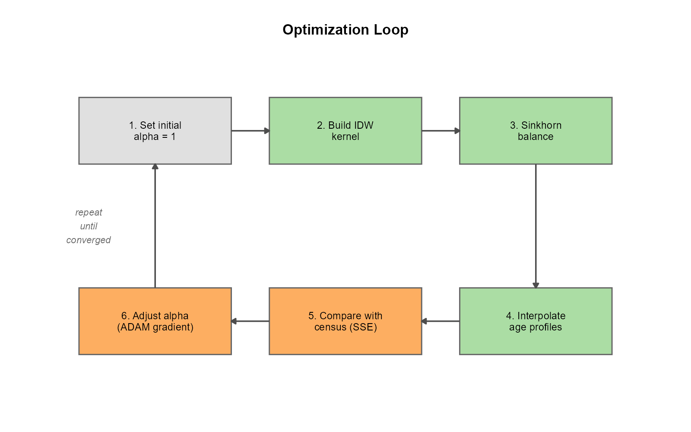
```

In words:

1. **Initialize**: set $\alpha_i = 1$ for all tracts (moderate decay)
2. **Build the IDW kernel**: compute raw weights from travel times and
   current $\alpha$
3. **Column-normalize**: enforce source conservation (column sums = 1)
4. **Interpolate demographics**: multiply normalized weights by
   station-level age profiles
5. **Compare with census**: compute the squared error between
   interpolated and census age profiles
6. **Adjust $\alpha$**: use the gradient (via automatic differentiation)
   to nudge $\alpha$ in the direction that reduces error
7. **Repeat** until the error stops decreasing

Each iteration of this loop evaluates the complete forward pass:
$\alpha \to \text{kernel} \to \text{column-normalize} \to \text{interpolation}
\to \text{error}$.

### 13.3 The formal objective

$$f(\alpha) = \sum_i \sum_k \left( \hat{V}_{ik} - P_{ik} \right)^2$$

where:

- $\hat{V} = W(\alpha) \times S$ --- interpolated voter demographics
  per tract, with $W$ built via per-bracket column normalization
  (Section 12.3)
- $P$ --- census demographics per tract
- $k$ = demographic bracket index ($K = 7$ for age-only calibration,
  $K = 14$ for full gender × age calibration)

The weight matrix $W(\alpha)$ is the aggregation of per-bracket
column-normalized matrices $W^{(k)}$, followed by a final column
normalization pass.

```{r objective-landscape, fig.height = 4.5, warning = FALSE}
# Simplified case: all tracts share the same alpha
tt_adj <- tt_toy + 1
pop_matrix_toy <- matrix(pop_toy, ncol = 1)
src_matrix_toy <- matrix(c(250, 400, 350), ncol = 1)

alpha_range <- seq(0.1, 8, by = 0.1)
sse_values <- sapply(alpha_range, function(a) {
  # Compute column-normalized weights and SSE
  K <- tt_adj ^ (-a)
  K[!is.finite(K)] <- 0
  W <- t(t(K) / colSums(K))  # column-normalize
  v_hat <- W %*% src_matrix_toy
  sum((v_hat - pop_matrix_toy)^2)
})

ggplot(data.frame(alpha = alpha_range, sse = sse_values),
       aes(x = alpha, y = sse)) +
  geom_line(color = "#4575b4", linewidth = 0.8) +
  geom_vline(xintercept = alpha_range[which.min(sse_values)],
             linetype = "dashed", color = "#d73027") +
  labs(title = "Objective Function Landscape",
       subtitle = sprintf(
         "Minimum at alpha = %.1f (shared across all tracts)",
         alpha_range[which.min(sse_values)]),
       x = expression(alpha), y = "SSE") +
  theme_minimal() +
  theme(plot.title = element_text(face = "bold"))
```

The landscape has a clear minimum. In practice, each tract has its own
alpha, creating a high-dimensional optimization problem.

## 14. Optimization: Per-Bracket Gradient Descent with Column Normalization

### 14.1 Why automatic differentiation?

The objective function involves column normalization of the IDW kernel,
followed by matrix multiplication and a squared-error loss. Writing the
analytical gradient by hand is straightforward for simple column
normalization, but becomes tedious when combined with the per-bracket
structure and exponential reparameterization.

Torch's **automatic differentiation** handles this: we define the
forward pass (kernel -> column-normalize -> interpolation -> loss), and
torch computes the gradient of the loss with respect to $\alpha$
automatically by recording every operation and applying the chain rule
backward.

### 14.2 Log-domain computation for numerical stability

When $\alpha$ is large and travel times vary widely, some weights become
astronomically small:

```{r underflow-demo}
# Demonstrate the underflow problem
tt_demo <- c(5, 20, 60, 120, 200)  # travel times (minutes)
alpha_high <- 8

raw <- (tt_demo + 1)^(-alpha_high)
cat("Raw weights at alpha = 8:\n")
cat(formatC(raw, format = "e", digits = 2), "\n")
cat("\nIn float32, values below ~1.2e-38 become exactly 0\n")
cat("Zero weights cause division by zero in column normalization\n")
```

In 32-bit floating point (standard for GPU computation), numbers smaller
than about $1.2 \times 10^{-38}$ underflow to zero. When a weight
becomes exactly zero, the column normalization produces $0/0 = \text{NaN}$,
and the optimization collapses.

**The log-domain solution**: the IDW kernel is computed in log space
as $\log K_{ij} = -\alpha_i \cdot \log(t_{ij} + 1)$, and the
column normalization uses the **logsumexp** trick for numerical
stability. The logsumexp function $\log(\sum_j \exp(x_j))$ is a
numerically stable primitive available in torch.

### 14.3 The column normalization algorithm

The optimizer performs per-bracket column normalization on 3D tensors.
The tensor shapes involved:

| Symbol | Shape | Meaning |
|---|---|---|
| `log_t` | $[n \times m]$ | Log travel times (precomputed once) |
| `alpha` | $[n]$ | Decay parameters (what we're optimizing) |
| `P` | $[n \times k_a]$ | Census population per tract and bracket |
| `V` | $[m \times k_a]$ | Voter counts per station and bracket |
| `log_K` | $[n \times m]$ | Log-kernel (broadcast to 3D) |
| `W_all` | $[k_a \times n \times m]$ | Per-bracket weight tensors |

The first dimension ($k_a$) indexes demographic brackets. All $k_a$
brackets share the same kernel --- column normalization is applied
independently to each bracket slice.

```
Input: log_t[n,m], alpha[n], P[n,ka], V[m,ka]

# Log-kernel (same for all brackets)
log_K[i,j] = -alpha[i] * log_t[i, j]                  # [n x m]

# Column normalization in log domain (per bracket)
log_colsum[j] = logsumexp_i(log_K[i,j])               # [m]
W[i,j] = exp(log_K[i,j] - log_colsum[j])              # [n x m]

# Per-bracket: broadcast W to [ka x n x m], then interpolate
V_hat = W @ V                                          # [n x ka]
loss = sum((V_hat - P)^2)
```

Every operation --- log, exp, logsumexp, matrix multiply, subtraction,
squaring --- has a defined backward pass in torch. The gradient
$\nabla_\alpha f$ flows backward through the column normalization
automatically.

### 14.4 ADAM optimization with per-bracket weights

We use **ADAM** (Adaptive Moment Estimation) as the underlying optimizer,
with **per-bracket column normalization**. At each gradient step:

1. **Build the IDW kernel** from current alpha values
2. **Per-bracket column normalization**: each demographic column uses the
   same column-normalized kernel
3. **Compute loss**: SSE between interpolated and observed values
4. **Backward + Adam step** on the unconstrained `theta` parameters

At the end of each epoch, the **true objective** is evaluated on the full
dataset (no gradient) and used for convergence monitoring and logging.

**Exponential reparameterization**: alpha is not optimized directly.
Instead we optimize `theta` (unconstrained) where `alpha = exp(theta)`,
initialized as `theta = log(alpha_init)`. This ensures:

- Alpha is always strictly positive --- no clamping or projection needed
- Gradient `d(alpha)/d(theta) = alpha` --- no saturation at any boundary
- Corner solutions due to hard boundary constraints cannot occur

The learning rate is reduced by half when the epoch loss plateaus
(ReduceLROnPlateau with patience = 2 x early-stop patience).

```{r optimize-call, eval = FALSE}
optim_result <- optimize_alpha(
  time_matrix   = time_matrix,
  pop_matrix    = pop_matrix,
  source_matrix = source_matrix,
  row_targets   = row_targets,
  optim = optim_control(
    max_epochs = 200,      # maximum epochs
    lr_init    = 0.05,     # initial learning rate (auto-reduced on plateau)
    use_gpu    = FALSE     # CPU for small problems
  )
)
```

```{r fig-optim-convergence, echo = FALSE, out.width = "90%"}
knitr::include_graphics("figures/optim-convergence.png")
```

The epoch loss curve shows the **true objective** evaluated on all tracts
at the end of each epoch. The package tracks the best epoch loss and
returns the corresponding alpha values.

**Key tuning parameters**:

Tuning parameters are grouped in `optim_control()`:

| Parameter | Default | Effect |
|---|---|---|
| `max_epochs` | 2000 | Maximum epochs. |
| `lr_init` | 0.05 | Initial learning rate. Auto-reduced when loss plateaus. |
| `dtype` | `"float32"` | `"float64"` for more precision (2x memory). |
| `alpha_min` | 1 | Lower bound for alpha (via softplus reparameterization). |
| `use_gpu` | `FALSE` | Enable GPU acceleration (CUDA/MPS). |


# Part VI: Results and Validation

## 15. The Effect of Alpha: Spatial Interpretation

```{r fig-alpha-hist, echo = FALSE, out.width = "80%"}
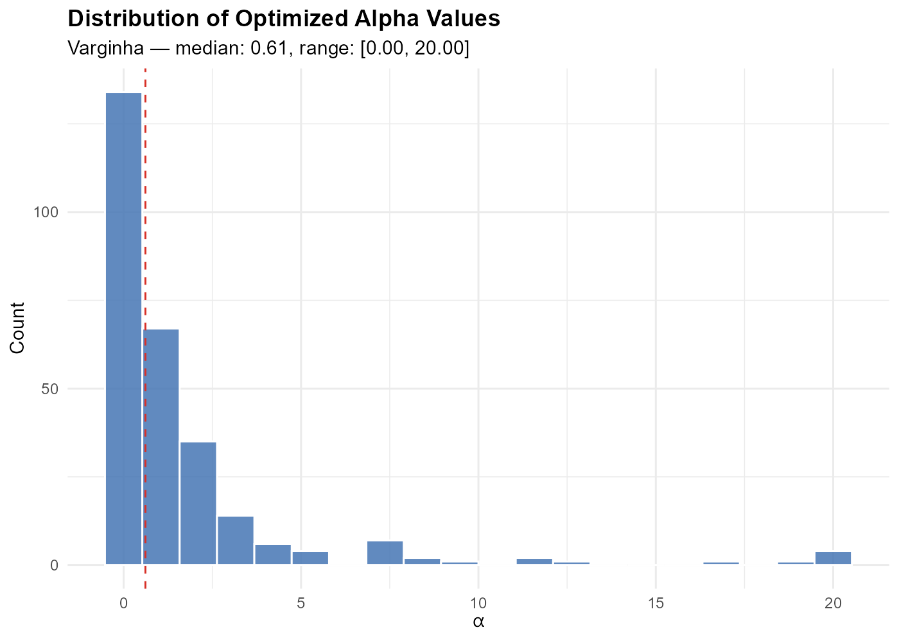
```

Most alphas cluster in a moderate range, with tails extending toward 0
(uniform allocation) and large values (nearest-station-only).

```{r fig-alpha-map, echo = FALSE, out.width = "100%"}
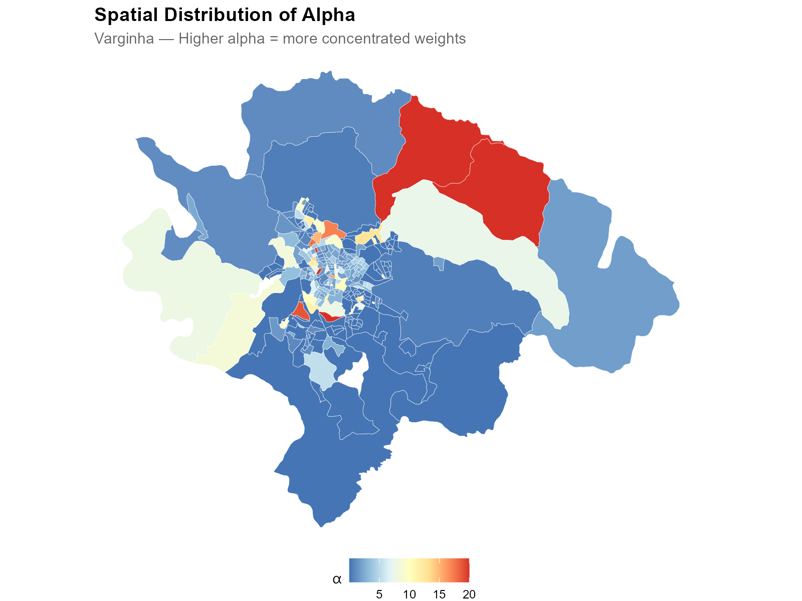
```

- **Low alpha** (blue, urban core): weight is spread across many nearby
  stations. Multiple stations overlap, and the optimizer distributes
  influence broadly.
- **High alpha** (red, periphery): weight is concentrated on the
  nearest station. Isolated tracts with one dominant station.

```{r alpha-effect, fig.height = 4}
# How alpha changes the weight distribution for a fixed tract
tt_one_tract <- c(3, 8, 15, 25, 40)
alphas_demo <- c(1, 3, 5, 10)
wt_df <- do.call(rbind, lapply(alphas_demo, function(a) {
  w <- (tt_one_tract + 1)^(-a)
  w <- w / sum(w)
  data.frame(station = 1:5, weight = w,
             alpha = paste0("alpha = ", a))
}))
wt_df$alpha <- factor(wt_df$alpha,
                        levels = paste0("alpha = ", alphas_demo))

ggplot(wt_df, aes(x = factor(station), y = weight, fill = alpha)) +
  geom_col(position = "dodge") +
  labs(title = "Weight Distribution as Alpha Increases",
       subtitle = "Fixed tract, 5 stations at 3, 8, 15, 25, 40 min",
       x = "Station (sorted by distance)",
       y = "Normalized weight", fill = "") +
  theme_minimal() +
  theme(plot.title = element_text(face = "bold"))
```

At $\alpha = 1$, weights are nearly uniform. At $\alpha = 10$, the
nearest station dominates with ~85% of the weight.

**Interpretation guide**:

- $\alpha < 1$: draws information almost equally from all stations.
  Unusual --- check for data issues.
- $\alpha \in [1, 3]$: several nearby stations contribute. Typical for
  dense urban areas.
- $\alpha \in [3, 6]$: a few stations dominate. Typical for suburban
  areas.
- $\alpha > 6$: one station dominates almost entirely. Typical for
  isolated tracts.


## 16. The Interpolation: From Weights to Tract-Level Estimates

The weight matrix $W$ encodes the geographic relationship between tracts
and stations. Multiplying by any station-level variable produces
tract-level estimates:

$$\hat{X} = W \times V$$

where $W$ is [N × M], $V$ is [M × 1], and $\hat{X}$ is [N × 1]. For
multiple variables: $\hat{X} = W \times V_{\text{matrix}}$ where
$V_{\text{matrix}}$ is [M × P].

```{r interpolation-code, eval = FALSE}
# W is returned directly from optimization
W <- optim_result$W

electoral_data <- as.matrix(
  sources[, c("CAND_13", "CAND_22", "QT_COMPARECIMENTO")]
)
interpolated <- W %*% electoral_data

pct_lula <- interpolated[, "CAND_13"] /
  interpolated[, "QT_COMPARECIMENTO"] * 100
```

```{r fig-interp-lula, echo = FALSE, out.width = "100%"}
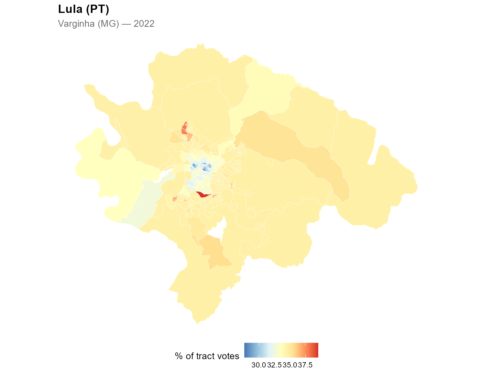
```

```{r fig-interp-bolsonaro, echo = FALSE, out.width = "100%"}
knitr::include_graphics("figures/interp-bolsonaro.png")
```

Geographic polarization becomes visible at the tract level --- a spatial
pattern that was previously impossible to observe with station-level
data alone.

**Calibration validation**: interpolated demographics should match census
demographics (the optimization objective).

```{r fig-scatter, echo = FALSE, out.width = "80%"}
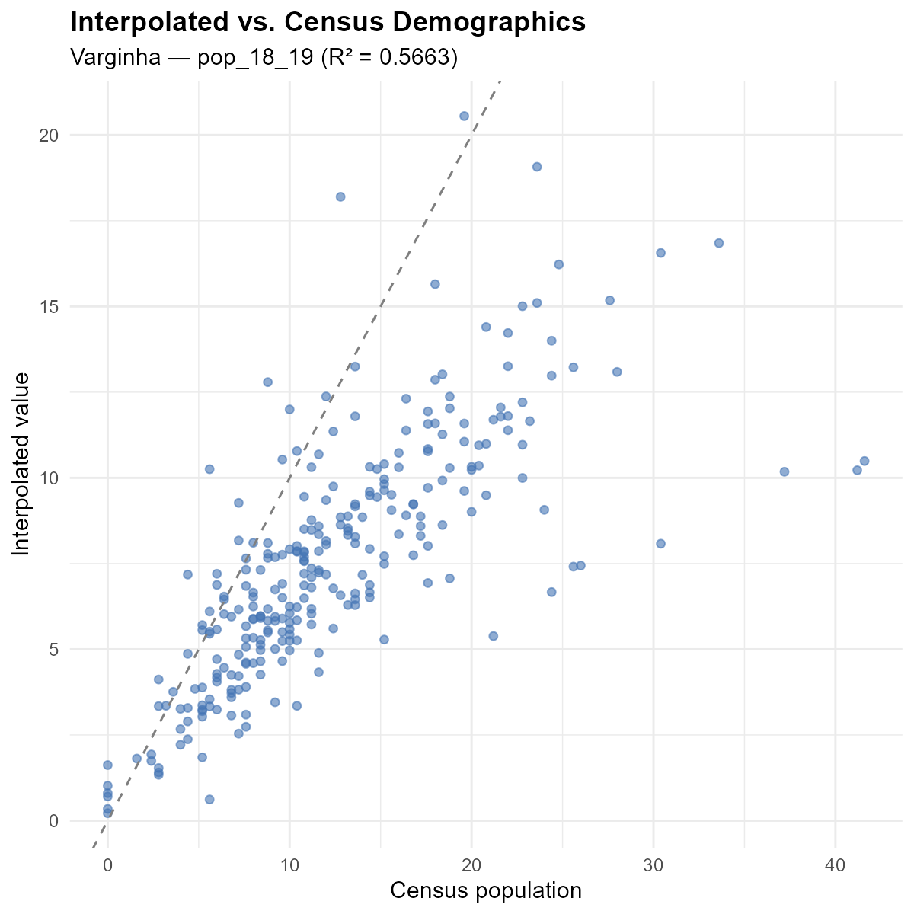
```

Points cluster tightly around the 45-degree line, confirming that the
optimization found good weights.

**The reuse principle**: the weight matrix $W$ is a property of the
geography and the calibration. Once computed, it can interpolate **any**
variable measured at polling stations --- candidates, parties, turnout,
gender composition, education level --- without re-optimizing alpha.


## 17. Validation: How Well Did We Recover the Age Structure?

### 17.1 Conservation properties

**Column conservation** (source conservation):

$$\sum_i W_{ij} = 1 \quad \forall j$$

Each station distributes exactly 100% of its data. Municipal totals are
preserved exactly.

```{r conservation-demo}
votes <- c(500, 800, 700)
interpolated_votes <- as.numeric(W_col %*% votes)

cat("Source total:", sum(votes), "\n")
cat("Interpolated total:", round(sum(interpolated_votes)), "\n")
cat("Per-tract:", round(interpolated_votes), "\n")
```

**Calibration residuals**:

```{r fig-residuals, echo = FALSE, out.width = "90%"}
knitr::include_graphics("figures/residuals-boxplot.png")
```

Residuals should be centered near zero with small magnitude. Outliers
may indicate boundary effects (voters crossing municipality borders) or
data quality issues.

### 17.2 Age pyramid recovery: Rocinha and Copacabana revisited

In Section 1, we showed that Rocinha and Copacabana have strikingly
different age structures. Does the interpolation recover these patterns?

```{r fig-age-recovery, echo = FALSE, out.width = "100%"}
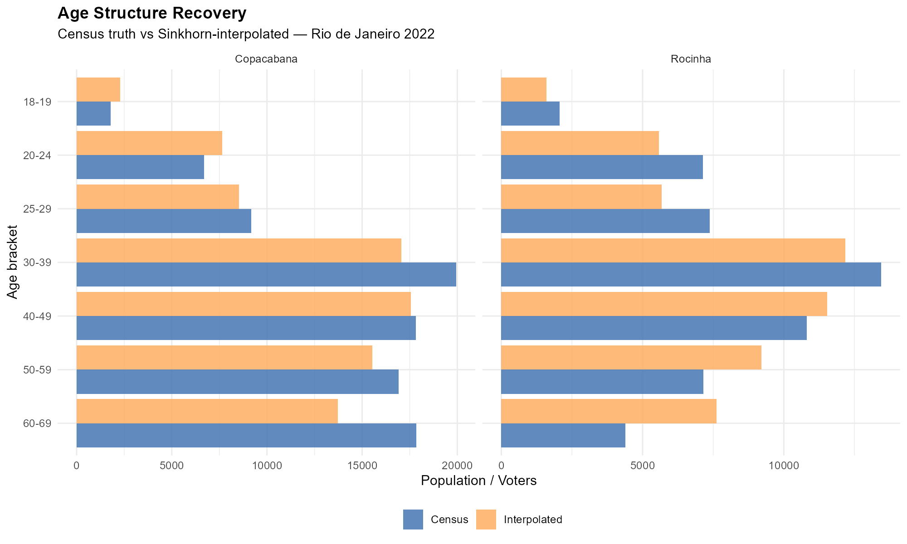
```

The blue bars show the census truth (population by age bracket) and the
yellow bars show the IDW-interpolated voter profiles. The interpolation
closely recovers the distinctive age patterns of both neighborhoods:
Rocinha's young skew and Copacabana's aging profile.

This is a demanding test. The method does not know anything about
Rocinha or Copacabana as neighborhoods --- it only sees census tracts and
polling stations. Yet the calibration against age brackets produces
weights that correctly recover the neighborhood-level demographic
signatures.

### 17.3 Comparison with Voronoi assignment

The simplest alternative to our method is **Voronoi assignment**: assign
each tract to its nearest polling station and use that station's data
directly. This is equivalent to constructing Voronoi (Thiessen) polygons
around each station and assigning each tract 100% of the weight from
one station.

We compare both methods across **four Brazilian state capitals** with
diverse urban morphologies: Palmas (TO), Cuiabá (MT), Manaus (AM), and
Natal (RN).

```{r fig-voronoi-map, echo = FALSE, out.width = "100%"}
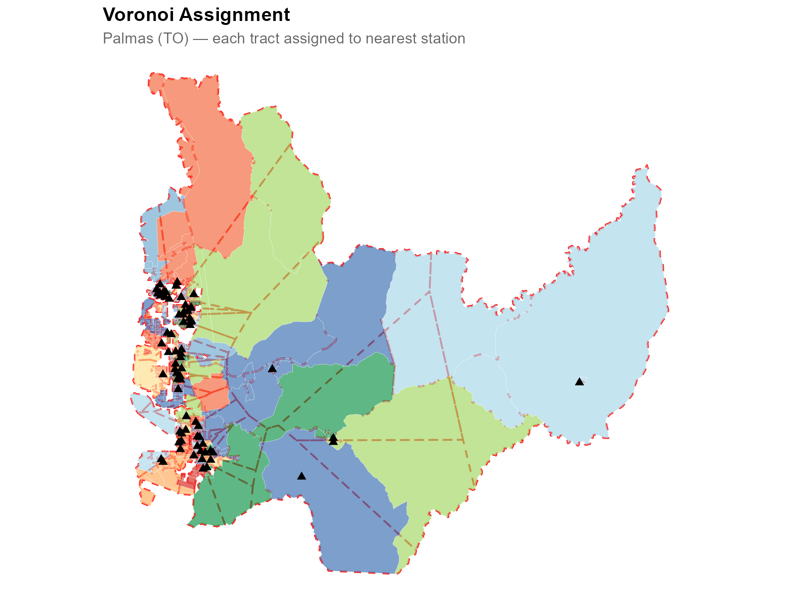
```

In the Voronoi approach, each tract inherits the complete demographic
and electoral profile of a single station. This ignores the many-to-many
structure: a tract near the boundary between two Voronoi cells gets
none of the influence from the station just across the boundary.

How well do the two methods recover the census age structure? The
following figure compares predicted versus observed demographic profiles
across all four cities:

```{r fig-voronoi-scatter, echo = FALSE, eval = FALSE, out.width = "100%"}
# Figure removed — to be regenerated with updated labels
# knitr::include_graphics("figures/voronoi-vs-idw-scatter.png")
```

IDW points cluster tightly around the 45-degree line in every city.
Voronoi points show much more scatter --- many tracts have large
prediction errors because they were assigned to a station with a very
different demographic composition.

```{r fig-voronoi-residuals, echo = FALSE, eval = FALSE, out.width = "100%"}
# Figure removed — to be regenerated with updated labels
# knitr::include_graphics("figures/voronoi-vs-idw-residuals.png")
```

The residual boxplots confirm the pattern across all four cities:
IDW residuals are tightly centered around zero, while Voronoi
residuals have much larger spread.

The aggregate SSE ratio quantifies the advantage:

```{r fig-voronoi-sse, echo = FALSE, out.width = "90%"}
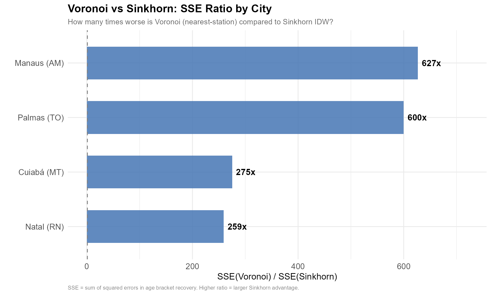
```

In every city, the IDW method achieves dramatically lower squared
error than Voronoi assignment --- by a factor of 275x (Cuiaba) to
1,624x (Manaus), with Palmas at 601x and Natal at 639x. The advantage
is consistent across cities of different sizes and urban layouts,
confirming that smooth, calibrated weighting is fundamentally superior
to hard nearest-station assignment.


### 17.4 Ecological correlation: Lula vote share and household income

As a final validation exercise, we examine whether the interpolated
voting patterns exhibit expected ecological correlations. If the spatial
weights are correct, interpolated vote shares should correlate with
tract-level socioeconomic indicators from independent data sources.

We correlate the interpolated percentage of votes for Lula (PT) in each
census tract with the average monthly income of household heads, obtained
from the 2022 Census (via `censobr::read_tracts(2022,
"ResponsavelRenda")`). We show this correlation for four cities with
very different socioeconomic profiles: São Paulo (SP), Salvador (BA),
Porto Alegre (RS), and Cuiabá (MT).

```{r fig-income-correlation, echo = FALSE, out.width = "100%"}
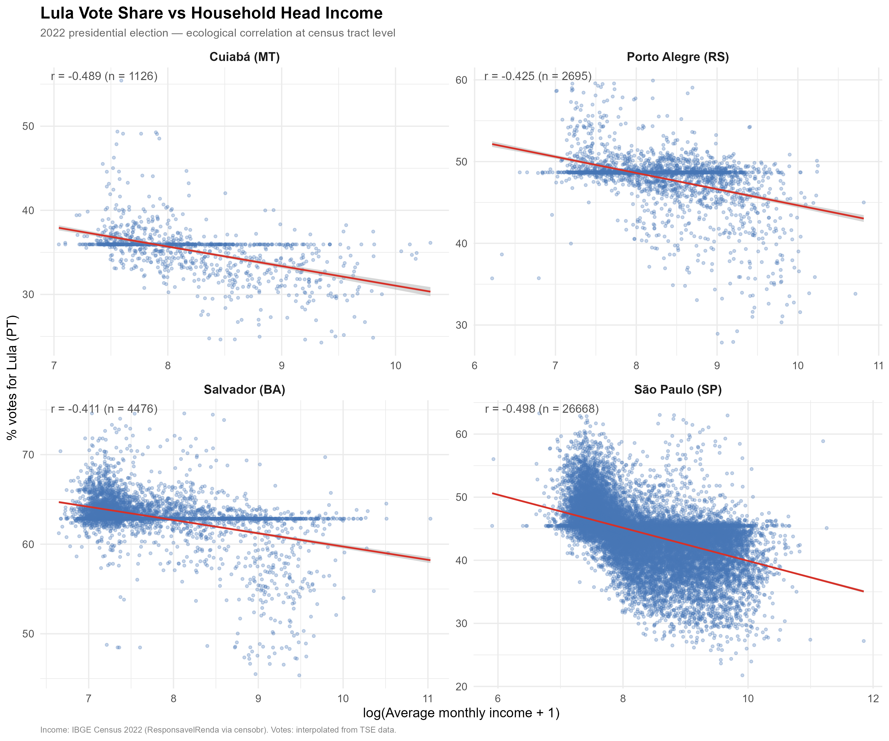
```

The negative correlation is consistent across all four cities and with
well-established patterns in Brazilian electoral geography: lower-income
areas tend to vote more heavily for PT candidates, while higher-income
areas lean toward other parties. The fact that our interpolated
tract-level estimates reproduce this pattern --- using vote data that
was originally measured at polling stations, not at tracts --- provides
external validation that the spatial weights are geographically
meaningful.

The income data is log-transformed ($\log(x+1)$) to reduce the
influence of extreme values and improve linearity.


# Part VII: Practical

## 18. Performance and Tuning

All timings below assume default optimization parameters:
`max_epochs = 200`, `dtype = "float32"`.

| Problem size (tracts) | Recommendation | Typical optimization time |
|---|---|---|
| < 200 | CPU | 10--30 seconds |
| 200--1,000 | CPU or GPU | 30s -- 2 min |
| 1,000--5,000 | GPU recommended | 15s -- 2 min |
| > 5,000 | GPU strongly recommended | 2--10 min |

**Practical runtimes** (optimization step only, from actual runs):

- Igrejinha (85 tracts, 17 stations): ~24s CPU
- Varginha (279 tracts, 37 stations): ~52s CPU
- Palmas (660 tracts, 71 stations): ~135s CPU
- Niterói (1,169 tracts, 135 stations): ~17s GPU
- Belo Horizonte (5,113 tracts, 407 stations): ~105s GPU
- Rio de Janeiro (13,370 tracts, 1,392 stations): ~10 min GPU

Note that total wall-clock time for `interpolate_election_br()` also
includes data downloads, travel time computation (via r5r), and weight
matrix construction, which can dominate for larger cities.

**Memory estimation.** GPU memory during optimization has two main
components:

1. **Full kernel matrix** (always in memory): $n \times m \times
   \text{bytes}$ --- e.g., 5,100 x 407 x 4 = 8 MB for Belo
   Horizonte in float32.
2. **Per-bracket weight tensors**: $k_a \times n \times m \times
   \text{bytes}$ --- torch must store intermediate tensors for
   backpropagation through the column normalization.

where $k_a = 14$ (gender × 7 age brackets) and `bytes` is
4 (float32) or 8 (float64).

| Municipality | Tracts | Stations | $k_a$ | Estimated GPU memory |
|---|---|---|---|---|
| Varginha | 279 | 37 | 14 | ~28 MB |
| Niteroi | 1,169 | 135 | 14 | ~242 MB |
| Belo Horizonte | 5,113 | 407 | 14 | ~729 MB |
| Rio de Janeiro | 13,370 | 1,392 | 14 | ~2.5 GB |

These are actual values reported by the optimizer during precomputation.
For very large cities on GPU, consider using `dtype = "float32"`
(the default) rather than `"float64"` to halve memory usage.

**RStudio**: torch inside RStudio IDE requires subprocess execution via
`callr` (automatic and transparent to the user). Standalone R scripts
run directly.


## 19. Setup: Torch, Java, and r5r

**Torch** (required for optimization):

```{r setup-torch, eval = FALSE}
setup_torch()    # installs torch + libtorch/lantern binaries
use_gpu(TRUE)    # enable GPU globally
```

GPU support: Windows (CUDA), macOS (MPS for Apple Silicon), Linux
(CUDA). CPU always works as fallback.

**Java + r5r** (required for travel time computation):

```{r setup-java, eval = FALSE}
setup_java()     # downloads and installs Java 21
```

Memory: `options(java.parameters = "-Xmx8g")` before loading r5r for
large municipalities.

**Cache management**:

```{r cache, eval = FALSE}
interpElections_cache()                             # list cached files
interpElections_cache("dir")                        # cache directory path
interpElections_cache("clean", category = "votes")  # clear by category
```


## 20. Mathematical Appendix

### Notation

- $N$ = number of census tracts, $M$ = number of polling stations
- $K$ = number of calibration brackets (7 for age-only, 14 for full)
- $t \in \mathbb{R}^{N \times M}$: travel time matrix (minutes)
- $\alpha \in \mathbb{R}^N$: per-tract decay parameters
- $P \in \mathbb{R}^{N \times K}$: census population by age bracket
- $S \in \mathbb{R}^{M \times K}$: voter counts by age bracket at
  stations
- $c \in \mathbb{R}^M$: column targets ($c_j = 1$, enforced by column
  normalization)

### IDW kernel

Both kernels share the form $\log K_{ij} = -\alpha_i \cdot \phi(t_{ij})$:

| Kernel | $K_{ij}$ | $\phi(t)$ | Tail |
|:------:|:---------:|:---------:|:----:|
| Power (default) | $(t_{ij} + 1)^{-\alpha_i}$ | $\log(t_{ij} + 1)$ | Heavy |
| Exponential | $\exp(-\alpha_i \cdot t_{ij})$ | $t_{ij}$ | Light |

### Log-domain kernel

$$\log K_{ij} = -\alpha_i \cdot \phi(t_{ij})$$

### Column normalization

$$W_{ij} = \frac{K_{ij}}{\sum_{i'} K_{i'j}}$$

In log domain (for numerical stability):

$$W_{ij} = \exp\!\left(\log K_{ij} - \text{logsumexp}_i(\log K_{ij})\right)$$

### Per-bracket column normalization

For each demographic bracket $k = 1, \ldots, K$:

1. Compute kernel: $K_{ij} = (t_{ij} + 1)^{-\alpha_i}$
2. Column-normalize: $W^{(k)}_{ij} = K_{ij} / \sum_{i'} K_{i'j}$

Aggregate and column-normalize:
$$W_{\text{total}} = \sum_{k=1}^{K} W^{(k)}$$
$$W_{ij} = W_{\text{total},ij} \bigg/ \sum_{i'} W_{\text{total},i'j}$$

### Objective function (full data)

$$f(\alpha) = \| W(\alpha) \cdot S - P \|_F^2 = \sum_{i=1}^N \sum_{k=1}^K \left( \sum_{j=1}^M W_{ij} S_{jk} - P_{ik} \right)^2$$

where $W(\alpha) \in \mathbb{R}^{N \times M}$ is the per-bracket
column-normalized weight matrix.

### Gradient

Computed by torch autograd through the column normalization. Each
operation (log, exp, logsumexp, matrix multiply, subtraction, squaring)
has a defined backward pass in torch:

$$\nabla_\alpha f = \frac{\partial}{\partial \alpha} \| \text{colnorm}(\text{kernel}(\alpha)) \cdot S - P \|_F^2$$
