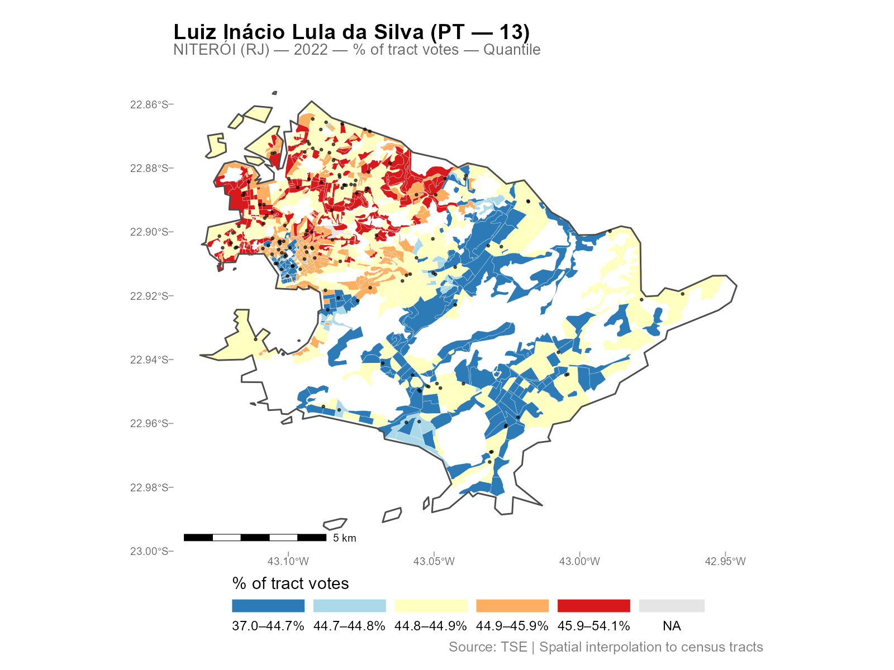
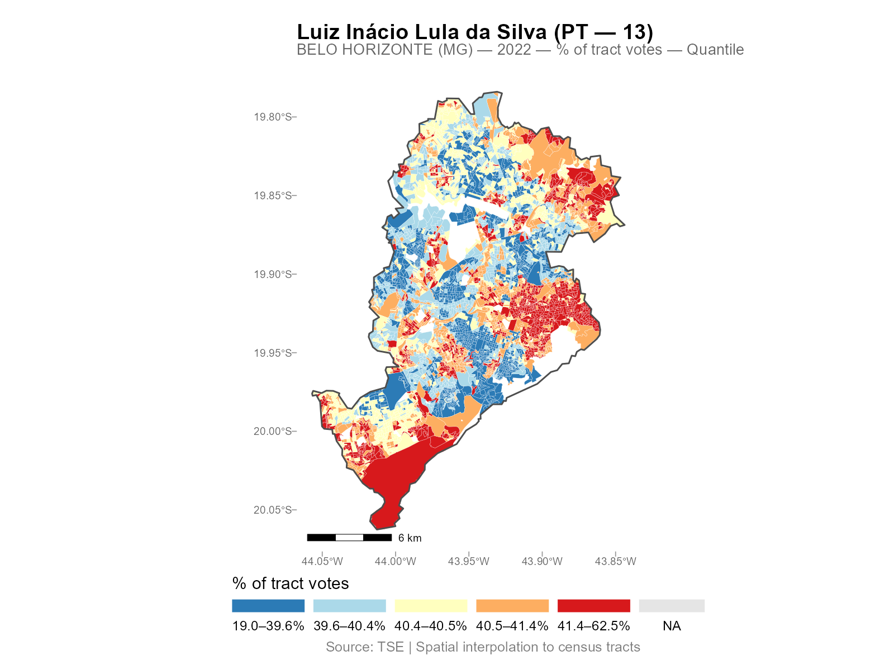
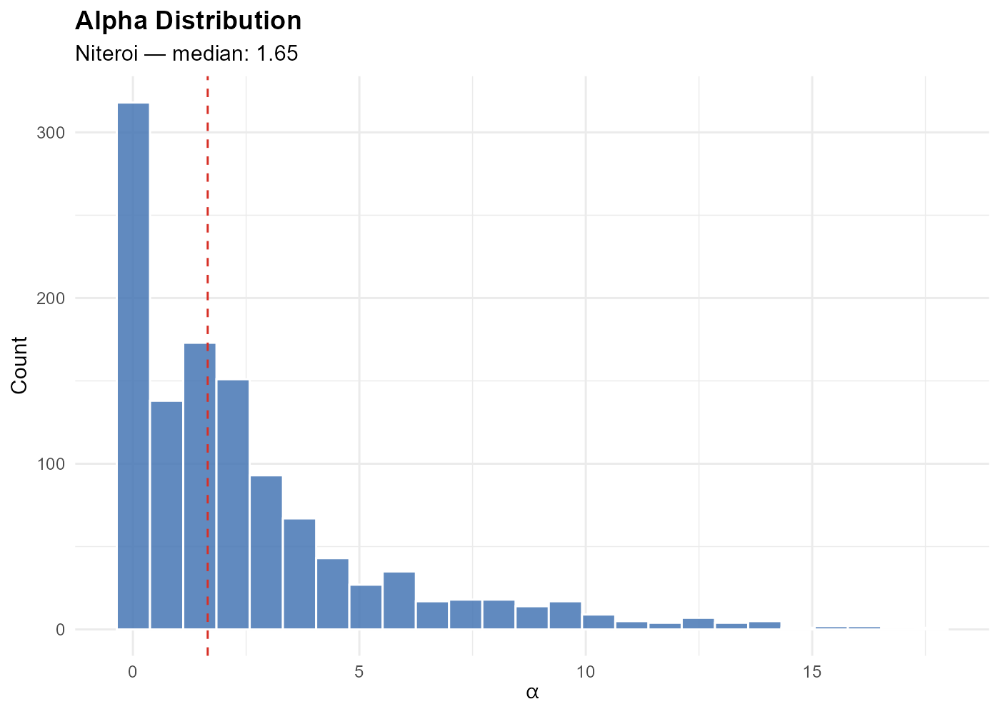
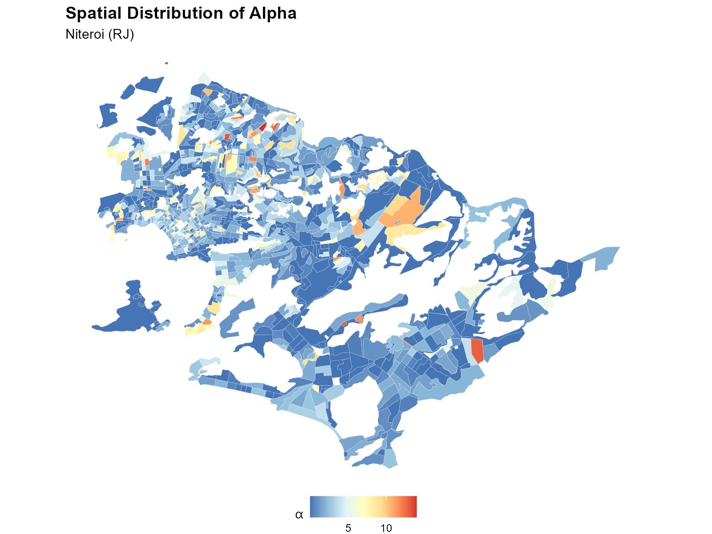

```{r setup, include = FALSE}
knitr::opts_chunk$set(
  collapse = TRUE,
  comment = "#>",
  fig.width = 7,
  fig.height = 5,
  out.width = "100%"
)
library(interpElections)
```

This vignette is a reference guide for working with `interpElections_result`
objects after interpolation. It covers S3 methods, plotting options,
residual analysis, validation, data export, and areal aggregation. Examples
use pre-computed results from **Niteroi (RJ)** (~500 tracts, GPU) and
**Belo Horizonte (MG)** (~4,000 tracts, GPU).

## Loading Results

```{r load-results, eval = FALSE}
# Run the pipeline (these were computed with GPU)
result_nit <- interpolate_election_br(
  "Niteroi", year = 2022, cargo = "presidente",
  what = c("candidates", "parties", "turnout", "demographics"),
  keep = c("weights", "sources_sf", "time_matrix"),
  use_gpu = TRUE
)

result_bh <- interpolate_election_br(
  "Belo Horizonte", year = 2022, cargo = "presidente",
  what = c("candidates", "turnout"),
  keep = c("weights", "sources_sf"),
  use_gpu = TRUE
)
```

```{r load-precomputed, include = FALSE}
# Load pre-computed for pkgdown
for (path in c("precomputed/niteroi_2022.rds",
               system.file("doc/precomputed/niteroi_2022.rds",
                           package = "interpElections"))) {
  if (file.exists(path)) {
    result_nit <- readRDS(path)
    break
  }
}
for (path in c("precomputed/belo_horizonte_2022.rds",
               system.file("doc/precomputed/belo_horizonte_2022.rds",
                           package = "interpElections"))) {
  if (file.exists(path)) {
    result_bh <- readRDS(path)
    break
  }
}
```

## Print and Summary

The `print()` method gives a compact overview:

```{r print, eval = FALSE}
result_nit
```

```
interpElections result -- Brazilian election
  Municipality: Niteroi (RJ)
  IBGE: 3303302 | TSE: 58718 | Election: 2022 | Census: 2010
  Census tracts: ~500 | Sources: ~100

  Variables: ~50
    Candidates:    13 (CAND_13, CAND_22, ...)
    Parties:       ~10 (PARTY_PT, PARTY_PL, ...)
    Turnout:       3 (QT_COMPARECIMENTO, QT_APTOS, QT_ABSTENCOES)
    Demographics:  ~15 (GENERO_FEMININO, EDUC_SUP_COMP, ...)
    Calibration:   7 (votantes_18_20, ...)
```

The `summary()` method adds per-variable statistics grouped by type:

```{r summary, eval = FALSE}
summary(result_nit)
```

The dictionary groups columns by type (candidate, party, turnout,
demographics, calibration) with metadata like candidate name, party
abbreviation, and ballot number:

```{r dictionary, eval = FALSE}
View(result_nit$dictionary)
```

## Plotting

### Single variable

```{r plot-single, eval = FALSE}
plot(result_nit, variable = "Lula")
```

```{r fig-nit-lula, echo = FALSE, out.width = "100%"}
knitr::include_graphics("figures/wr-nit-lula.png")
```

Variables can be referenced by:

- **Column name**: `"CAND_13"`, `"PARTY_PT"`, `"QT_COMPARECIMENTO"`
- **Ballot number**: `13`, `22`
- **Candidate name** (substring, case-insensitive): `"Lula"`, `"Bolsonaro"`
- **Party abbreviation**: `"PT"`, `"PL"`

### Absolute counts

```{r plot-absolute, eval = FALSE}
plot(result_nit, variable = "Lula", type = "absolute")
```

```{r fig-nit-abs, echo = FALSE, out.width = "100%"}
knitr::include_graphics("figures/wr-nit-lula-abs.png")
```

### Faceted comparison

```{r plot-faceted, eval = FALSE}
plot(result_nit, variable = c("Lula", "Bolsonaro"), type = "pct_tract")
```

```{r fig-nit-faceted, echo = FALSE, out.width = "100%"}
knitr::include_graphics("figures/wr-nit-faceted.png")
```

### Plot types

The `type` parameter controls the quantity mapped:

| Type | Description |
|---|---|
| `"pct_tract"` | % of total tract votes (default) |
| `"absolute"` | Raw interpolated count |
| `"pct_muni"` | % of municipality total |
| `"pct_valid"` | % of valid votes (excludes blank/null) |
| `"pct_eligible"` | % of eligible voters (requires turnout data) |
| `"density"` | Count per km^2^ |

### Break methods

The `breaks` parameter controls the color scale:

- `"quantile"` (default): equal-count bins
- `"continuous"`: smooth gradient
- `"jenks"`: natural breaks (requires classInt package)
- Custom numeric vector: `breaks = c(0, 20, 40, 60, 80, 100)`

```{r plot-breaks, eval = FALSE}
plot(result_nit, variable = "Lula", breaks = "continuous")
plot(result_nit, variable = "Lula", breaks = "jenks")
```

### Additional options

```{r plot-options, eval = FALSE}
# Overlay polling stations
plot(result_nit, variable = "Lula", show_sources = TRUE)

# Zoom into a region (lon/lat bounding box)
plot(result_nit, variable = "Lula",
     limits = c(-43.15, -43.05, -22.92, -22.86))

# Custom palette
plot(result_nit, variable = "Lula", palette = "viridis")
plot(result_nit, variable = "Lula", palette = "Spectral")

# Composable with ggplot2
library(ggplot2)
plot(result_nit, variable = "Lula") + theme_dark()
```

```{r fig-nit-sources, echo = FALSE, out.width = "100%"}

```

### Interactive maps

```{r plot-interactive, eval = FALSE}
# Opens in browser with hover tooltips and zoom
plot_interactive(result_nit, variable = "Lula")
```

### Large-scale example (Belo Horizonte)

```{r plot-bh, eval = FALSE}
plot(result_bh, variable = "Lula")
```

```{r fig-bh-lula, echo = FALSE, out.width = "100%"}

```

## Extracting Alpha

The `coef()` method returns the optimized decay parameters:

```{r alpha, eval = FALSE}
alpha <- coef(result_nit)
summary(alpha)
```

```{r fig-nit-alpha-hist, echo = FALSE, out.width = "80%"}

```

Map the alpha values spatially to see the urban/peripheral gradient:

```{r alpha-map, eval = FALSE}
result_nit$tracts_sf$alpha <- coef(result_nit)
ggplot(result_nit$tracts_sf) +
  geom_sf(aes(fill = alpha), color = "white", linewidth = 0.05) +
  scale_fill_distiller(palette = "RdYlBu", direction = -1) +
  theme_void()
```

```{r fig-nit-alpha-map, echo = FALSE, out.width = "100%"}

```

**Interpretation**: Low alpha (blue) = weight spread across many stations
(dense urban areas). High alpha (red) = weight concentrated on the
nearest station (periphery).

## Residual Analysis

The `residuals()` method computes the calibration residuals (fitted minus
observed) for each tract and age bracket. Requires `keep = "weights"` or
`keep = "time_matrix"`.

```{r residuals, eval = FALSE}
resid <- residuals(result_nit)
str(resid)
#> num [1:~500, 1:7] ...

# Per-bracket summary
colMeans(resid)                        # mean residual per bracket
sqrt(colMeans(resid^2))                # RMSE per bracket
```

```{r fig-nit-residuals, echo = FALSE, out.width = "90%"}
knitr::include_graphics("figures/wr-nit-residuals.png")
```

Residuals should be centered near zero. Large residuals may indicate
boundary effects (voters crossing municipality borders), data quality
issues, or census/election year mismatches.

## Validation Checklist

Five checks to apply to any result:

```{r validation, eval = FALSE}
# 1. Total conservation: interpolated totals match source totals
colSums(result_nit$interpolated)[1:3]
colSums(result_nit$sources[, result_nit$interp_cols[1:3]])

# 2. Residual magnitude
resid <- residuals(result_nit)
sqrt(mean(resid^2))   # overall RMSE

# 3. Alpha distribution (no extreme piling at bounds)
summary(coef(result_nit))

# 4. Non-negative values
all(result_nit$interpolated >= -1e-10)

# 5. Convergence
result_nit$optimization$convergence   # 0 = success
```

## Exporting Results

```{r export, eval = FALSE}
# Plain data frame (no geometry)
df <- as.data.frame(result_nit)
write.csv(df, "niteroi_2022.csv", row.names = FALSE)

# GeoPackage with geometry (for GIS)
sf::st_write(result_nit$tracts_sf, "niteroi_2022.gpkg")

# Column metadata
result_nit$dictionary

# Source-level data (without geometry)
head(result_nit$sources)
```

## Areal Aggregation: From Tracts to Neighborhoods

Tract-level results can be reaggregated into larger zones (neighborhoods,
administrative regions, custom polygons) using `areal_weights()` and
`areal_interpolate()`.

**Example: Belo Horizonte tracts to neighborhoods**

```{r areal, eval = FALSE}
library(sf)
library(geobr)

# Download BH neighborhood boundaries
bairros <- read_neighborhood(year = 2010)
bairros <- bairros[bairros$code_muni == 3106200, ]

# Compute area-weighted intersection matrix
W_areal <- areal_weights(
  target_sf = bairros,
  source_sf = result_bh$tracts_sf,
  target_id = "code_neighborhood",
  source_id = "code_tract"
)

# Aggregate interpolated data
vote_data <- result_bh$interpolated
aggregated <- areal_interpolate(vote_data, W_areal)

# Conservation check
colSums(aggregated)[1:3]
colSums(vote_data)[1:3]   # should match
```

The weight matrix `W_areal` is `[n_neighborhoods x n_tracts]`. Each
column sums to 1 (each tract's data is distributed proportionally to
the area overlap). `areal_interpolate()` is simply `W_areal %*% data`.

This approach preserves total conservation: the neighborhood-level
totals equal the tract-level totals, which equal the original
municipality totals.

## The `keep` Parameter

Control which intermediate objects are retained in the result:

| Value | Object | Use case |
|---|---|---|
| `"weights"` | `result$weights` | `residuals()`, manual reweighting |
| `"time_matrix"` | `result$time_matrix` | `residuals()` (alternative), reuse |
| `"sources_sf"` | `result$sources_sf` | `plot(..., show_sources = TRUE)` |
| `"pop_raster"` | `result$pop_raster` | Inspect population density raster |
| `"rep_points"` | `result$rep_points` | Inspect representative points |

Default: `NULL` (lightweight, nothing kept). Recommended:

```{r keep-example, eval = FALSE}
result <- interpolate_election_br("Niteroi", year = 2022,
  keep = c("weights", "sources_sf"))
```

This enables residual analysis and source point overlays without
excessive memory use.
